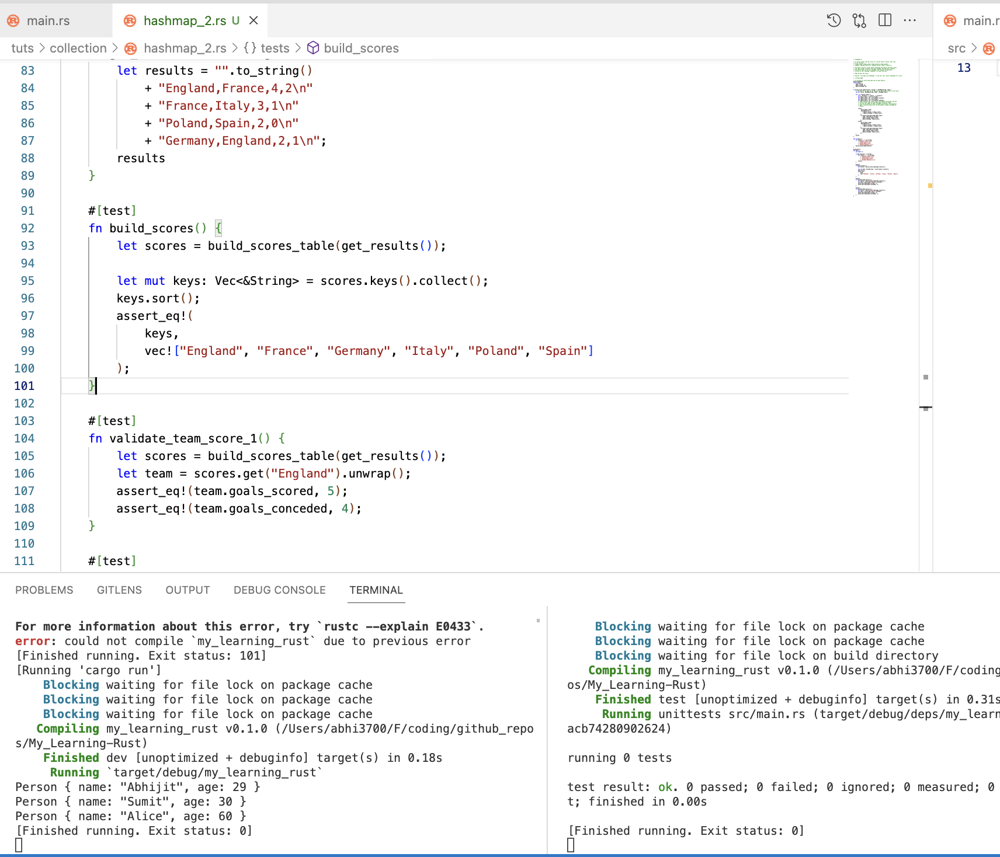
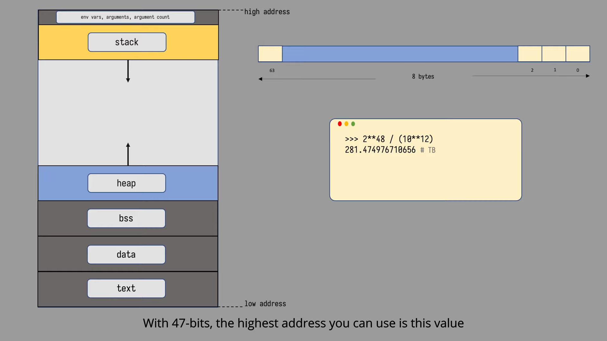
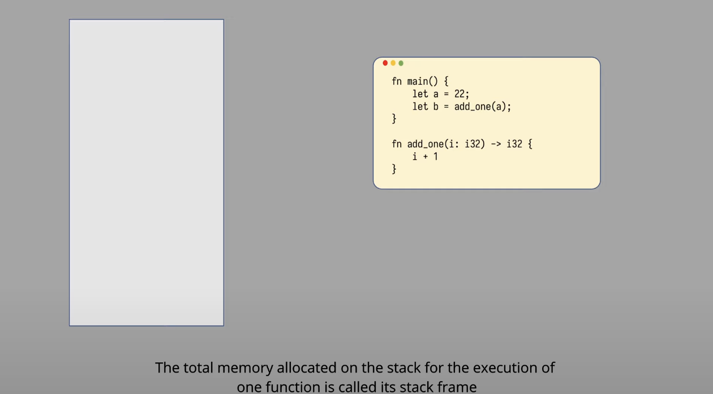
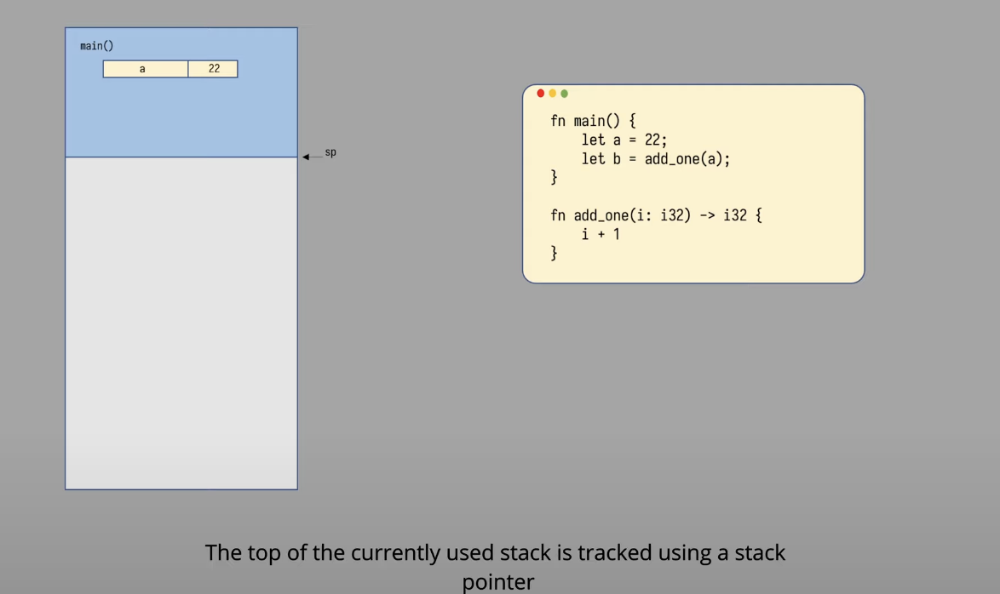
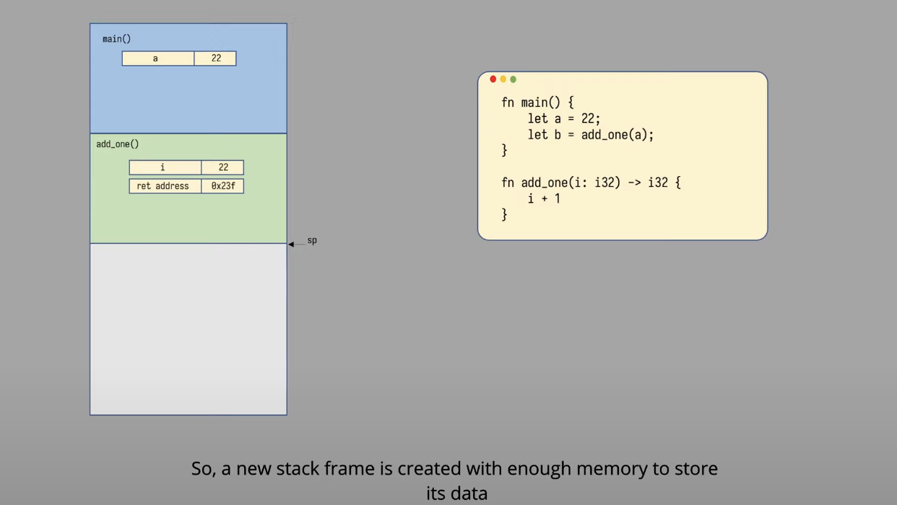
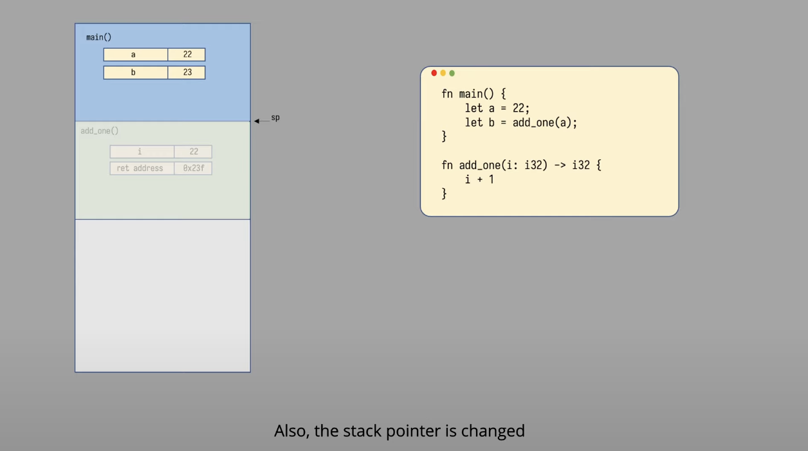
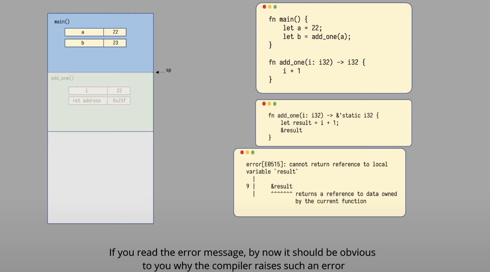

# My_Learning-Rust

Rust programming language

## Installation

### Linux or macOS

> Including VMs

#### Compiler

- Install

```console
$ curl --proto '=https' --tlsv1.2 https://sh.rustup.rs -sSf | sh
```

Following tools get installed: `rustup`, `rustc`, `cargo`, `rustfmt`

> **Different release channels**
>
> - stable: stable, but has a 6-week stabilization period
> - beta: unstable, but has a 6-week stabilization period
> - nightly: unstable, but has the latest features
>
> `rustup` is for managing different rust toolchain versions for different targets/architectures (arm, x86, etc.)

```console
This will download and install the official compiler for the Rust
programming language, and its package manager, Cargo.

Rustup metadata and toolchains will be installed into the Rustup
home directory, located at:

  /Users/abhi3700/.rustup

This can be modified with the RUSTUP_HOME environment variable.

The Cargo home directory located at:

  /Users/abhi3700/.cargo

This can be modified with the CARGO_HOME environment variable.

The cargo, rustc, rustup and other commands will be added to
Cargo's bin directory, located at:

  /Users/abhi3700/.cargo/bin

This path will then be added to your PATH environment variable by
modifying the profile files located at:

  /Users/abhi3700/.profile
  /Users/abhi3700/.zshenv

You can uninstall at any time with rustup self uninstall and
these changes will be reverted.
```

- set `stable` as default toolchain via `$ rustup default stable`
- set `nightly` as default toolchain via `$ rustup default nightly`
- set `nightly` as default toolchain for a specific project via `$ rustup override set nightly`
- All the rust binaries are installed in this folder `$HOME/.cargo/bin`
- **Update** using `$ rustup update` [RECOMMENDED]
  - And then need to install the latest `rustc` & `cargo` for individual channels: `stable`, `beta`, `nightly`
    - `$ rustup default stable-aarch64-apple-darwin`
    - `$ rustup default beta-aarch64-apple-darwin`
    - `$ rustup default nightly-aarch64-apple-darwin`
- Update to stable version: `$ rustup update stable`
- View installed version via `$ rustup show`
- Check latest version via `$ rustup check`
- install a **specific version** via `$ rustup install 1.64.0` or `$ rustup install 1.64.0-aarch64-apple-darwin`
- set a specific version via `$ rustup default 1.64.0` or `$ rustup override set 1.64.0`
- **Uninstall** using `$ rustup self uninstall`
- **lib**:
  - Show all available lib using `$ rustup component list`
  - Show all installed lib using `$ rustup component list --installed`
  - Install rust std lib using `$ rustup component add rust-src`
- **target**:
  - Show all available target using `$ rustup target list`
  - show all installed target using `$ rustup target list --installed`
  - Install rust target using `$ rustup target add <component-name>`. E.g. `$ rustup target add wasm32-unknown-unknown`
    > Here, `unknown` means that it is for any OS.

---

- After `cargo` installation,
  - add package locally into the repo via `$ cargo add <package-name>`. E.g. `$ cargo add dotenv`.
  - list globally installed packages via `$ cargo install --list`.
  - `$ cargo update`: This command will update dependencies in the Cargo.lock file to the latest version. If the Cargo.lock file does not exist, it will be created with the latest available versions.
  - install the binaries (by default `/target/release`) folder via `$ cargo install --path .`. This will install the binary in the `~/.cargo/bin` folder.
  - install `cargo-edit` for helping with edit, add, remove, upgrade, downgrade, and list dependencies in `Cargo.toml`
  - `cargo-watch` install via `$ cargo install cargo-watch`.
    - Watch for changes in the project and automatically run via `$ cargo watch -x run`
    - Watch for changes in the project and automatically test via `$ cargo watch -x test`
  - `cargo-expand`: install via `$ cargo install cargo-expand`. more [here](./libs/expanded_rust/README.md)
  - `cargo-audit`: install via `$ cargo install cargo-audit`.
- build using `nightly` toolchain for a project via `$ cargo +nightly build`
- build a releasable (optimized) version of a project via `$ cargo build --release`

> Often, `cargo check` is much faster than `cargo build`, because it skips the step of producing an executable. If you’re continually checking your work while writing the code, using `cargo check` will speed up the process! As such, many Rustaceans run `cargo check` periodically as they write their program to make sure it compiles. Then they run `cargo build` when they’re ready to use the executable.

---

> NOTE: If there is any error related to `linker` with C, follow this:

> You will also need a linker, which is a program that Rust uses to join its compiled outputs into one file. It is likely you already have one. If you get linker errors, you should install a C compiler, which will typically include a linker. A C compiler is also useful because some common Rust packages depend on C code and will need a C compiler.

> On macOS, you can get a C compiler by running:

```console
xcode-select --install
```

#### Editor

Use VSCode.

**Extensions**:

[Source](https://www.becomebetterprogrammer.com/rust-recommended-vscode-extensions/)

- [rust-analyzer](https://marketplace.visualstudio.com/items?itemName=rust-lang.rust-analyzer)

  ```json
    "[rust]": {
      "editor.defaultFormatter": "rust-lang.rust-analyzer",
      "editor.formatOnSave": true
    },
  ```

- [CodeLLDB](https://marketplace.visualstudio.com/items?itemName=vadimcn.vscode-lldb)
- [Error Lens](https://marketplace.visualstudio.com/items?itemName=usernamehw.errorlens) [OPTIONAL]
- [Better TOML](https://marketplace.visualstudio.com/items?itemName=bungcip.better-toml)
- [Even Better TOML](https://marketplace.visualstudio.com/items?itemName=tamasfe.even-better-toml)

---

An ideal setup for a rust code (with tests) would be:



So, here on left terminal, we have `$ cargo watch -x run` running, which will watch for changes in the project and automatically run. On right terminal, we have `$ cargo watch -x test` running, which will watch for changes in the project and automatically test.

## CI/CD (Github Actions)

Create a `.github/workflows/rust-ci.yml` file.

The file should contain this:

```yml
jobs:
  build:
    runs-on: ubuntu-latest
    steps:
      - name: Set up Rust
        uses: actions/checkout@v2
      - name: Install cargo-audit
        run: cargo install cargo-audit
      - name: Build
        run: cargo build --verbose
      - name: Test
        run: cargo test --verbose
      - name: Clippy
        run: cargo clippy --verbose -- -D warnings
      - name: Audit
        run: cargo audit
```

## Crates

Important ones.

- [serde](https://crates.io/crates/serde)
- [serde_json](https://crates.io/crates/serde_json)
- [thiserror](https://crates.io/crates/thiserror)
- [anyhow](https://crates.io/crates/anyhow)
- [tokio](https://crates.io/crates/tokio)

For more, see [here](https://blessed.rs/crates).

## Repositories

- [calamine](https://github.com/tafia/calamine)
- [DSLCad](https://github.com/DSchroer/dslcad): DSLCad is a programming language & interpreter for building 3D models.
- [Implementation of the Ethereum precompiled contracts in Rust](https://github.com/ewasm/ewasm-precompiles)
- [A new markup-based typesetting system that is powerful and easy to learn] (https://github.com/typst/typst)
- [Twilio Sendgrid Unofficial library to send OTP, tokens to email](https://crates.io/crates/sendgrid)

## [C++ vs Rust](./cpp_vs_rust.md)

## Getting Started

### Code

```rust
fn main() {
    println!("Hello World!");
}
```

### Compile

`cargo` can also be used for compiling a project like `node` in NodeJS project.

```sh
$ rustc hello.rs
```

```sh
$ cargo build
```

### Output

```console
$ ./hello
```

## Practice

Put the code inside a `.rs` file & link into [`./src/main.rs`](./src/main.rs) using `#[path= "path/to/file"]` macro.

## Concepts

> “Ownership is Rust’s most unique feature, and it enables Rust to make memory safety guarantees without needing a garbage collector.”

- By default, all the variables are defined as `immutable` equivalent to `const` in JS/TS.
- In Rust, borrowing is analogous to referencing in C++ & dereferencing is same as that of C++.
- The value of mutable variable can be changed, but not the type.
- In Rust, every value has a single owner that determines its lifetime.
- Rust has preferred **composition** over **inheritance**. That's why in Rust, we use traits to define shared behavior.

### Primitive types and Variables

1. Various sizes of integers, signed and unsigned (i32, u8, etc.)
1. Floating point types f32 and f64.
1. Booleans (bool)
1. Characters (char). Note these can represent unicode scalar values (i.e. beyond ASCII)

> `usize`: the size is dependent on the kind of computer your program is running on: 32 bits if you’re on a 32-bit architecture and 64 bits if you’re on a 64-bit architecture.

---

### str vs String

| str                                                                       | String                                                                     |
| ------------------------------------------------------------------------- | -------------------------------------------------------------------------- |
| Primitive Type                                                            | Built-in struct                                                            |
| Doesn’t have ownership of the string as it is typically used by reference | Has ownership of the string                                                |
| It is a string slice                                                      | It is a growable array                                                     |
| Size known at compile time                                                | Size is unknown at compile time                                            |
| Data allocated in the data segment of the application binary              | Data allocated in a heap                                                   |
| Uses & or reference to assign a str value to a variable                   | Not need need to use & or reference to assign a String value to a variable |

---

- `&str` to `String` is always an expensive operation, as it is owned with a `String` type.

  ```rs
  let name: &str = "Abhijit Roy"
  let name_String: String = name.to_string(); // used `to_string()` to convert from `&str` to `String` type
  ```

- `String` to `&str` is a cheap operation, as it is borrowed with a `&str` type.

  ```rs
  let name: String = "Abhijit Roy"
  let name_String: &str = &name; // used `&` to convert from `String` to `&str` type
  ```

- The following function is more expensive than the latter.

  ```rs
  fn main() {
      let my_str: &str = "This is a str";

      // converting the str to String is an expensive operation
      print_data(&my_str.to_string());

      print!("printing inside main {}", my_str);
  }

  fn  print_data(data: &String) {
      println!("printing my data {} ", data);
  }
  ```

  ```rs
  fn main() {
      let my_string: String = String::from("Understanding the String concept?");

      print_data(&my_string);

      print!("printing inside main {}", my_string);
  }

  fn  print_data(data: &str) {
      println!("printing my data {} ", data);
  }
  ```

  [Source](https://www.becomebetterprogrammer.com/rust-string-vs-str/)

### Print

- 1. formatting variables inside `println` function

```rs
let name = "Abhijit";
let age = 28;

println!("My name is {name}, and age is {age}");        // ❌
println!("My name is {0}, and age is {1}", name, age);  // ✔️
println!("My name is {}, and age is {}", name, age);    // ✔️
```

- 2. Multiple usage of variables without repetition

```rs
let alice = "Alice";
let bob = "Bob";

println!("{0}, this is {1}. {1}, this is {0}", alice, bob);
```

---

### Attributes

- `#[allow(unused)]` - to ignore the warning for unused variable

### Error handling

- [tuts](./tuts/error_handling)
- 2 types: Recoverable, Unrecoverable

#### Recoverable errors

- Recoverable using `Result`

  - e.g. `Result::Err("burn and crash")` in case of function return type.

The `try-catch` can be implemented like this:

```rs
fn main() {
    // the output is of type `Result<File, Error>`
    let f = File::open("hello.txt");
    match f {
        Ok(success) => println!("{:?}", success),
        Err(failure) => panic!("file is not found: {:?}", failure),
    };
}
```

in analogous to:

```js
try {
  const f = File.open("hello.txt");
  console.log(f);
} catch (e) {
  console.log(e);
}
```

Understand the following examples sequentially:

[recoverable_err_1a.rs](./tuts/error_handling/recoverable_err_1a.rs)

[recoverable_err_1b.rs](./tuts/error_handling/recoverable_err_1b.rs)

[recoverable_err_1c.rs](./tuts/error_handling/recoverable_err_1c.rs)

#### Unrecoverable errors

- Unrecoverable using `panic`
  - e.g. `panic!("burn and crash")` in case of array out of bound error.

```rs
fn run() {
  panic!("burn and crash");
}

fn main() {
  run();
}
```

### Pointer

- `Box<T>` - A pointer type for heap allocation

  > By default, in Rust variables are stored in stack. But, if we want to store in heap, we can use `Box<T>` pointer. This is similar to `new` keyword in JS/TS.

- Box is basically used for:
  - For dynamic allocation of memory for variables.
  - When there is a lot of data that we need to transfer ownership and we don’t want that they are copied.

---

#### Mutex

Mutex stands for Mutual Exclusion, and it's a synchronization primitive used to protect shared data in concurrent programming. In the context of Rust, the `std::sync::Mutex` type provides a mechanism for multiple threads to mutually exclude each other from accessing some particular data.

Let's imagine we have a book 📚 (representing the shared data), and we have two friends 👥 (representing two threads). They both want to write in the book 📚 at the same time.

The book 📚 is our shared data that both friends 👥 want to modify. We can't have both friends 👥 writing in the book 📚 at the same time, because that would create a mess. We need some way to ensure that only one friend 👥 can write in the book 📚 at a time. That's where our Mutex comes in!

A mutex is like a key 🔑 to the book 📚. When a friend 👥 has the key 🔑, they can write in the book 📚. When they're done, they give the key 🔑 back, and the other friend 👥 can take the key 🔑 to write in the book 📚.

Here is how it works in code:

```rust
use std::sync::Mutex;

let m = Mutex::new(5);  // Here we are creating our book 📚 with a number 5 inside it.

{
    let mut num = m.lock().unwrap();  // One of our friends 👥 takes the key 🔑.
    *num = 6;  // They change the number in the book 📚 from 5 to 6.
}  // The friend 👥 gives back the key 🔑 when they are done.

println!("m = {:?}", m);  // Now the book 📚 has number 6 inside it.
```

In this example, the friend 👥 is able to take the key 🔑 (acquire the lock) by calling `m.lock()`. They can then modify the data (write in the book 📚) by dereferencing `num` to get access to the data. When they're done, they give the key 🔑 back automatically because Rust's scoping rules will drop the `MutexGuard` (represented by `num`) at the end of the scope, which releases the lock.

It's important to remember that if a friend 👥 forgets to give back the key 🔑 (doesn't release the lock), the other friend 👥 will be left waiting indefinitely, unable to write in the book 📚. This is called a deadlock, and it's a common problem in concurrent programming that you should try to avoid.

This is a simplified view of mutexes in Rust, but hopefully, it helps you understand the basic concept. For more complex scenarios, you'll want to learn about things like error handling with `Result`, using `Condvar` for condition variables, and understanding the different methods available on `Mutex` and `MutexGuard`.

### Array

- Arrays are fixed length. They are stored in stack.
- E.g.

  ```rs
  let array: [i32; 4] = [42, 10, 5, 2];
  ```

```

```


### Vector

- Vectors are dynamic length. They are stored in heap.
- They are allocated/deallocated based on the capacity of the vector filled.
- In this code:

  ```rs
  //! step-1
  let mut v: Vec<i32> = vec![1, 2, 3, 4];
  //prints 4
  println!("v's capacity is {}", v.capacity());
  println!("v's length is {}", v.len());  // -> 4
  println!("Address of v's first element: {:p}", &v[0]); //{:p} prints the address
  v.push(5);

  //! step-2
  //prints 8
  println!("v's capacity is {}", v.capacity());
  println!("v's length is {}", v.len());  // -> 5
  println!("Address of v's first element: {:p}", &v[0]);
  ```

  **At step-1**:

  

  **At step-2**:

  

> If you do not see a different address after pushing more elements onto a vector, it might be because the allocator had enough space at the end of the original buffer such that the new and the old buffers have the same starting address. Try pushing more elements and you will see a different address. Read about C library function `realloc` to understand how this might happen.

### Memory: stack, heap

> - **Stack** (fixed size like char, bool, int, array; less costly; quick to access by calling var like easy to copy the var)
>
> - **Heap** (variable size like string, vector, class; more costly; access var or object via pointer)

- The memory of the declared variables are dropped (or freed) when the program leaves a block in which the variable is declared.
  - E.g. Normally, inside the `main` function, whenever a variable is defined, it is dropped after exiting the `main` function.

```rs
fn main() {
    // Case-1
    let x = 10;
    let r = &x;

    let k;
    {
        let y = Box::new(5);            // Using Box pointer for storing into heap
        let y = 5;              // stored in stack
        // let y <'a> = 5;
        // k = &y;         // y dropped here as it is not available for lifetime. Moreover the block is getting over after this
        k = y;          // this implies that the ownership of 5 is transferred to `k` from `y`
    }
}
```

### Conditional

- In Rust, `match` is used more often than `if-else`. `match` is similar to `switch` in other languages and requires to cover all the cases.
- <u>Pattern matching</u>: `match` vs `if-let`:
  - The former has to cover all the cases
  - The latter is used for only 1 case, if we don't want to cover all the cases.
- #### `if-let` is preferred over `if` condition in cases of pattern matching with `Option`, `Result`

  ```rust
  let x = 3;
  if (x == 3) {
      println!("x is equal to 3");
  }
  ```

  ```rust
  let value = Some(3);
  if let Some(x) = value {
      println!("x is equal to 3");
  }
  ```

  The two expressions you've mentioned serve different purposes in Rust, so it's not really a matter of one being 'better' than the other; rather, it depends on the context of use.

  1. `if x == 3`: This is a simple comparison. If the value of x is equal to 3, then the code block following this if statement will execute. If x is not equal to 3, the code block will be skipped.

  2. `if let x = 3`: This is actually a misuse of Rust's if let construct. The if let statement is used for pattern matching, and it works a bit differently. The correct usage would be if let `PAT` = `EXPR`, where PAT is a pattern and `EXPR` is an expression. For example, you might use `if let Some(x) = some_option` to check if an Option is Some and, if so, bind the value inside to x.

  In your specific case, if you want to compare `x` to `3`, you should use `if x == 3`. If you need pattern matching (like checking if an `Option` is `Some` or a `Result` is `Ok`), then if let is the appropriate construct.

### Loop

- `..` used for range like `1..4` i.e. 1, 2, 3. But, if `1..=4` i.e. 1, 2, 3, 4

### Function

- `fn` keyword is used to define a function
- `->` is used to define the return type of the function
- `()` is used to define the arguments of the function
- `return` keyword is not used in Rust. The last line of the function is the return value of the function
- return type can be `Option`, `Result`.
- #### Use wildcard pattern `_` to ignore the value of the variable.

  In this code:

  ```rs
  fn add() -> (i32, i32, i32) {
      (1, 2, 3)
  }

  fn main() {
      let (x, _, _) = add();
      println!("x is {}", x);
  }
  ```

  The underscore `_` in Rust is called a wildcard pattern. It's used when you want to pattern match some parts of a data structure, but you're not interested in all parts of it. It's a way of saying "I know there's a value here, but I don't care about it".

  In your code `(x, _, _) = add();`, it means you're calling a function `add()` which returns a tuple of three values. You're interested in the first value, which is being assigned to x, but you're not interested in the second and third values, hence the `_` wildcard.

  The wildcard pattern is useful in many situations where you need to satisfy the compiler's requirement for exhaustive pattern matching, but there are some values you don't need to handle.

### Borrowing & Ownership

> <u>Borrow Checker</u>: You can move the data itself and give up ownership in the process, create a copy of the data and pass that along, or pass a reference to the data and retain ownership, letting the recipient borrow it for a while. The most appropriate approach depends entirely on the situation. Try [this](./tuts/functions/borrow_checker.rs)

- Rust memory safety is based on this rule: Given an object T, it is only possible to have one of the following:

  - Having several immutable references (&T) to the object (also known as aliasing).
  - Having one mutable reference (&mut T) to the object (also known as mutability).

<!-- TODO: correct this with telegram msg -->

```rs
// ✅
let x = 5;
let y = &x;
let z = &x

// ❌
let mut x = 5;
let y = &mut x;
let z = &mut x;
```

### Lifetimes

- Lifetimes are another kind of generic that we’ve already been using. Rather than ensuring that a type has the behavior we want, lifetimes ensure that references are valid as long as we need them to be. [source](https://doc.rust-lang.org/book/ch10-03-lifetime-syntax.html#preventing-dangling-references-with-lifetimes)
- Rust doesn't allow _dangling pointer_ by design. This means that any variable, struct, enum, etc can't live more than the lifetime of the referenced type

```rs
struct Config {

}

// INCORRECT ❌
struct App {
    config: &Config     // `Config` used as reference
}

// CORRECT ✅
/// Here, it is used as lifetime ownership of the code.
struct App<'a> {
    config: &'a Config
}
```

- `lifetimes` are a compile-time feature and don’t exist at runtime.

### Option, Result

- `Option` vs `Result`

| Option                                                                                                                                                                                  | Result                                                                                                                             |
| --------------------------------------------------------------------------------------------------------------------------------------------------------------------------------------- | ---------------------------------------------------------------------------------------------------------------------------------- |
| Some or None                                                                                                                                                                            | Ok or Err                                                                                                                          |
| An optional value can have either Some value or no value/ None.                                                                                                                         | A result can represent either success/ Ok or failure/ Err                                                                          |
| The Option type is a way to use Rust’s type system to express the possibility of absence                                                                                                | Result expresses the possibility of error                                                                                          |
| mainly used for var, function output. For struct, the parameters can have Option type. E.g. In full name, middle_name can be missing for cases, so define `middle_name: Option<String>` | mainly used for operation, function. As normally a variable won't have Err unless there is some calculation involved with this var |
| Don't want to print the exact issue as `None` doesn't have anything as param unlike `Some(T)`                                                                                           | Want to print the exact issue as `Err(E)` contains the message inside                                                              |
| E.g. "./tuts/error_handling/opt"                                                                                                                                                        | E.g. "./tuts/error_handling/res"                                                                                                   |

### Modules

- any folder can have a `mod.rs` which is going to be like `index.js` in JS.
- tree structure is as follows:

```bash
src/
├── main.rs
└── something
    ├── a.rs
    ├── b.rs
    └── mod.rs
```

When `Rust` check for `something.rs` and doesn't find it will check for the folder `something/` and then inside look for a file named `mod.rs`.

We can call `a` like this in the `main.rs`:

```rs
use crate::something::a::*;
use crate::something::b::*;
```

> When using `crate`, no need to use `mod` keyword in the `src/main.rs` file.

---

**Another example**:

In this rust project `src/` folder structure:

```sh
├── src
│   ├── app
│   │   └── README.md
│   ├── handlers.rs
│   ├── main.rs
│   ├── models.rs
│   └── utils
│       ├── determine_emoji.rs
│       ├── get_current_time.rs
│       └── mod.rs
```

When using `determine_emoji` inside `handler.rs` file:

```rust
use crate::utils::{determine_emoji, get_current_time};
```

provided the below is maintained:

```rust
// src/utils/mod.rs
pub mod determine_emoji;
pub mod get_current_time;
```

```rust
// src/main.rs
mod utils; // Add this line
```

### Struct

- There are different types of struct

  - normal struct: with parameters
  - unit struct: without parameters

- Structs can be inherited from other structs via declaring the 1 struct type as type of another struct's parameter.

```rs
struct Purchase {
  bill: f64,
  tax: f64,
  shop_name: String,
  gst_no: String,
}

struct House {
  address: String,
  area: f64,
  price: f64,
  purchase: Purchase,
}
```

### Trait

- A trait is a collection of methods that are defined for an unknown type: `Self`. They can access other methods declared in the same trait.
- A trait is a common interface that a group of types can implement. The Rust standard library has many useful traits, such as:

  - `io::Read` for values that can read bytes from a source.
  - `io::Write` for values that can write out bytes.
  - `Debug` for values that can be printed in the console using the "{:?}" format specifier.
  - `Clone` for values that can be explicitly duplicated in memory.
  - `ToString` for values that can be converted to a String.
  - `Default` for types that have a sensible default value, like zero for numbers, empty for vectors, and “” for String.
  - `Iterator` for types that can produce a sequence of values.

- "Indeed, traits are more like interfaces than classes. You don't store "fields" or "data" in a trait, you describe functionality in it. You would put your data in another type declaration, like a struct or an enum. Then you would externally implement your trait for that struct or enum, etc. In order to achieve a true object-oriented style, you'll need to use traits and you want to compose them in a way that allows them to be used as "trait objects". This means that each fn in the trait needs to have &self of &mut self, basically "getters" and "setters" for your "object"."

- `&self` - used as getter
- `&mut self` - used as setter
- return self like this - `fn build(&self) -> Self`
- implement multiple traits for a struct using `derive macro` like `#[derive(Debug, Clone, ....)]`:

  ```rs
  #[derive(Debug, Clone, Copy, Eq, PartialEq)]
  struct Person {
      name: String,
      age: u8,
  }
  ```

- trait can be defined implemented for `enum`, `struct`, etc. Anything which contains data (const, variable). `enum` contains `const` data and `struct` contains `variable` data.

  ```rs
  enum TrafficLight {
      Red,
      Yellow,
      Green,
  }
  impl TrafficLight {
      fn duration(&self) -> u8 {
          match self {
              TrafficLight::Red => 30,
              TrafficLight::Yellow => 10,
              TrafficLight::Green => 60,
              _ => 0,
          }
      }
  }
  ```

  ```rs
  struct TrafficLight {
      color: String,
  }
  impl TrafficLight {
      fn duration(&self) -> u8 {
          match self.color.as_str() {
              "Red" => 30,
              "Yellow" => 10,
              "Green" => 60,
              _ => 0,
          }
      }
  }
  ```

  The eg above shows how the single trait is used for both `struct` & `enum` data type in Rust.

### Generics

Generics are a way to reduce the need to write repetitive code and instead delegate this task to the compiler while also making the code more flexible. Many languages support some way to do this, even though they might call it something different.

Using generics, we can write code that can be used with multiple data types without having to rewrite the same code for each data type, making life easier and coding less error-prone.

### Macros

- Apply `#[derive(Debug)]` for making the struct, enum printable
- Apply `#[derive(Clone)]` for making the struct, enum copyable.
- Use this globally in `src/main.rs` to ignore unused code, variables

```rust
#![allow(dead_code)]
#![allow(unused_variables)]

fn main() {
    // ...
}
```

- A function is marked with #[allow(dead_code)], which suppresses the Rust compiler warning for unused code. This is typically used when the function is expected to be used in the future or when it is part of a public API that isn't currently being used in the local codebase.

  - Suppose, there is a util function and I am not using it anywhere. So, I can mark it as `#[allow(dead_code)]` to avoid the compiler's warning.

  ```rust
  #[allow(dead_code)]
  fn handle_task() {}
  ```

  Further explanation:

  `#[allow(dead_code)]` 🚦

  This line is like a "do not disturb" sign 🚫. It tells the Rust compiler not to worry if this function isn't being used right now.

- Same goes for unused variables:

  ```rust
  #[allow(unused_variables)]
  let v = vec![1, 2, 2, 3, 4, 4, 5, 6, 7, 7];
  ```

### Concurrency

Refer [this](./tuts/concurrency/)

### Comments

Here are some of the key guidelines for writing comments in Rust:

- Use /// for documenting items such as functions, structs, enums, and modules. The comment should describe what the item does, its parameters (if any), and its return value (if any).
- Use //! for documenting the crate root. This comment should provide a brief overview of the crate's purpose and functionality.
- Use // for adding comments to individual lines of code. These comments should explain what the code is doing and why it's necessary.
- Use Markdown formatting to add emphasis, headings, lists, and links to your comments.
- Keep your comments concise and to the point. Avoid unnecessary details or redundant information.
- Use proper spelling, grammar, and punctuation in your comments.
- Update your comments when you make changes to your code. Outdated comments can be misleading and confusing.

### `super` vs `crate`

This is important while importing modules.

- `super` is used to import from parent module of the current module (file). When you use `super` for importing, you're specifying a relative path from the current module's parent.

  ```rs
  // Assuming we have a module hierarchy like this:
  // my_module
  // ├── sub_module1
  // │   ├── sub_module1_1
  // │   │   ├── some_file.rs
  // │   ├── MyStruct.rs
  // ├── sub_module2

  // In some_file.rs
  use super::MyStruct;
  ```

- `crate` is used to import from root module of the current module (file). When you use `crate` for importing, you're specifying an absolute path from the root of the current crate (where Cargo.toml file is there).

  ```rust
  // Assuming we have a module named `my_module` at the root of our crate
  use crate::my_module::MyStruct;
  ```

### lib or bin

- `$ cargo init --lib <name>` creates a lib
- `$ cargo init <name>` creates a package

### Move | Copy | Clone

Refer [this](./tuts/move_copy_clone)

### Testing

All tests like unit, integration tests are in `tests` folder.

- add `panic` in test to fail the test

  ```rs
    #[test]
    #[should_panic]
    fn fail_creating_weightless_package() {
        let sender_country = String::from("Spain");
        let recipient_country = String::from("Austria");

        Package::new(sender_country, recipient_country, -2210);
    }
  ```

- add `#[ignore]` to skip the test.

## Miscellaneous

Picked from this [book: Rust Design Patterns](https://rust-unofficial.github.io/patterns/intro.html)

Look for files with `_opt` suffix like this at the repo root:

```sh
❯ find . | grep _opt
```

### Understanding memory layout (low level language design)

[Video source](https://www.youtube.com/watch?v=rDoqT-a6UFg) 🌟🌟🌟🌟🌟



- stack is used for:
  - primitive types
  - function param, return values (address), local variables
- For 64-bit machine, total allowed stack size for the main thread is 8 MB. In below example, there are different stack frame created. Consider the entire white area as stack size for main thread as 8 MB. Also, there is only 1 thread running. Here, stack pointer is getting incremented/decremented based on the program logic running in the thread.
  
  
  
  

  > Here, the blurred one is not deallocated, but just be replaced by the next function.

  

### Idioms

#### Use Borrowed types for arguments

```rs
&String -> &str
&Vec<T> -> &[T]
&Box<T> -> &T
```

[Code](./pro/three_vowels/)

[Reference](https://rust-unofficial.github.io/patterns/idioms/coercion-arguments.html)

---

#### Concatenate strings with format

```rs
format!("{} World!", s1)
```

[Code](./pro/concat_str/)

[Reference](https://rust-unofficial.github.io/patterns/idioms/concat-format.html)

---

#### Use `collect` wherever possible to create a collection

```rs
let s = "Abhijit is a good boy"; // collection of bytes like
// [65, 98, 104, 105, 106, 105, 116, 32, 105, 115, 32, 97, 32, 103, 111, 111, 100, 32, 98, 111, 121]
let v = s.bytes().collect::<Vec<u8>>(); // RECOMMENDED for iteration
```

[Code](./tuts/iterator/collect_4_opt.rs)

[Reference](https://www.dotnetperls.com/collect-rust)

#### Some macros implicitly always borrow. So, not need to use `&` explicitly

```rs
let x = 5;
println!("x = {}", x);
```

[Reference](https://stackoverflow.com/a/30451360/6774636)

### Coherence (Overlap) and Orphan Rules

- **Coherence/Overlap rule**: There should not be multiple implementations using `impl` for the same type.
- **Orphan rule**: The trait or type should be defined in the same crate as the implementation.

✅

```rust
// crate_a
struct MyStruct;

trait MyTrait {
    fn my_fn(&self);
}
```

---

❌

```rust
// crate_b
use crate_a::{MyStruct, MyTrait};

// WRONG: Orphan rule violation
impl MyTrait for MyStruct {
    fn my_fn(&self) {
        println!("Hello");
    }
}
```

This would be illegal under the orphan rules, because both `MyType` and `MyTrait` are foreign to `Crate B`. If this were allowed, and `Crate A` also provided an implementation of `MyTrait` for `MyType`, there would be a conflict, and Rust wouldn't know which implementation to use. The orphan rules prevent this situation from arising.

## Tools

- Check behind-the-code for a code snippet - https://play.rust-lang.org/
  - Tools >> Expand Macros

## Fields

### Application Development

- Best 2:
  1. **Rocket** (good docs) [Familiar]
  2. **Actix_web** (under development) [Recommended]
     > `2` is much faster than `1` in terms of performance. Infact, it is closer to [`drogon-core (in C++)`](https://github.com/drogonframework/drogon)

### Blockchain

### AI | ML | DL

### Embedded Systems

### Data Science

## Troubleshoot

### 1. warning: path statement with no effect

- _Cause_: there is a statement having no effect
- _Solution_: Assign the variable to `_`.

Before:

```rs
    let result = match grade {
        "A" => { println!("Excellent!"); },
        "B" => { println!("Great!"); },
        "C" => { println!("Good"); },
        "D" => { println!("You passed"); },
        "F" => { println!("Sorry, you failed"); },
        _ => { println!("Unknown Grade"); }
    };

    result;
```

After:

```rs
    let result = match grade {
        "A" => { println!("Excellent!"); },
        "B" => { println!("Great!"); },
        "C" => { println!("Good"); },
        "D" => { println!("You passed"); },
        "F" => { println!("Sorry, you failed"); },
        _ => { println!("Unknown Grade"); }
    };

    // result;             // warning: path statement with no effect, Solution --> assign to `_`
    let _ = result;

```

### 2. warning: variant is never constructed, error[E0277]: `UsState` doesn't implement `Debug`

- _Cause_: It simply means that the variant is never used, "constructed", anywhere in your program. There is no `AppAction::Task` anywhere in the program. Rust expects that if you say an enum variant exists, you will use it for something somewhere.
- _Solution_: by putting this before the enum, or individually before intentionally unused items, you can make the warning disappear:

Before:

```rs
enum UsState {
	California,
	Mexico,
	Alaska,
}

enum Coin {
	Penny,
	Nickel,
	Dime,
	Quarter,
	Custom(UsState),
}
```

After:

```rs
#[allow(dead_code)]
#[derive(Debug)]		// this use is recommended, otherwise there is error.
enum UsState {
	California,
	Mexico,
	Alaska,
}

#[allow(dead_code)]
enum Coin {
	Penny,
	Nickel,
	Dime,
	Quarter,
	Custom(UsState),
}
```

### 3. Error: "move occurs...which does not implement the Copy trait"

- _Cause_: Copy designates types for which making a bitwise copy creates a valid instance without invalidating the original instance.

This isn't true for String, because String contains a pointer to the string data on the heap and assumes it has unique ownership of that data. When you drop a String, it deallocates the data on the heap. If you had made a bitwise copy of a String, then both instances would try to deallocate the same memory block, which is undefined behaviour.

- _Solution_: Just use `format` like this:

Before:

```rs
impl Detail for Car {
    fn brand(&self) -> String {
        return self.brand;
    }
    fn color(&self) -> String {
        return self.color;
    }
}
```

After:

```rs
impl Detail for Car {
    fn brand(&self) -> String {
        // using `format` instead of directly returning the brand bcoz it throws error:
        // "move occurs because `self.brand` has type `String`, which does not implement the `Copy` trait"
        return format!("{}", self.brand);
    }
    fn color(&self) -> String {
        return format!("{}", self.color);
    }
}
```

### 4. Error: mismatched types expected `i32`, found `usize`

_Cause_: Because of type mismatch


_Solution_: Just typecast it as the required type

```rs
res.push(i as i32);
```

## Quiz

There is a section called [quiz](./quiz/) in this repo. It contains some questions and their solutions. The plan is to add them into Rustlings later in an organized manner.

## References

### Books

- [The Rust Programming Language](https://doc.rust-lang.org/book/)
- [The Rust Reference](https://doc.rust-lang.org/reference/introduction.html)
- [Rust by example](https://doc.rust-lang.org/stable/rust-by-example/)
- [Rust Cookbook](https://rust-lang-nursery.github.io/rust-cookbook/intro.html)
- [Learning Rust With Entirely Too Many Linked Lists](https://rust-unofficial.github.io/too-many-lists/index.html)
  - Here, one get to learn the Rust concepts by implementing a Linked List in series of chapters.
- [Learn Rust Documentation](https://learning-rust.github.io/)
- [The Little Book of Rust Macros](https://veykril.github.io/tlborm/introduction.html)
- [Rust by Practice](https://practice.rs/why-exercise.html)
- [Asynchronous Programming in Rust](https://rust-lang.github.io/async-book/01_getting_started/01_chapter.html)
- [Async programming in Rust with async-std](https://book.async.rs/introduction.html)
- [The Embedded Rust Book](https://doc.rust-lang.org/beta/embedded-book/intro/index.html)
- [Rustlings | Play like a game to learn Rust](https://github.com/rust-lang/rustlings)
  - Just do the manual installation following the [README](https://github.com/rust-lang/rustlings/blob/main/README.md#manually) & get started.
  - [Solution](https://egghead.io/courses/learning-rust-by-solving-the-rustlings-exercises-a722)
- [24 days of Rust](https://zsiciarz.github.io/24daysofrust/index.html)

### Courses

- https://egghead.io/q/rust?q=rust

### Blogs

- **Series**:
  - [BecomBetterProgrammer](https://www.becomebetterprogrammer.com/rust/)
  - [TMS Developer Blog](https://tms-dev-blog.com/) (has blogs on Rust full-stack, solana, etc.)
  - [Learn Rust by KODERHQ](https://www.koderhq.com/tutorial/rust/)
  - [Hashrust Blogs](https://hashrust.com/blog/)
  - [LogRocket Blogs](https://blog.logrocket.com/tag/rust/)
  - [This week in Rust](https://this-week-in-rust.org/)
- [Learn Macros In Rust like Rustlings game](https://github.com/tfpk/macrokata)
- [Learn Rust by aml3](https://aml3.github.io/RustTutorial/html/toc.html)
- [Rust for C++ programmers](https://github.com/nrc/r4cppp)
- [Rust for Haskell Programmers!](https://mmhaskell.com/rust)
  - [Part 1: Basic Syntax](https://www.mmhaskell.com/rust/syntax)
  - [Part 2: Managing Memory](https://www.mmhaskell.com/rust/memory)
  - [Part 3: Data Types](https://www.mmhaskell.com/rust/data)
  - [Part 4: Cargo Package Manager](https://www.mmhaskell.com/rust/cargo)
  - [Part 5: Collections and Lifetimes](https://www.mmhaskell.com/rust/lifetimes)
- [What is Rust and why is it so popular?](https://stackoverflow.blog/2020/01/20/what-is-rust-and-why-is-it-so-popular/)
- [Understanding the Rust borrow checker](https://blog.logrocket.com/introducing-the-rust-borrow-checker/)
- [No auto type deduction for function, but for local variable](https://stackoverflow.com/questions/24977365/differences-in-type-inference-for-closures-and-functions-in-rust)
- [Including Files and Deeply Directories in Rust](https://hackernoon.com/including-files-and-deeply-directories-in-rust-q35o3yer)
- [Understand Rust Ownership model by thoughtram](https://blog.thoughtram.io/rust/2015/05/11/rusts-ownership-model-for-javascript-developers.html)
- [Memory Safety in Rust: A Case Study with C](https://willcrichton.net/notes/rust-memory-safety/)
- [Ownership in Rust by thoughtram](https://blog.thoughtram.io/ownership-in-rust/)
- [References in Rust by thoughtram](https://blog.thoughtram.io/references-in-rust/)
- [Iterators in Rust by thoughtram](https://blog.thoughtram.io/iterators-in-rust/)
- [Lifetimes in Rust by thoughram](https://blog.thoughtram.io/lifetimes-in-rust/)
- [Creating a Rust Web App with Rocket and Diesel](https://itnext.io/creating-a-rust-web-app-with-rocket-and-diesel-58f5f6cacd27)
- [Understanding Rust generics and how to use them](https://blog.logrocket.com/understanding-rust-generics/)
- [Understanding lifetimes in Rust](https://blog.logrocket.com/understanding-lifetimes-in-rust/)

### Videos

- [Learn Rust by Practical Projects](https://www.youtube.com/watch?v=LPzx2Fzd7Vs&list=PLK_g1a_cAfaZDdybJzwI1m7AVl4tSo87Z)
- [Learn Rustlings](https://www.youtube.com/watch?v=VZnfLBmc_Oo&list=PLSbgTZYkscaoV8me47mKqSM6BBSZ73El6&index=12)
- [Learn Rust by Book via Video](https://www.youtube.com/watch?v=5QsEuoIt7JQ&list=PLSbgTZYkscaoV8me47mKqSM6BBSZ73El6&index=1)
- [Crust of Rust YT playlist](https://youtube.com/playlist?list=PLqbS7AVVErFiWDOAVrPt7aYmnuuOLYvOa)
- [Rust Powered Polymorphism ⚡️ With Traits](https://www.youtube.com/watch?v=CHRNj5oubwc) ✅
- [5 Better ways to code in Rust](https://www.youtube.com/watch?v=BU1LYFkpJuk) ✅
