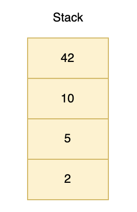
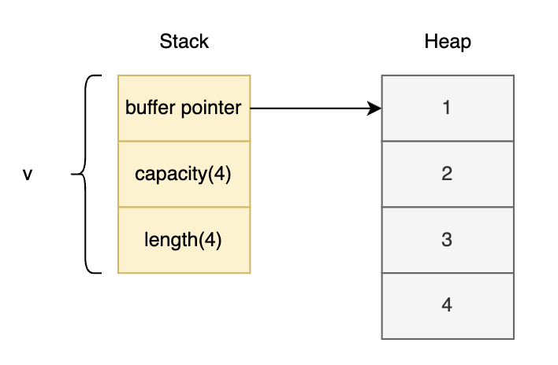
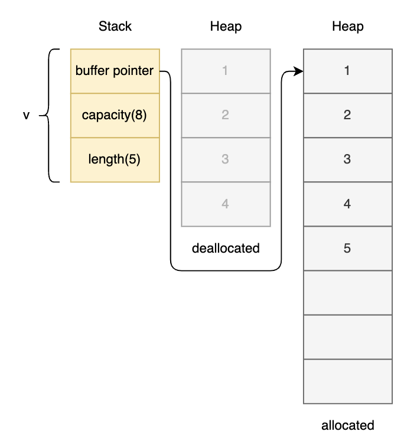
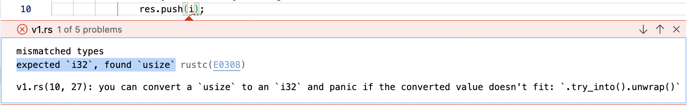

# My_Learning-Rust

Rust programming language

## Installation

### Linux or macOS

> Including VMs

- Install

```console
$ curl --proto '=https' --tlsv1.2 https://sh.rustup.rs -sSf | sh
```

Following tools get installed: `rustup`, `rustc`, `cargo`, `rustfmt`

> **Different release channels**
>
> - stable: stable, but has a 6-week stabilization period
> - beta: unstable, but has a 6-week stabilization period
> - nightly: unstable, but has the latest features
>
> `rustup` is for managing different rust toolchain versions for different targets/architectures (arm, x86, etc.)

```console
This will download and install the official compiler for the Rust
programming language, and its package manager, Cargo.

Rustup metadata and toolchains will be installed into the Rustup
home directory, located at:

  /Users/abhi3700/.rustup

This can be modified with the RUSTUP_HOME environment variable.

The Cargo home directory located at:

  /Users/abhi3700/.cargo

This can be modified with the CARGO_HOME environment variable.

The cargo, rustc, rustup and other commands will be added to
Cargo's bin directory, located at:

  /Users/abhi3700/.cargo/bin

This path will then be added to your PATH environment variable by
modifying the profile files located at:

  /Users/abhi3700/.profile
  /Users/abhi3700/.zshenv

You can uninstall at any time with rustup self uninstall and
these changes will be reverted.
```

- **Update** using `$ rustup update` [RECOMMENDED]
- Update to stable version: `$ rustup update stable`
- View installed version via `$ rustup show`
- Check latest version via `$ rustup check`
- install a **specific version** via `$ rustup install 1.64.0` or `$ rustup install 1.64.0-aarch64-apple-darwin`
- set a specific version via `$ rustup default 1.64.0` or `$ rustup override set 1.64.0`
- **Uninstall** using `$ rustup self uninstall`
- **lib**:
  - Show all available lib using `$ rustup component list`
  - Show all installed lib using `$ rustup component list --installed`
  - Install rust std lib using `$ rustup component add rust-src`
- **target**:
  - Show all available target using `$ rustup target list`
  - show all installed target using `$ rustup target list --installed`
  - Install rust target using `$ rustup target add <component-name>`. E.g. `$ rustup target add wasm32-unknown-unknown`
    > Here, `unknown` means that it is for any OS.
- After `cargo` installation, install `cargo-edit` for helping with edit, add, remove, upgrade, downgrade, and list dependencies in `Cargo.toml`

> Often, `cargo check` is much faster than `cargo build`, because it skips the step of producing an executable. If you’re continually checking your work while writing the code, using `cargo check` will speed up the process! As such, many Rustaceans run `cargo check` periodically as they write their program to make sure it compiles. Then they run `cargo build` when they’re ready to use the executable.

---

> NOTE: If there is any error related to `linker` with C, follow this:

> You will also need a linker, which is a program that Rust uses to join its compiled outputs into one file. It is likely you already have one. If you get linker errors, you should install a C compiler, which will typically include a linker. A C compiler is also useful because some common Rust packages depend on C code and will need a C compiler.

> On macOS, you can get a C compiler by running:

```console
xcode-select --install
```

## Repositories

- [calamine](https://github.com/tafia/calamine)

## [C++ vs Rust](./cpp_vs_rust.md)

## Getting Started

### Code

```rust
fn main() {
    println!("Hello World!");
}
```

### Compile

`cargo` can also be used for compiling the code.

```console
$ rustc hello.rs
```

### Output

```console
$ ./hello
```

## Practice

Put the code inside a file & link into `./src/main.rs`

## Concepts

- `..` used for range like `1..4` i.e. 1, 2, 3. But, if `1..=4` i.e. 1, 2, 3, 4
- There are different types of struct
  - normal struct: with parameters
  - unit struct: without parameters

> “Ownership is Rust’s most unique feature, and it enables Rust to make memory safety guarantees without needing a garbage collector.”

> <u>Borrow Checker</u>: You can move the data itself and give up ownership in the process, create a copy of the data and pass that along, or pass a reference to the data and retain ownership, letting the recipient borrow it for a while. The most appropriate approach depends entirely on the situation. Try [this](./tuts/functions/borrow_checker.rs)

> - **Stack** (fixed size like char, bool, int, array; less costly; quick to access by calling var like easy to copy the var) | **Heap** (variable size like string, vector, class; more costly; access var or object via pointer)

- By default, all the variables are defined as `immutable` equivalent to `const` in JS/TS.
- In Rust, borrowing is analogous to referencing in C++ & dereferencing is same as that of C++.
- The value of mutable variable can be changed, but not the type.
- In Rust, every value has a single owner that determines its lifetime.
- The memory of the declared variables are dropped (or freed) when the program leaves a block in which the variable is declared.
  - E.g. Normally, inside the `main` function, whenever a variable is defined, it is dropped after exiting the `main` function.

```rs
fn main() {
    // Case-1
    let x = 10;
    let r = &x;

    let k;
    {
        let y = Box::new(5);            // Using Box pointer for storing into heap
        let y = 5;              // stored in stack
        // let y <'a> = 5;
        // k = &y;         // y dropped here as it is not available for lifetime. Moreover the block is getting over after this
        k = y;          // this implies that the ownership of 5 is transferred to `k` from `y`
    }
}
```

- Rust doesn't allow _dangling pointer_ by design. This means that any variable, struct, enum, etc can't live more than the lifetime of the referenced type

```rs
struct Config {

}

// INCORRECT ❌
struct App {
    config: &Config     // `Config` used as reference
}

// CORRECT ✅
/// Here, it is used as lifetime ownership of the code.
struct App<'a> {
    config: &'a Config
}
```

- `lifetimes` are a compile-time feature and don’t exist at runtime.
- Rust memory safety is based on this rule: Given an object T, it is only possible to have one of the following:
  - Having several immutable references (&T) to the object (also known as aliasing).
  - Having one mutable reference (&mut T) to the object (also known as mutability).
- Apply `#[derive(Debug)]` for making the struct, enum printable
- Apply `#[derive(Clone)]` for making the struct, enum copyable.
- `Option` vs `Result`

| Option                                                                                                                                                                                  | Result                                                                                                                             |
| --------------------------------------------------------------------------------------------------------------------------------------------------------------------------------------- | ---------------------------------------------------------------------------------------------------------------------------------- |
| Some or None                                                                                                                                                                            | Ok or Err                                                                                                                          |
| An optional value can have either Some value or no value/ None.                                                                                                                         | A result can represent either success/ Ok or failure/ Err                                                                          |
| The Option type is a way to use Rust’s type system to express the possibility of absence                                                                                                | Result expresses the possibility of error                                                                                          |
| mainly used for var, function output. For struct, the parameters can have Option type. E.g. In full name, middle_name can be missing for cases, so define `middle_name: Option<String>` | mainly used for operation, function. As normally a variable won't have Err unless there is some calculation involved with this var |
| Don't want to print the exact issue as `None` doesn't have anything as param unlike `Some(T)`                                                                                           | Want to print the exact issue as `Err(E)` contains the message inside                                                              |
| E.g. "./tuts/error_handling/opt"                                                                                                                                                        | E.g. "./tuts/error_handling/res"                                                                                                   |

### Primitive types and Variables

1. Various sizes of integers, signed and unsigned (i32, u8, etc.)
1. Floating point types f32 and f64.
1. Booleans (bool)
1. Characters (char). Note these can represent unicode scalar values (i.e. beyond ASCII)

> `usize`: the size is dependent on the kind of computer your program is running on: 32 bits if you’re on a 32-bit architecture and 64 bits if you’re on a 64-bit architecture.

---

### Print

- 1. formatting variables inside `println` function

```
let name = "Abhijit";
let age = 28;

println!("My name is {name}, and age is {age}");					// ❌
println!("My name is {0}, and age is {1}", name, age);		// ✔️
println!("My name is {}, and age is {}", name, age);			// ✔️
```

- 2. Multiple usage of variables without repetition

```
let alice = "Alice";
let bob = "Bob";

println!("{0}, this is {1}. {1}, this is {0}", alice, bob);
```

---

### Attributes

- `#[allow(unused)]` - to ignore the warning for unused variable

### Pointer

- `Box<T>` - A pointer type for heap allocation

  > By default, in Rust variables are stored in stack. But, if we want to store in heap, we can use `Box<T>` pointer. This is similar to `new` keyword in JS/TS.

- Box is basically used for:
  - For dynamic allocation of memory for variables.
  - When there is a lot of data that we need to transfer ownership and we don’t want that they are copied.

### Array

- Arrays are fixed length. They are stored in stack.
- E.g.

  ```rs
  let array: [i32; 4] = [42, 10, 5, 2];
  ```

  

### Vector

- Vectors are dynamic length. They are stored in heap.
- They are allocated/deallocated based on the capacity of the vector filled.
- In this code:

  ```rs
  //! step-1
  let mut v: Vec<i32> = vec![1, 2, 3, 4];
  //prints 4
  println!("v's capacity is {}", v.capacity());
  println!("v's length is {}", v.len());  // -> 4
  println!("Address of v's first element: {:p}", &v[0]); //{:p} prints the address
  v.push(5);

  //! step-2
  //prints 8
  println!("v's capacity is {}", v.capacity());
  println!("v's length is {}", v.len());  // -> 5
  println!("Address of v's first element: {:p}", &v[0]);
  ```

  **At step-1**:

  

  **At step-2**:

  

> If you do not see a different address after pushing more elements onto a vector, it might be because the allocator had enough space at the end of the original buffer such that the new and the old buffers have the same starting address. Try pushing more elements and you will see a different address. Read about C library function `realloc` to understand how this might happen.

### Conditional

In Rust, `match` is used more often than `if-else`.

### Modules

- any folder can have a `mod.rs` which is going to be like `index.js` in JS.
- tree structure is as follows:

```bash
src/
├── main.rs
└── something
    ├── a.rs
    ├── b.rs
    └── mod.rs
```

When `Rust` check for `something.rs` and doesn't find it will check for the folder `something/` and then inside look for a file named `mod.rs`.

We can call `a` like this in the `main.rs`:

```rs
use crate::something::a::*;
use crate::something::b::*;
```

### Trait

- A trait is a collection of methods that are defined for an unknown type: `Self`. They can access other methods declared in the same trait.
- "Indeed, traits are more like interfaces than classes. You don't store "fields" or "data" in a trait, you describe functionality in it. You would put your data in another type declaration, like a struct or an enum. Then you would externally implement your trait for that struct or enum, etc. In order to achieve a true object-oriented style, you'll need to use traits and you want to compose them in a way that allows them to be used as "trait objects". This means that each fn in the trait needs to have &self of &mut self, basically "getters" and "setters" for your "object"."

- `&self` - used as getter
- `&mut self` - used as setter
- return self like this - `fn build(&self) -> Self`
- implement multiple traits for a struct using `#[derive(Debug, Clone, ....)]`:

  ```rs
  #[derive(Debug, Clone, Copy, Eq, PartialEq)]
  struct Person {
      name: String,
      age: u8,
  }
  ```

- trait can be defined implemented for `enum`, `struct`, etc. Anything which contains data (const, variable). `enum` contains `const` data and `struct` contains `variable` data.

  ```rs
  enum TrafficLight {
      Red,
      Yellow,
      Green,
  }
  impl TrafficLight {
      fn duration(&self) -> u8 {
          match self {
              TrafficLight::Red => 30,
              TrafficLight::Yellow => 10,
              TrafficLight::Green => 60,
              _ => 0,
          }
      }
  }
  ```

  ```rs
  struct TrafficLight {
      color: String,
  }
  impl TrafficLight {
      fn duration(&self) -> u8 {
          match self.color.as_str() {
              "Red" => 30,
              "Yellow" => 10,
              "Green" => 60,
              _ => 0,
          }
      }
  }
  ```

  The eg above shows how the single trait is used for both `struct` & `enum` data type in Rust.

### Generics

Generics are a way to reduce the need to write repetitive code and instead delegate this task to the compiler while also making the code more flexible. Many languages support some way to do this, even though they might call it something different.

Using generics, we can write code that can be used with multiple data types without having to rewrite the same code for each data type, making life easier and coding less error-prone.

### lib or bin

- `$ cargo init --lib <name>` creates a lib
- `$ cargo init <name>` creates a package

### Move | Copy | Clone

Refer [this](./tuts/move_copy_clone)

## Miscellaneous

Picked from this [book: Rust Design Patterns](https://rust-unofficial.github.io/patterns/intro.html)

### Idioms

#### Use Borrowed types for arguments

```rs
&String -> &str
&Vec<T> -> &[T]
&Box<T> -> &T
```

[Code](./pro/three_vowels/)

[Reference](https://rust-unofficial.github.io/patterns/idioms/coercion-arguments.html)

#### Concatenate strings with format

```rs
format!("{} World!", s1)
```

[Code](./pro/concat_str/)

[Reference](https://rust-unofficial.github.io/patterns/idioms/concat-format.html)

## Tools

- Check behind-the-code for a code snippet - https://play.rust-lang.org/
  - Tools >> Expand Macros

## Fields

### Application Development

- Best 2:
  1. **Rocket** (good docs) [Familiar]
  2. **Actix_web** (under development) [Recommended]
     > `2` is much faster than `1` in terms of performance. Infact, it is closer to [`drogon-core (in C++)`](https://github.com/drogonframework/drogon)

### Blockchain

### AI | ML | DL

### Embedded Systems

### Data Science

## Troubleshoot

### 1. warning: path statement with no effect

- _Cause_: there is a statement having no effect
- _Solution_: Assign the variable to `_`.

Before:

```rs
    let result = match grade {
        "A" => { println!("Excellent!"); },
        "B" => { println!("Great!"); },
        "C" => { println!("Good"); },
        "D" => { println!("You passed"); },
        "F" => { println!("Sorry, you failed"); },
        _ => { println!("Unknown Grade"); }
    };

    result;
```

After:

```rs
    let result = match grade {
        "A" => { println!("Excellent!"); },
        "B" => { println!("Great!"); },
        "C" => { println!("Good"); },
        "D" => { println!("You passed"); },
        "F" => { println!("Sorry, you failed"); },
        _ => { println!("Unknown Grade"); }
    };

    // result;             // warning: path statement with no effect, Solution --> assign to `_`
    let _ = result;

```

### 2. warning: variant is never constructed, error[E0277]: `UsState` doesn't implement `Debug`

- _Cause_: It simply means that the variant is never used, "constructed", anywhere in your program. There is no `AppAction::Task` anywhere in the program. Rust expects that if you say an enum variant exists, you will use it for something somewhere.
- _Solution_: by putting this before the enum, or individually before intentionally unused items, you can make the warning disappear:

Before:

```rs
enum UsState {
	California,
	Mexico,
	Alaska,
}

enum Coin {
	Penny,
	Nickel,
	Dime,
	Quarter,
	Custom(UsState),
}
```

After:

```rs
#[allow(dead_code)]
#[derive(Debug)]		// this use is recommended, otherwise there is error.
enum UsState {
	California,
	Mexico,
	Alaska,
}

#[allow(dead_code)]
enum Coin {
	Penny,
	Nickel,
	Dime,
	Quarter,
	Custom(UsState),
}
```

### 3. Error: "move occurs...which does not implement the Copy trait"

- _Cause_: Copy designates types for which making a bitwise copy creates a valid instance without invalidating the original instance.

This isn't true for String, because String contains a pointer to the string data on the heap and assumes it has unique ownership of that data. When you drop a String, it deallocates the data on the heap. If you had made a bitwise copy of a String, then both instances would try to deallocate the same memory block, which is undefined behaviour.

- _Solution_: Just use `format` like this:

Before:

```rs
impl Detail for Car {
    fn brand(&self) -> String {
        return self.brand;
    }
    fn color(&self) -> String {
        return self.color;
    }
}
```

After:

```rs
impl Detail for Car {
    fn brand(&self) -> String {
        // using `format` instead of directly returning the brand bcoz it throws error:
        // "move occurs because `self.brand` has type `String`, which does not implement the `Copy` trait"
        return format!("{}", self.brand);
    }
    fn color(&self) -> String {
        return format!("{}", self.color);
    }
}
```

### 4. Error: mismatched types expected `i32`, found `usize`

_Cause_: Because of type mismatch


_Solution_: Just typecast it as the required type

```rs
res.push(i as i32);
```

## References

- [Rust by example](https://doc.rust-lang.org/stable/rust-by-example/)
- [Book: The Rust Programming Language](https://doc.rust-lang.org/book/)
- [Rust for Haskell Programmers!](https://mmhaskell.com/rust)
  - [Part 1: Basic Syntax](https://www.mmhaskell.com/rust/syntax)
  - [Part 2: Managing Memory](https://www.mmhaskell.com/rust/memory)
  - [Part 3: Data Types](https://www.mmhaskell.com/rust/data)
  - [Part 4: Cargo Package Manager](https://www.mmhaskell.com/rust/cargo)
  - [Part 5: Collections and Lifetimes](https://www.mmhaskell.com/rust/lifetimes)
- [Learn Rust Documentation](https://learning-rust.github.io/)
- [Rustlings](https://github.com/rust-lang/rustlings)
- [24 days of Rust](https://zsiciarz.github.io/24daysofrust/index.html)
- [Learn Rust by aml3](https://aml3.github.io/RustTutorial/html/toc.html)
- [Rust for C++ programmers](https://github.com/nrc/r4cppp)
- [Learn Rust by KODERHQ](https://www.koderhq.com/tutorial/rust/)
- [Learn Rust by Practical Projects](https://www.youtube.com/watch?v=LPzx2Fzd7Vs&list=PLK_g1a_cAfaZDdybJzwI1m7AVl4tSo87Z)
- [Learn Rustlings](https://www.youtube.com/watch?v=VZnfLBmc_Oo&list=PLSbgTZYkscaoV8me47mKqSM6BBSZ73El6&index=12)
- [Learn Rust by Book via Video](https://www.youtube.com/watch?v=5QsEuoIt7JQ&list=PLSbgTZYkscaoV8me47mKqSM6BBSZ73El6&index=1)
- [Hashrust Blogs](https://hashrust.com/blog/)
- [LogRocket Blogs](https://blog.logrocket.com/tag/rust/)

### Blogs

- [What is Rust and why is it so popular?](https://stackoverflow.blog/2020/01/20/what-is-rust-and-why-is-it-so-popular/)
- [Understanding the Rust borrow checker](https://blog.logrocket.com/introducing-the-rust-borrow-checker/)
- [No auto type deduction for function, but for local variable](https://stackoverflow.com/questions/24977365/differences-in-type-inference-for-closures-and-functions-in-rust)
- [Including Files and Deeply Directories in Rust](https://hackernoon.com/including-files-and-deeply-directories-in-rust-q35o3yer)
- [Understand Rust Ownership model by thoughtram](https://blog.thoughtram.io/rust/2015/05/11/rusts-ownership-model-for-javascript-developers.html)
- [Memory Safety in Rust: A Case Study with C](https://willcrichton.net/notes/rust-memory-safety/)
- [Ownership in Rust by thoughtram](https://blog.thoughtram.io/ownership-in-rust/)
- [References in Rust by thoughtram](https://blog.thoughtram.io/references-in-rust/)
- [Iterators in Rust by thoughtram](https://blog.thoughtram.io/iterators-in-rust/)
- [Lifetimes in Rust by thoughram](https://blog.thoughtram.io/lifetimes-in-rust/)
- [Creating a Rust Web App with Rocket and Diesel](https://itnext.io/creating-a-rust-web-app-with-rocket-and-diesel-58f5f6cacd27)
- [Understanding Rust generics and how to use them](https://blog.logrocket.com/understanding-rust-generics/)
