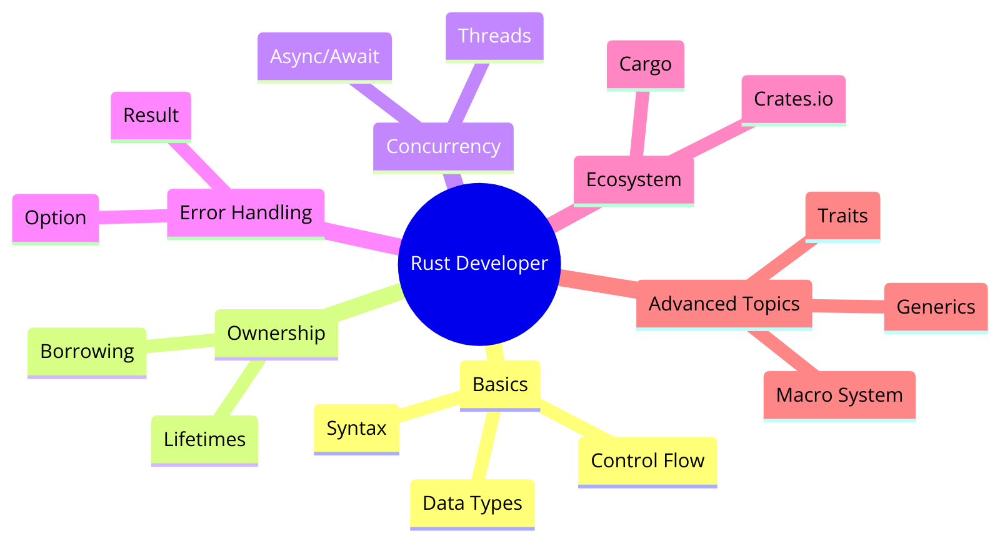

# My_Learning-Rust

Rust 🦀 programming language learning.

<kbd>**[Cheatsheet](https://cheats.rs/)**</kbd>

<kbd>**Mindmap**</kbd>:



## Installation

For Linux or macOS

> Including VMs

### Compiler

Following tools get installed: `rustup`, `rustc`, `cargo`, `rustfmt`

> **Different release channels**
>
> - stable: stable, but has a 6-week stabilization period
> - beta: unstable, but has a 6-week stabilization period
> - nightly: unstable, but has the latest features
>
> `rustup` is for managing different rust toolchain versions for different targets/architectures (arm, x86, etc.)

```bash
curl https://sh.rustup.rs -sSf | sh

This will download and install the official compiler for the Rust
programming language, and its package manager, Cargo.

Rustup metadata and toolchains will be installed into the Rustup
home directory, located at:

  /Users/abhi3700/.rustup

This can be modified with the RUSTUP_HOME environment variable.

The Cargo home directory located at:

  /Users/abhi3700/.cargo

This can be modified with the CARGO_HOME environment variable.

The cargo, rustc, rustup and other commands will be added to
Cargo's bin directory, located at:

  /Users/abhi3700/.cargo/bin

This path will then be added to your PATH environment variable by
modifying the profile files located at:

  /Users/abhi3700/.profile
  /Users/abhi3700/.zshenv

You can uninstall at any time with rustup self uninstall and
these changes will be reverted.
```

### Editor

Use VSCode.

**Extensions**:

[Source](https://www.becomebetterprogrammer.com/rust-recommended-vscode-extensions/)

- [rust-analyzer](https://marketplace.visualstudio.com/items?itemName=rust-lang.rust-analyzer)

  ```json
    "[rust]": {
      "editor.defaultFormatter": "rust-lang.rust-analyzer",
      "editor.formatOnSave": true
    },
  ```

- [CodeLLDB](https://marketplace.visualstudio.com/items?itemName=vadimcn.vscode-lldb)
- [Error Lens](https://marketplace.visualstudio.com/items?itemName=usernamehw.errorlens) [OPTIONAL]
- [Better TOML](https://marketplace.visualstudio.com/items?itemName=bungcip.better-toml)
- [Even Better TOML](https://marketplace.visualstudio.com/items?itemName=tamasfe.even-better-toml)

The list might get updated over the time. Refer to your VSCode extension list.

---

An ideal setup for a rust code (with tests) would be:


So, here on left terminal, we have `$ cargo watch -x run` running, which will watch for changes in the project and automatically run. On right terminal, we have `$ cargo watch -x test` running, which will watch for changes in the project and automatically test.

## Commands

### `rustup`

- set `stable` as default toolchain via `$ rustup default stable`
- set `nightly` as default toolchain via `$ rustup default nightly`
- set `nightly` as default toolchain for a specific project via `$ rustup override set nightly`
  > If any repository has `rust-toolchain.toml` file present, then the toolchain version mentioned in the file will be used for that project if you have already switched to that toolchain.
- All the rust binaries are installed in this folder `$HOME/.cargo/bin`
- **Update** all channels using `$ rustup update` [RECOMMENDED]

  ```sh
  stable-aarch64-apple-darwin updated - rustc 1.72.1 (d5c2e9c34 2023-09-13) (from rustc 1.72.0 (5680fa18f 2023-08-23))
  beta-aarch64-apple-darwin updated - rustc 1.74.0-beta.1 (b5c050feb 2023-10-03) (from rustc 1.73.0-beta.3 (bc28abf92 2023-08-27))
  nightly-aarch64-apple-darwin updated - rustc 1.75.0-nightly (187b8131d 2023-10-03) (from rustc 1.74.0-nightly (84a9f4c6e 2023-08-29))
  ```

  - And then need to set the latest `rustc` & `cargo` for individual channels: `stable`, `beta`, `nightly`
    - `$ rustup default stable-aarch64-apple-darwin`
    - `$ rustup default beta-aarch64-apple-darwin`
    - `$ rustup default nightly-aarch64-apple-darwin`
- Update the toolchain (of stable channel): `$ rustup update stable`
- Update all toolchains (irrespective of channel): `$ rustup update`
- View installed version via `$ rustup show`
- Check if there is any latest version using `$ rustup check`
- install a **specific version** via `$ rustup install 1.64.0` or `$ rustup install 1.64.0-aarch64-apple-darwin`
- set a specific version in the already set channel via `$ rustup default 1.64.0` or `$ rustup override set 1.64.0`
- **Uninstall** rustup using `$ rustup self uninstall`
- **toolchains**:
  - List all installed toolchains using `$ rustup toolchain list`
  - Install a toolchain using `$ rustup toolchain install <toolchain-name-w-version-arch-developer>`. E.g. `$ rustup toolchain install 1.70.0-aarch64-apple-darwin`
  - Uninstall a toolchain using `$ rustup toolchain uninstall <toolchain-name-w-version-arch-developer>`. E.g. `$ rustup toolchain uninstall 1.70.0-aarch64-apple-darwin`
  -
- **lib**:
  - Show all available lib using `$ rustup component list`
  - Show all installed lib using `$ rustup component list --installed`
  - Install rust std lib using `$ rustup component add rust-src`
- **target** (for a toolchain):
  - Show all available target using `$ rustup target list`
  - show all installed target using `$ rustup target list --installed`
  - Install rust target using `$ rustup target add <component-name>`. E.g. `$ rustup target add wasm32-unknown-unknown`
    > Here, `unknown` means that it is for any OS.
- Some components to be installed
  - clippy: `$ rustup component add clippy`
  - rustfmt: `$ rustup component add rustfmt`
  - rust-src: `$ rustup component add rust-src`
  - docs: `$ rustup component add rust-docs`

### `cargo`

- `$ cargo new <package-folder-name>`: Create a new project with folder & package named as given.
  - `$ cargo new hello`: Create a project folder named 'hello' & the package name as `hello` in `Cargo.toml` file.
- `$ cargo new <folder-name> --name <package-name>`: Create a new project with folder name different than the package name.
  - `$ cargo new demo --name game-demo`: Here, `demo` is the folder name whereas the package name is `game-demo` in `Cargo.toml` file.
- `$ cargo add <package-name>`: add package to `[dependencies]` locally into the rust project. E.g. `$ cargo add dotenv`.
- `$ cargo add <package-name> --dev`: add package to `[dev-dependencies]` locally into the rust project. E.g. `$ cargo add hex-literal --dev`.
- `$ cargo install --list`: list globally installed packages via .
- `$ cargo update`: This command will update dependencies in the Cargo.lock file to the latest version. If the Cargo.lock file does not exist, it will be created with the latest available versions.
- `$ cargo install --path <path/to/folder/containing/Cargo.toml>`: install the binaries in by default `/target/release` (by default) folder . This will install the binary in the `~/.cargo/bin` folder. In case of workspace, parse the path of the bin folder containing `Cargo.toml` file.
  - After this, if you want to uninstall the binary, then you can do it via `$ cargo uninstall <bin-name>`. Suppose, you installed a binary named `hello` via `$ cargo install --path <path/to/folder/containing/Cargo.toml>`, then you can uninstall it via `$ cargo uninstall hello`.
- Install `cargo-edit`: for helping with edit, add, remove, upgrade, downgrade, and list dependencies in `Cargo.toml`
- Install `cargo-watch`: via `$ cargo install cargo-watch`.
  - Watch for changes in the project and automatically run via `$ cargo watch -x run`
  - Watch for changes in the project and automatically test via `$ cargo watch -x test`
- `cargo-expand`: install via `$ cargo install cargo-expand`. more [here](./libs/expanded_rust/README.md)
- `cargo-audit`: install via `$ cargo install cargo-audit`.
- `$ cargo +nightly build`: build using `nightly` toolchain for a project
- `$ cargo build --release`: build a release (optimized) version of a project

  > Often, `cargo check` is much faster than `cargo build`, because it skips the step of producing an executable. If you’re continually checking your work while writing the code, using `cargo check` will speed up the process! As such, many Rustaceans run `cargo check` periodically as they write their program to make sure it compiles or they depend on `rust-analyzer` (sometimes not accurate as exprienced in big blockchain codebase like substrate where `target/` folder is 25 GB+) Then they run `cargo build` when they’re ready to use the executable.

- `$ cargo test`: run all the tests in a project & also captures the output by default. That means output from `println!` won't be shown when run.
- `$ cargo test -- --nocapture`: run all the tests in a project & doesn't capture the output. That means output from `println!` would be shown when run.
- `$ cargo test <module-name>::<test-function-name>` run a specific test function in a module. E.g. `$ cargo test tests::test_add_two_and_two` for rust code:

  ```rust
  #[cfg(test)]
  mod tests {
      #[test]
      fn test_add_two_and_two() {
          assert_eq!(4, add_two_and_two());
      }

      fn add_two_and_two() -> i32 {
          4
      }
  }
  ```

  - if there is a single or a few test function(s) then it is better to use `#[test]` attribute. But, if there are many test functions, then it is better to use `#[cfg(test)]` attribute to put into module.
- View the dependency graph of a project using `$ cargo tree`
- **Publish** a crate to [crates.io](https://crates.io/) via `$ cargo publish`

  - Each crate has a limit of 10 MB in size for each version.
  - `$ cargo publish --dry-run` won't upload, just check if everything is fine.
  - `$ cargo publish` will upload the crate to crates.io
  - crates **can't be deleted**, but can be yanked i.e. a particular version can be removed from crates.io
    - `$ cargo yank --version 1.0.1` will yank the version `1.0.1` from crates.io
    - `$ cargo yank --version 1.0.1 --undo` will undo the yank
  - `cargo owner` can add/remove owner (individual or team)

  ```sh
  cargo owner --add github-handle
  cargo owner --remove github-handle
  cargo owner --add github:rust-lang:owners
  cargo owner --remove github:rust-lang:owners
  ```

- Add workspace member(s) to manage multiple projects inside one rust project (containing `Cargo.toml` file):

  - `$ mkdir hello`
  - `$ cd hello`
  - `$ touch Cargo.toml`
  - Add this to `Cargo.toml` file:

  ```toml
  [workspace]
  members = ["project1", "project2", "project3"]
  resolver = "2"
  ```

  > Here, `resolver` is added to ensure that all the members/projects follow rust 2021 or else, set to "1".

  - `$ cargo new project1`
  - `$ cargo new project2`
  - `$ cargo new project3`
  - `$ cargo build`: Build the workspace

  > Now, you would also view the linting in all repos.

- <u>Make Binary inside lib</u>: Any file (with `main` function) inside a cargo lib project can be defined as binary for easy call via `target/release/<bin>`

  For instance, inside a cargo project, the project folder looks like this:

  <details><summary>folder structure:</summary>

  ```sh
  └── src
    ├── accumulator.rs
    ├── bn_solidity_utils.rs
    ├── client
    │   └── main.rs
    ├── constants.rs
    ├── contracts
    │   ├── Semacaulk.json
    │   ├── Verifier.json
    │   ├── format
    │   ├── foundry.toml
    │   ├── lib
    │   ├── mod.rs
    │   ├── script
    │   ├── sol
    │   └── tests
    ├── demo
    │   └── main.rs
    ├── error.rs
    ├── gates
    │   ├── gate_sanity_checks.rs
    │   ├── mod.rs
    │   ├── tests.rs
    │   └── utils.rs
    ├── keccak_tree
    │   └── mod.rs
    ├── kzg.rs
    ├── layouter
    │   └── mod.rs
    ├── lib.rs
    ├── mimc7.rs
    ├── multiopen
    │   ├── mod.rs
    │   ├── prover.rs
    │   └── verifier.rs
    ├── prover
    │   ├── mod.rs
    │   ├── precomputed.rs
    │   ├── prover.rs
    │   └── structs.rs
    ├── rng.rs
    ├── setup
    │   ├── main.rs
    │   ├── mod.rs
    │   └── tests.rs
    ├── tests
    │   ├── mod.rs
    │   └── prover_and_verifier.rs
    ├── transcript.rs
    ├── utils.rs
    └── verifier
        └── mod.rs
  ```

  </details>

  Now, inside the main `Cargo.toml` file, all the required binary could be added like this:

  ```toml
  [[bin]]
  edition = "2021"
  name = "setup"
  path = "src/setup/main.rs"

  [[bin]]
  edition = "2021"
  name = "demo"
  path = "src/demo/main.rs"

  [[bin]]
  edition = "2021"
  name = "client"
  path = "src/client/main.rs"
  ```

  Now, you can call `/target/release/client` to call the client program.

  [Repo as reference](https://github.com/geometryresearch/semacaulk).

---

> NOTE: If there is any error related to `linker` with C, follow this:

> You will also need a linker, which is a program that Rust uses to join its compiled outputs into one file. It is likely you already have one. If you get linker errors, you should install a C compiler, which will typically include a linker. A C compiler is also useful because some common Rust packages depend on C code and will need a C compiler.

> On macOS, you can get a C compiler by running:

```console
xcode-select --install
```

## CI/CD (Github Actions)

Create a `.github/workflows/rust-ci.yml` file.

The file should contain this:

```yml
jobs:
  build:
    runs-on: ubuntu-latest
    steps:
      - name: Set up Rust
        uses: actions/checkout@v2
      - name: Install cargo-audit
        run: cargo install cargo-audit
      - name: Build
        run: cargo build --verbose
      - name: Test
        run: cargo test --verbose
      - name: Clippy
        run: cargo clippy --verbose -- -D warnings
      - name: Audit
        run: cargo audit
```

## Crates

Important ones.

- [serde](https://crates.io/crates/serde)
- [serde_json](https://crates.io/crates/serde_json)
- [thiserror](https://crates.io/crates/thiserror)
- [eyre](https://crates.io/crates/eyre)
- [log & env_logger](https://crates.io/crates/env_logger)
- [tokio](https://crates.io/crates/tokio)

For more, see [here](https://blessed.rs/crates).

## Repositories

- [calamine | Rust Excel/OpenDocument SpreadSheets file reader: rust on metal sheets](https://github.com/tafia/calamine)
- [DSLCad](https://github.com/DSchroer/dslcad): DSLCad is a programming language & interpreter for building 3D models.
- [Implementation of the Ethereum precompiled contracts in Rust](https://github.com/ewasm/ewasm-precompiles)
- [A new markup-based typesetting system that is powerful and easy to learn] (<https://github.com/typst/typst>)
- [Twilio Sendgrid Unofficial library to send OTP, tokens to email](https://crates.io/crates/sendgrid)
- [Plotly charts lib for Rust](https://github.com/igiagkiozis/plotly)
- [LLM-chain](https://github.com/sobelio/llm-chain)
- [GeoRust: A collection of geospatial tools and libraries written in Rust](https://github.com/georust)
- [Blake3 crypto lib (Official)](https://github.com/BLAKE3-team/BLAKE3)
- [SHA3 crypto lib](https://crates.io/crates/sha3)
  - [documentation](https://docs.rs/sha3/latest/sha3/)
- [Collection of cryptographic hash functions written in pure Rust](https://github.com/RustCrypto/hashes)
  > Blake3 ❌
- [Easy implementation using GeoUtils](https://github.com/srishanbhattarai/geoutils)
  > Both formula covered: [Vincenty's Inverse Formula](https://en.wikipedia.org/wiki/Vincenty%27s_formulae), [Haversine Formula](https://en.wikipedia.org/wiki/Haversine_formula).

## [C++ vs Rust](./cpp_vs_rust.md)

## Getting Started

### Code

```rust
fn main() {
    println!("Hello World!");
}
```

### Build

`cargo` can also be used for compiling a project like `node` in NodeJS project.

```sh
rustc hello.rs
```

```sh
cargo build
```

### Output

```console
./hello
```

## Practice

Put the code inside a `.rs` file & link into [`./tuts/src/main.rs`](./tuts/src/main.rs) using `#[path= "path/to/file"]` macro.

## Concepts

> “Ownership is Rust’s most unique feature, and it enables Rust to make memory safety guarantees without needing a garbage collector.”

- By default, all the variables are defined as `immutable` equivalent to `const` in JS/TS.
- In Rust, borrowing is analogous to referencing in C++ & dereferencing is same as that of C++.
- The value of mutable variable can be changed, but not the type.
- In Rust, every value has a single owner that determines its lifetime.
- Rust has preferred **composition** over **inheritance**. That's why in Rust, we use traits to define shared behavior.

### Primitive types and Variables

1. Various sizes of integers, signed and unsigned (i32, u8, etc.)
1. Floating point types f32 and f64.
1. Booleans (bool)
1. Characters (char). Note these can represent unicode scalar values (i.e. beyond ASCII)

> `usize`: the size is dependent on the kind of computer your program is running on: 32 bits if you’re on a 32-bit architecture and 64 bits if you’re on a 64-bit architecture.

---

### str vs String

| str                                                                       | String                                                                     |
| ------------------------------------------------------------------------- | -------------------------------------------------------------------------- |
| Primitive Type                                                            | Built-in struct                                                            |
| Doesn’t have ownership of the string as it is typically used by reference | Has ownership of the string                                                |
| It is a string slice                                                      | It is a growable array                                                     |
| Size known at compile time                                                | Size is unknown at compile time                                            |
| Data allocated in the data segment of the application binary              | Data allocated in a heap                                                   |
| Uses & or reference to assign a str value to a variable                   | Not need need to use & or reference to assign a String value to a variable |

---

- `&str` to `String` is always an expensive operation, as it is owned with a `String` type.

  ```rs
  let name: &str = "Abhijit Roy"
  let name_String: String = name.to_string(); // used `to_string()` to convert from `&str` to `String` type
  ```

- `String` to `&str` is a cheap operation, as it is borrowed with a `&str` type.

  ```rs
  let name: String = "Abhijit Roy"
  let name_String: &str = &name; // used `&` to convert from `String` to `&str` type
  ```

- The following function is more expensive than the latter.

  ```rs
  fn main() {
      let my_str: &str = "This is a str";

      // converting the str to String is an expensive operation
      print_data(&my_str.to_string());

      print!("printing inside main {}", my_str);
  }

  fn  print_data(data: &String) {
      println!("printing my data {} ", data);
  }
  ```

  ```rs
  fn main() {
      let my_string: String = String::from("Understanding the String concept?");

      print_data(&my_string);

      print!("printing inside main {}", my_string);
  }

  fn  print_data(data: &str) {
      println!("printing my data {} ", data);
  }
  ```

  [Source](https://www.becomebetterprogrammer.com/rust-string-vs-str/)

### Print

- 1. formatting variables inside `println` function

```rs
let name = "Abhijit";
let age = 28;

println!("My name is {name}, and age is {age}");        // ❌
println!("My name is {0}, and age is {1}", name, age);  // ✔️
println!("My name is {}, and age is {}", name, age);    // ✔️
```

- 2. Multiple usage of variables without repetition

```rs
let alice = "Alice";
let bob = "Bob";

println!("{0}, this is {1}. {1}, this is {0}", alice, bob);
```

---

### Attributes

Here, each aforementioned cases like unused variables, dead code, means something (shown on hover) like this:


This means "allow unused imports". Hence, the compiler will not show any warning for unused variable.

---


This means "not to allow detecting dead code". Hence, the compiler will not show warning for dead code.

---

As code example, see this:

```rust
//! This won't show any warning for unused import.

#[allow(unused_imports)]
use std::io::{self, Write};
```

### Pointer

- `Box<T>` - A pointer type for heap allocation

  > By default, in Rust variables are stored in stack. But, if we want to store in heap, we can use `Box<T>` pointer. This is similar to `new` keyword in JS/TS.

- Box is basically used for:
  - For dynamic allocation of memory for variables.
  - When there is a lot of data that we need to transfer ownership and we don’t want that they are copied.

---

#### Mutex

Mutex stands for Mutual Exclusion, and it's a synchronization primitive used to protect shared data in concurrent programming. In the context of Rust, the `std::sync::Mutex` type provides a mechanism for multiple threads to mutually exclude each other from accessing some particular data.

Let's imagine we have a book 📚 (representing the shared data), and we have two friends 👥 (representing two threads). They both want to write in the book 📚 at the same time.

The book 📚 is our shared data that both friends 👥 want to modify. We can't have both friends 👥 writing in the book 📚 at the same time, because that would create a mess. We need some way to ensure that only one friend 👥 can write in the book 📚 at a time. That's where our Mutex comes in!

A mutex is like a key 🔑 to the book 📚. When a friend 👥 has the key 🔑, they can write in the book 📚. When they're done, they give the key 🔑 back, and the other friend 👥 can take the key 🔑 to write in the book 📚.

Here is how it works in code:

```rust
use std::sync::Mutex;

let m = Mutex::new(5);  // Here we are creating our book 📚 with a number 5 inside it.

{
    let mut num = m.lock().unwrap();  // One of our friends 👥 takes the key 🔑.
    *num = 6;  // They change the number in the book 📚 from 5 to 6.
}  // The friend 👥 gives back the key 🔑 when they are done.

println!("m = {:?}", m);  // Now the book 📚 has number 6 inside it.
```

In this example, the friend 👥 is able to take the key 🔑 (acquire the lock) by calling `m.lock()`. They can then modify the data (write in the book 📚) by dereferencing `num` to get access to the data. When they're done, they give the key 🔑 back automatically because Rust's scoping rules will drop the `MutexGuard` (represented by `num`) at the end of the scope, which releases the lock.

It's important to remember that if a friend 👥 forgets to give back the key 🔑 (doesn't release the lock), the other friend 👥 will be left waiting indefinitely, unable to write in the book 📚. This is called a deadlock, and it's a common problem in concurrent programming that you should try to avoid.

This is a simplified view of mutexes in Rust, but hopefully, it helps you understand the basic concept. For more complex scenarios, you'll want to learn about things like error handling with `Result`, using `Condvar` for condition variables, and understanding the different methods available on `Mutex` and `MutexGuard`.

### Memory: stack, heap

> - **Stack** (fixed size like char, bool, int, array; less costly; quick to access by calling var like easy to copy the var)
>
> - **Heap** (variable size like string, vector, class; more costly; access var or object via pointer)

- The memory of the declared variables are dropped (or freed) when the program leaves a block in which the variable is declared.
  - E.g. Normally, inside the `main` function, whenever a variable is defined, it is dropped after exiting the `main` function.

```rs
fn main() {
    // Case-1
    let x = 10;
    let r = &x;

    let k;
    {
        let y = Box::new(5);            // Using Box pointer for storing into heap
        let y = 5;              // stored in stack
        // let y <'a> = 5;
        // k = &y;         // y dropped here as it is not available for lifetime. Moreover the block is getting over after this
        k = y;          // this implies that the ownership of 5 is transferred to `k` from `y`
    }
}
```

### [Casting](./tuts/topics/casting/README.md)

### [Collection](./tuts/topics/collection/README.md)

### [Conditional](./tuts/topics/conditional/README.md)

### [Function](./tuts/topics/functions/README.md)

### [Borrowing & Ownership](./tuts/topics/ownership/README.md)

### [Lifetimes](./tuts/topics/lifetimes/README.md)

### [Error handling](./tuts/topics/error_handling/README.md)

### [Modules](./tuts/topics/modules/README.md)

### [Struct](./tuts/topics/structs/README.md)

### [Trait](./tuts/topics/traits/README.md)

### [Generics](./tuts/topics/generics/README.md)

### [Macros](./tuts/topics/macros/README.md)

### Concurrency(./tuts/concurrency/README.md)

### Comments

Here are some of the key guidelines for writing comments in Rust:

- Use /// for documenting items such as functions, structs, enums, and modules. The comment should describe what the item does, its parameters (if any), and its return value (if any).
- Use //! for documenting the crate root. This comment should provide a brief overview of the crate's purpose and functionality.
- Use // for adding comments to individual lines of code. These comments should explain what the code is doing and why it's necessary.
- Use Markdown formatting to add emphasis, headings, lists, and links to your comments.
- Keep your comments concise and to the point. Avoid unnecessary details or redundant information.
- Use proper spelling, grammar, and punctuation in your comments.
- Update your comments when you make changes to your code. Outdated comments can be misleading and confusing.

### `super` vs `crate`

This is important while importing modules.

- `super` is used to import from parent module of the current module (file). When you use `super` for importing, you're specifying a relative path from the current module's parent.

  ```rs
  // Assuming we have a module hierarchy like this:
  // my_module
  // ├── sub_module1
  // │   ├── sub_module1_1
  // │   │   ├── some_file.rs
  // │   ├── MyStruct.rs
  // ├── sub_module2

  // In some_file.rs
  use super::MyStruct;
  ```

- `crate` is used to import from root module of the current module (file). When you use `crate` for importing, you're specifying an absolute path from the root of the current crate (where Cargo.toml file is there).

  ```rust
  // Assuming we have a module named `my_module` at the root of our crate
  use crate::my_module::MyStruct;
  ```

### lib or bin

- `$ cargo init --lib <name>` creates a lib
- `$ cargo init <name>` creates a package

### [Move | Copy | Clone](./tuts/move_copy_clone)

### Testing

All tests like unit, integration tests are in `tests` folder.

- add `panic` in test to fail the test

  ```rs
    #[test]
    #[should_panic]
    fn fail_creating_weightless_package() {
        let sender_country = String::from("Spain");
        let recipient_country = String::from("Austria");

        Package::new(sender_country, recipient_country, -2210);
    }
  ```

- add `#[ignore]` to skip the test.

## Miscellaneous

Picked from this [book: Rust Design Patterns](https://rust-unofficial.github.io/patterns/intro.html)

Look for files with `_opt` suffix like this at the repo root:

```sh
❯ find . | grep _opt
```

### Clippy

Use this tool to get the code related issues (if any).

Simple way to install:

```sh
rustup component add clippy
```

Run this to get the issues:

```sh
cargo clippy
```

### Understanding memory layout (low level language design)

[Video source](https://www.youtube.com/watch?v=rDoqT-a6UFg) 🌟🌟🌟🌟🌟


- stack is used for:
  - primitive types
  - function param, return values (address), local variables
- For 64-bit machine, total allowed stack size for the main thread is 8 MB. In below example, there are different stack frame created. Consider the entire white area as stack size for main thread as 8 MB. Also, there is only 1 thread running. Here, stack pointer is getting incremented/decremented based on the program logic running in the thread.
  
  
  
  

  > Here, the blurred one is not deallocated, but just be replaced by the next function.

  

### Idioms

#### Use Borrowed types for arguments

```rs
&String -> &str
&Vec<T> -> &[T]
&Box<T> -> &T
```

[Code](./pro/three_vowels/)

[Reference](https://rust-unofficial.github.io/patterns/idioms/coercion-arguments.html)

---

#### Concatenate strings with format

```rs
format!("{} World!", s1)
```

[Code](./pro/concat_str/)

[Reference](https://rust-unofficial.github.io/patterns/idioms/concat-format.html)

---

#### Use `collect` wherever possible to create a collection

```rs
let s = "Abhijit is a good boy"; // collection of bytes like
// [65, 98, 104, 105, 106, 105, 116, 32, 105, 115, 32, 97, 32, 103, 111, 111, 100, 32, 98, 111, 121]
let v = s.bytes().collect::<Vec<u8>>(); // RECOMMENDED for iteration
```

[Code](./tuts/iterator/collect_4_opt.rs)

[Reference](https://www.dotnetperls.com/collect-rust)

#### Some macros implicitly always borrow. So, not need to use `&` explicitly

```rs
let x = 5;
println!("x = {}", x);
```

[Reference](https://stackoverflow.com/a/30451360/6774636)

### Coherence (Overlap) and Orphan Rules

- **Coherence/Overlap rule**: There should not be multiple implementations using `impl` for the same type.
- **Orphan rule**: The trait or type should be defined in the same crate as the implementation.

✅

```rust
// crate_a
struct MyStruct;

trait MyTrait {
    fn my_fn(&self);
}
```

---

❌

```rust
// crate_b
use crate_a::{MyStruct, MyTrait};

// WRONG: Orphan rule violation
impl MyTrait for MyStruct {
    fn my_fn(&self) {
        println!("Hello");
    }
}
```

This would be illegal under the orphan rules, because both `MyType` and `MyTrait` are foreign to `Crate B`. If this were allowed, and `Crate A` also provided an implementation of `MyTrait` for `MyType`, there would be a conflict, and Rust wouldn't know which implementation to use. The orphan rules prevent this situation from arising.

## Tools

- Check behind-the-code for a code snippet - <https://play.rust-lang.org/>
  - Tools >> Expand Macros
- Debugger tool
  - [FireDBG](https://github.com/SeaQL/FireDBG.for.Rust)
    - [VSCode Extension](https://marketplace.visualstudio.com/items?itemName=SeaQL.firedbg-rust)
    - CLI Installation:

    ```sh
    git clone https://github.com/SeaQL/FireDBG.for.Rust.git
    cd FireDBG.for.Rust
    cargo install --path ./command
    ```

## Fields

### Application Development

- Best 2:
  1. **Rocket** (good docs) [Familiar]
  2. **Actix_web** (under development) [Recommended]
     > `2` is much faster than `1` in terms of performance. Infact, it is closer to [`drogon-core (in C++)`](https://github.com/drogonframework/drogon)

### Blockchain

### AI | ML | DL

### Embedded Systems

### Data Science

## Troubleshoot

### 1. warning: path statement with no effect

- _Cause_: there is a statement having no effect
- _Solution_: Assign the variable to `_`.

Before:

```rs
    let result = match grade {
        "A" => { println!("Excellent!"); },
        "B" => { println!("Great!"); },
        "C" => { println!("Good"); },
        "D" => { println!("You passed"); },
        "F" => { println!("Sorry, you failed"); },
        _ => { println!("Unknown Grade"); }
    };

    result;
```

After:

```rs
    let result = match grade {
        "A" => { println!("Excellent!"); },
        "B" => { println!("Great!"); },
        "C" => { println!("Good"); },
        "D" => { println!("You passed"); },
        "F" => { println!("Sorry, you failed"); },
        _ => { println!("Unknown Grade"); }
    };

    // result;             // warning: path statement with no effect, Solution --> assign to `_`
    let _ = result;

```

### 2. warning: variant is never constructed, error[E0277]: `UsState` doesn't implement `Debug`

- _Cause_: It simply means that the variant is never used, "constructed", anywhere in your program. There is no `AppAction::Task` anywhere in the program. Rust expects that if you say an enum variant exists, you will use it for something somewhere.
- _Solution_: by putting this before the enum, or individually before intentionally unused items, you can make the warning disappear:

Before:

```rs
enum UsState {
 California,
 Mexico,
 Alaska,
}

enum Coin {
 Penny,
 Nickel,
 Dime,
 Quarter,
 Custom(UsState),
}
```

After:

```rs
#[allow(dead_code)]
#[derive(Debug)]  // this use is recommended, otherwise there is error.
enum UsState {
 California,
 Mexico,
 Alaska,
}

#[allow(dead_code)]
enum Coin {
 Penny,
 Nickel,
 Dime,
 Quarter,
 Custom(UsState),
}
```

### 3. Error: "move occurs...which does not implement the Copy trait"

- _Cause_: Copy designates types for which making a bitwise copy creates a valid instance without invalidating the original instance.

This isn't true for String, because String contains a pointer to the string data on the heap and assumes it has unique ownership of that data. When you drop a String, it deallocates the data on the heap. If you had made a bitwise copy of a String, then both instances would try to deallocate the same memory block, which is undefined behaviour.

- _Solution_: Just use `format` like this:

Before:

```rs
impl Detail for Car {
    fn brand(&self) -> String {
        return self.brand;
    }
    fn color(&self) -> String {
        return self.color;
    }
}
```

After:

```rs
impl Detail for Car {
    fn brand(&self) -> String {
        // using `format` instead of directly returning the brand bcoz it throws error:
        // "move occurs because `self.brand` has type `String`, which does not implement the `Copy` trait"
        return format!("{}", self.brand);
    }
    fn color(&self) -> String {
        return format!("{}", self.color);
    }
}
```

### 4. Error: mismatched types expected `i32`, found `usize`

_Cause_: Because of type mismatch


_Solution_: Just typecast it as the required type

```rs
res.push(i as i32);
```

### 5. error: the 'cargo' binary, normally provided by the 'cargo' component, is not applicable to the '1.70.0-aarch64-apple-darwin' toolchain

- _Cause_: It happens on a particular rust codebase. In my case, it happened with `aptos-core` repo.
- _Solution_: Just remove & then add `cargo` via this: [Source](https://github.com/rust-lang/rustup/issues/2704)

```sh
1. rustup component remove cargo
2. rustup component add cargo
```

## Quiz

There is a section called [quiz](./quiz/) in this repo. It contains some questions and their solutions. The plan is to add them into Rustlings later in an organized manner.

## References

- [Error codes](https://doc.rust-lang.org/error_codes/)

### Books

#### By Community

- [The Rust Programming Language](https://doc.rust-lang.org/book/)
- [The Rust Reference](https://doc.rust-lang.org/reference/introduction.html)
- [Rust by example](https://doc.rust-lang.org/stable/rust-by-example/)
- [Rust Cookbook](https://rust-lang-nursery.github.io/rust-cookbook/intro.html)
- [Learning Rust With Entirely Too Many Linked Lists](https://rust-unofficial.github.io/too-many-lists/index.html)
  > learn by implementing a Linked List in series of chapters.
- [Effective Rust](https://www.lurklurk.org/effective-rust/cover.html)
  > 35 ways to better your rust code like "Effective C++" book.
- [Learn Rust Documentation](https://learning-rust.github.io/)
- [The Little Book of Rust Macros](https://veykril.github.io/tlborm/introduction.html)
- [Rust by Practice](https://practice.rs/why-exercise.html)
- [Asynchronous Programming in Rust](https://rust-lang.github.io/async-book/01_getting_started/01_chapter.html)
- [Async programming in Rust with async-std](https://book.async.rs/introduction.html)
- [The Embedded Rust Book](https://doc.rust-lang.org/beta/embedded-book/intro/index.html)
- [Rustlings | Play like a game to learn Rust](https://github.com/rust-lang/rustlings)
  - Just do the manual installation following the [README](https://github.com/rust-lang/rustlings/blob/main/README.md#manually) & get started.
  - [Solution](https://egghead.io/courses/learning-rust-by-solving-the-rustlings-exercises-a722)
- [Rustlings course | By JetBrains](https://github.com/jetbrains-academy/rustlings-course/)
  - Much more detailed than the above one. As in, they take you through every rust topics & then give you the exercise.
- [24 days of Rust](https://zsiciarz.github.io/24daysofrust/index.html)
- [Idiomatic Rust](https://github.com/mre/idiomatic-rust)

#### By Author(s)

- **Rust for Rustaceans** by Jon Gjengset
  > <kbd>purchased</kbd> on Kindle
- [Programming Rust: Fast, Safe Systems Development by Jim Blandy, Jason Orendorff](https://github.com/abhi3700/books/blob/main/rust/Programming%20Rust%202nd%20Edition.pdf)

### Courses

- <https://egghead.io/q/rust?q=rust>

### Blogs

- **Series**:
  - [BecomBetterProgrammer](https://www.becomebetterprogrammer.com/rust/)
  - [TMS Developer Blog](https://tms-dev-blog.com/) (has blogs on Rust full-stack, solana, etc.)
  - [Learn Rust by KODERHQ](https://www.koderhq.com/tutorial/rust/)
  - [Hashrust Blogs](https://hashrust.com/blog/)
  - [LogRocket Blogs](https://blog.logrocket.com/tag/rust/)
  - [This week in Rust](https://this-week-in-rust.org/)
  - [Possible Rust](https://www.possiblerust.com/)
- [Learn Macros In Rust like Rustlings game](https://github.com/tfpk/macrokata)
- [Learn Rust by aml3](https://aml3.github.io/RustTutorial/html/toc.html)
- [Rust for C++ programmers](https://github.com/nrc/r4cppp)
- [Rust for Haskell Programmers!](https://mmhaskell.com/rust)
  - [Part 1: Basic Syntax](https://www.mmhaskell.com/rust/syntax)
  - [Part 2: Managing Memory](https://www.mmhaskell.com/rust/memory)
  - [Part 3: Data Types](https://www.mmhaskell.com/rust/data)
  - [Part 4: Cargo Package Manager](https://www.mmhaskell.com/rust/cargo)
  - [Part 5: Collections and Lifetimes](https://www.mmhaskell.com/rust/lifetimes)
- [What is Rust and why is it so popular?](https://stackoverflow.blog/2020/01/20/what-is-rust-and-why-is-it-so-popular/)
- [Understanding the Rust borrow checker](https://blog.logrocket.com/introducing-the-rust-borrow-checker/)
- [No auto type deduction for function, but for local variable](https://stackoverflow.com/questions/24977365/differences-in-type-inference-for-closures-and-functions-in-rust)
- [Including Files and Deeply Directories in Rust](https://hackernoon.com/including-files-and-deeply-directories-in-rust-q35o3yer)
- [Understand Rust Ownership model by thoughtram](https://blog.thoughtram.io/rust/2015/05/11/rusts-ownership-model-for-javascript-developers.html)
- [Memory Safety in Rust: A Case Study with C](https://willcrichton.net/notes/rust-memory-safety/)
- [Ownership in Rust by thoughtram](https://blog.thoughtram.io/ownership-in-rust/)
- [References in Rust by thoughtram](https://blog.thoughtram.io/references-in-rust/)
- [Iterators in Rust by thoughtram](https://blog.thoughtram.io/iterators-in-rust/)
- [Lifetimes in Rust by thoughram](https://blog.thoughtram.io/lifetimes-in-rust/)
- [Creating a Rust Web App with Rocket and Diesel](https://itnext.io/creating-a-rust-web-app-with-rocket-and-diesel-58f5f6cacd27)
- [Understanding Rust generics and how to use them](https://blog.logrocket.com/understanding-rust-generics/)
- [Understanding lifetimes in Rust](https://blog.logrocket.com/understanding-lifetimes-in-rust/)

### Videos

- [Learn Rust by Practical Projects](https://www.youtube.com/watch?v=LPzx2Fzd7Vs&list=PLK_g1a_cAfaZDdybJzwI1m7AVl4tSo87Z)
- [Learn Rustlings](https://www.youtube.com/watch?v=VZnfLBmc_Oo&list=PLSbgTZYkscaoV8me47mKqSM6BBSZ73El6&index=12)
- [Learn Rust by Book via Video](https://www.youtube.com/watch?v=5QsEuoIt7JQ&list=PLSbgTZYkscaoV8me47mKqSM6BBSZ73El6&index=1)
- [Crust of Rust YT playlist](https://youtube.com/playlist?list=PLqbS7AVVErFiWDOAVrPt7aYmnuuOLYvOa)
- [Rust Powered Polymorphism ⚡️ With Traits](https://www.youtube.com/watch?v=CHRNj5oubwc) ✅
- [5 Better ways to code in Rust](https://www.youtube.com/watch?v=BU1LYFkpJuk) ✅
