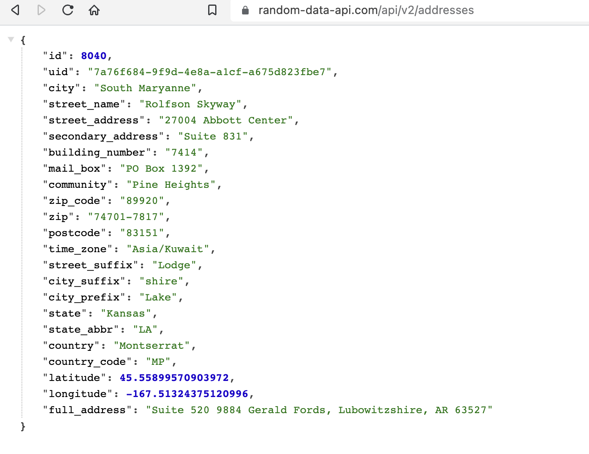

## Pre-requisites

In order to fetch any JSON data, one needs to deserialize the JSON data of custom type into a struct. This can be done using the [`serde_json`](https://crates.io/crates/serde_json/) crate.

Initially, I am trying to fetch the response body from the API that looks like this:


```toml
[dependencies]
dotenv = "0.15.0"
reqwest = { version = "0.11.18", features = ["json"] }
tokio = { version = "1.31.0", features = ["full"] }
```

## Usages

### Use `reqwest` progressively

In order to fetch API GET request, we use the `reqwest` crate in Rust.

There are 4 versions of the code for a simple API fetching like random number generation.

- v1: Using `reqwest` crate with `async`/`await` and and `tokio` runtime
- v2: Decoupling the `async`/`await` code from the main function
- v3: Add `std::env` module to get the URL from the environment variable set in CLI.
- v4: Add `dotenv` crate to load the `.env` file and get the URL from the environment variable set in the `.env` file.

The code is structured here in [repo](https://github.com/abhi3700/coursera_01_rust_l1) for [Coursera: Rust for Beginners: Building Target Proximity Game](coursera.org/projects/rust-for-beginners-gp)

We need to add 3 crates in total till `v4`:

```toml
[dependencies]
# cargo add dotenv
dotenv = "0.15.0"
# cargo add reqwest --features json
reqwest = {version ="0.11.18", features = ["json"]}
# cargo add tokio --features full
tokio = {version = "1.29.1", features = ["full"]}
```

### Use API

```rust
use reqwest::Result;

// get location input of valet via Location API
#[tokio::main]
async fn get_valet() -> Result<User> {
    let name = get_input(&format!("Valet 🚚💁 name please?"));

    dotenv::from_path("./.env").expect("Failed to load .env file");
    let url = std::env::var("VALET_LOCATION_URL").expect("URL var not found");

    let response_body = reqwest::get(url).await?;
    let valet_location = response_body.json::<ValetLocation>().await?;

    // println!("{:?}", response_body);
    // println!("{:?}", valet_location);
    let valet = User {
        name,
        lat: valet_location.latitude,
        lng: valet_location.longitude,
    };

    Ok(valet)
}
```

### Use API with custom struct

Now, I need to create a struct - `ValetLocation` to deserialize the JSON data into it.

And then I have to add the `serde` crate in order to use `Deserialize` trait for the JSON data that I am going to fetch.

```toml
[dependencies]
# ...
# cargo add serde --features=derive
serde = { version = "1.0", features = ["derive"] }
```

```rust
use serde::Deserialize;

#[derive(Deserialize, Debug)]
struct ValetLocation {
    id: u32,
    uid: String,
    city: String,
    street_name: String,
    street_address: String,
    secondary_address: String,
    building_number: String,
    mail_box: String,
    community: String,
    zip_code: String,
    zip: String,
    postcode: String,
    time_zone: String,
    street_suffix: String,
    city_suffix: String,
    city_prefix: String,
    state: String,
    state_abbr: String,
    country: String,
    country_code: String,
    latitude: f64,
    longitude: f64,
    full_address: String,
}

// get location input of valet via Location API
#[tokio::main]
async fn get_valet() -> Result<User> {
    let name = get_input(&format!("Valet 🚚💁 name please?"));

    dotenv::from_path("./.env").expect("Failed to load .env file");
    let url = std::env::var("VALET_LOCATION_URL").expect("URL var not found");

    let response_body = reqwest::get(url).await?;
    let valet_location = response_body.json::<ValetLocation>().await?;

    // println!("{:?}", response_body);
    // println!("{:?}", valet_location);
    let valet = User {
        name,
        lat: valet_location.latitude,
        lng: valet_location.longitude,
    };

    Ok(valet)
}
```

With the above code, we get the following terminal output:

**Output**:

```sh
ValetLocation { id: 4928, uid: "7fef49a8-809e-48d8-b155-c072a34e29ba", city: "Yundtside", street_name: "Stanton Fields", street_address: "55989 Effertz Brooks", secondary_address: "Suite 683", building_number: "77339", mail_box: "PO Box 81", community: "Park Acres", zip_code: "76601-7271", zip: "13600-8160", postcode: "37818", time_zone: "America/Godthab", street_suffix: "Rapid", city_suffix: "port", city_prefix: "West", state: "Colorado", state_abbr: "AL", country: "Sierra Leone", country_code: "HT", latitude: 16.96054548560228, longitude: -80.78326583644798, full_address: "9449 Towne Glen, Irishberg, CT 47471-6266" }
```

### Use API with clipped ✂️ struct

But I figured out that I can just minimize the struct by shortening the fields that I need from the API response.
To do this, consider these fields (`latitude`, `longitude`), then modify the struct like this as I don't need other data from the API response.

```rust
#[derive(Deserialize, Debug)]
struct ValetLocation {
    latitude: f64,
    longitude: f64,
}


// get location input of valet via Location API
#[tokio::main]
async fn get_valet() -> Result<User> {
    let name = get_input(&format!("Valet 🚚💁 name please?"));

    dotenv::from_path("./.env").expect("Failed to load .env file");
    let url = std::env::var("VALET_LOCATION_URL").expect("URL var not found");

    let response_body = reqwest::get(url).await?;
    let valet_location = response_body.json::<ValetLocation>().await?;

    // println!("{:?}", response_body);
    // println!("{:?}", valet_location);
    let valet = User {
        name,
        lat: valet_location.latitude,
        lng: valet_location.longitude,
    };
    let response_body = reqwest::get(url).await?;
    let valet_location = response_body.json::<ValetLocation>().await?;

    // println!("{:?}", response_body);
    // println!("{:?}", valet_location);
    let valet = User {
        name,
        lat: valet_location.latitude,
        lng: valet_location.longitude,
    };

    Ok(valet)
}
```

**Terminal output**:

```sh
ValetLocation { latitude: -28.38022252300653, longitude: -30.736327485312614 }
```

### Use API with camelCase object fields

Suppose, the original JSON response object defined in API server at endpoint: `GET /sapi/v1/trades` is:

```json
[
  {
    "id": 28457,
    "price": "4.00000100",
    "qty": "12.00000000",
    "quoteQty": "48.000012",
    "time": 1499865549590,
    "isBuyerMaker": true
  }
]
```

Now in rust code, we can defined it as struct like this:

```rust
#[derive(Deserialize, Debug)]
#[serde(rename_all = "camelCase")]
struct Trade {
    id: u32,
    price: f64,
    qty: f64,
    quote_qty: f64,
    time: u64,  // in ms
    is_buyer_maker: bool,
}
```

And in order to use as SDK function, we can define it as follows:

```rust
impl WazirX {
    async fn recent_trades(&self, symbol: &str, limit: u16) -> Result<Vec<Trade>, reqwest::Error> {
        reqwest::get(self.api_url).await?.json::<Vec<Trade>>().await
    }
}
```

> Here, camelCase is used as snake_case in Rust (as expected by default).

| NOTE | Short way to call the API |
|--|--|
