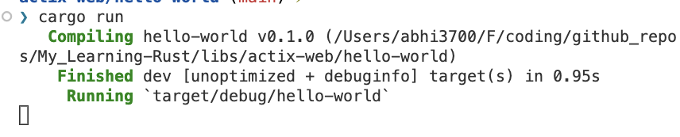

# Actix-web

## Overview

- Actix-web is a web framework for Rust.
- Faster than [Rocket](../rocket/).
- **Cons**:
  - Checked version `4` & found that any updation made on the code level doesn't get updated on the fly on the browser api response.
  - Doesn't show any logs on the console.
    

## Getting Started

- Install Rust and Cargo.
- `$ cargo new hello-world`
- `$ cargo run`

## Lessons

- [x] [Hello World](./hello-world/src/l1_api.rs)
- [x] [Application](./hello-world/src/l2_app.rs)
      
- [x] [Application State](hello-world/src/l3_app_state.rs)
      

## Coding

There are 2 ways to create handler function:

**M-1**:

I prefer this, because we get to see all the API routes with the API handler functions in the `main()` function. Also, there is no need of creating a separate function called `config` in the handlers module.

```rust
// handlers.rs
pub async fn get_tasks(task_map: web::Data<Mutex<HashMap<u64, Task>>>) -> impl Responder {
    let map = task_map.lock().unwrap();
    HttpResponse::Ok().json(map.clone())
}
```

```rs
// src/main.rs
#[actix_web::main]
async fn main() -> std::io::Result<()> {
    // some code

    HttpServer::new(move || {
        App::new()
            .app_data(task_map.clone())
            .service(web::resource("/index").route(web::get().to(index)))
            .service(
                web::resource("/tasks")
                    .route(web::get().to(get_tasks))
                    .route(web::post().to(create_task)),
            )
            .service(web::resource("/tasks/{id}").route(web::put().to(update_task)))
            .service(web::resource("/tasks/{id}").route(web::delete().to(delete_task)))
    })
    .bind("127.0.0.1:8080")?
    .run()
    .await
}
```

**M-2**:

```rs
// handlers.rs
#[get("/tasks/{id}")]
pub async fn get_tasks(task_map: web::Data<Mutex<HashMap<u64, Task>>>) -> impl Responder {
    let map = task_map.lock().unwrap();
    HttpResponse::Ok().json(map.clone())
}

pub fn config(cfg: &mut web::ServiceConfig) {
    cfg.service(get_tasks)
        // .service(create_entry_handler)
        // .service(update_entry_handler)
        // .service(delete_entry_handler)
        ;
}

```

```rs
// src/main.rs
#[actix_web::main]
async fn main() -> std::io::Result<()> {
    // some code

    HttpServer::new(move || {
        App::new()
            .app_data(app_data.clone())
            .service(health_checker_handler)
            .configure(handlers::config)    // there needs to be a function which has this `config` function
    })
    .bind(("127.0.0.1", 8080))?
    .run()
    .await?;

}
```

## Troubleshoot

### 1. Address in use

- _Cause_: The port is already being used.
- _Solution_: change the port no. in the `main` function.

## References

- [Documentation](https://actix.rs/docs/)
