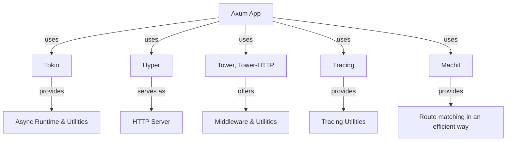

# Axum playground

## Description

The diagram below shows the architecture of an Axum app:



> Here, app is a collection of routes, and each route is a combination of a method, a path, and a handler.

## Usage

Run the examples with:

```sh
cargo r -r example <eg-file-name> -p axum-playground
# e.g. for `hello.rs`:
cargo r -r example hello -p axum-playground
```

## Output

It runs like this (on given socket address):

```sh
     Running `target/release/examples/hello`

```

And then to view the output, use `curl`:

```sh
❯ curl "localhost:3000/"
hello world
```

> Use `--verbose` flag to see the request and response headers.

For more usage, refer my notes on [curl](https://github.com/abhi3700/my_coding_toolkit/blob/main/curl.md).

OR

Use [Thunder Client](https://marketplace.visualstudio.com/items?itemName=rangav.vscode-thunder-client) (VSCode extension) to view the output.
