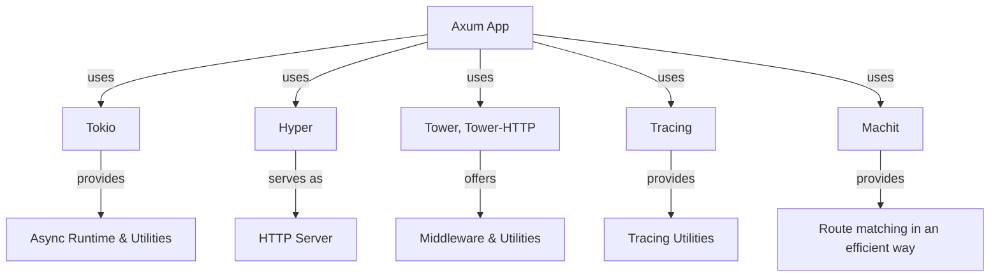
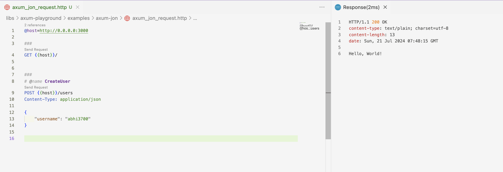
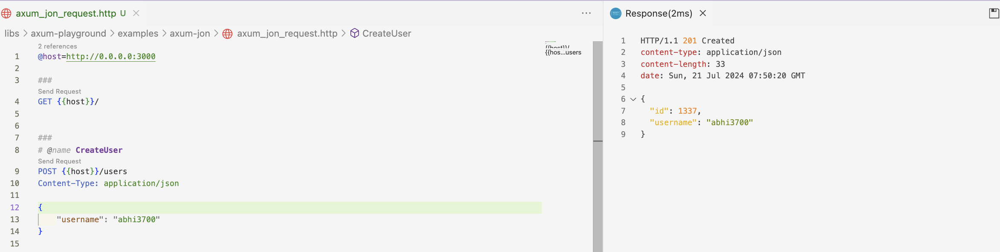

# Axum playground

## Description

Axum has 2 main components:

- `Router`
- `Listener`

The diagram below shows the architecture of an Axum app:



> Here, app is a collection of routes, and each route is a combination of a method, a path, and a handler.

Axum leans on other libraries to provide the core functionality and doesn't induce much of its own code.

### Tower

`tower::Service` is roughly equivalent to something like this. It has a Layer trait which does composition of services.

```rust
async fn a(request) -> Result<Response, E> // for some <request, E>
async fn b(request) -> Result<Response, E> // for some <request, E>
async fn c(request) -> Result<Response, E> {
    (a.layer(b))(request).await
}
```

> 👆 is just a pseudo code to give you a feel of how it would be composed.

## Routing

Routing is done by matching the request path against a list of routes.

- Put multiple HTTP methods on the same path like this. Here, `get_foo` and `post_foo` are handlers for `GET` and `POST` requests respectively for the same path.

```rust
/// Example:
/// GET /foo: When a client sends a GET request to /foo, the `get_foo` function will be executed.
/// POST /foo: When a client sends a POST request to /foo, the `post_foo` function will be executed.

.route("/foo", get(get_foo).post(post_foo)) // This line
```

## Usage

Run the examples with:

```sh
cargo r -r example <eg-file-name> -p axum-playground
# e.g. for `hello.rs`:
cargo r -r example hello -p axum-playground
```

---

1. [Hello](./examples/hello.rs)
2. [Greetings with name](./examples/greet_name.rs)
3. [API Heroku](./examples/api_heroku.rs)

## Output

It runs like this (on given socket address):

```sh
     Running `target/release/examples/hello`

```

### Using CLI

And then to view the output, use `curl`:

```sh
❯ curl "localhost:3000/"
hello world
```

> Use `--verbose` flag to see the request and response headers.

For POST:

```sh
❯ curl localhost:3000/users -X POST -H "Content-Type: application/json" -d @body.json
{"id":1337,"username":"abhi3700"}
```

For more commands, refer my notes on [curl](https://github.com/abhi3700/my_coding_toolkit/blob/main/curl.md).

### Using `.http` file

For `GET /`:


---

For `POST /users`:



### Using "Thunder Client" VSCode ext

Use [Thunder Client](https://marketplace.visualstudio.com/items?itemName=rangav.vscode-thunder-client) (VSCode extension) to view the output.

## References

- [Decrusting the axum crate](https://www.youtube.com/watch?v=Wnb_n5YktO8) 🧑‍💻
- [Building Web APIs With Rust and Axum - An Introduction](https://www.youtube.com/watch?v=q53xalVoc6w) ✅
- Axum 0.7 series by Brooks Builds
  - [Introduction to Axum](https://www.youtube.com/playlist?list=PLrmY5pVcnuE-_CP7XZ_44HN-mDrLQV4nS)
- [Rust Axum Production Coding (E01 - Rust Web App Production Coding)](https://www.youtube.com/watch?v=3cA_mk4vdWY) by Jeremy Chone
