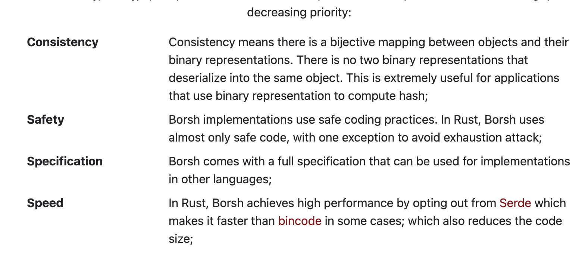
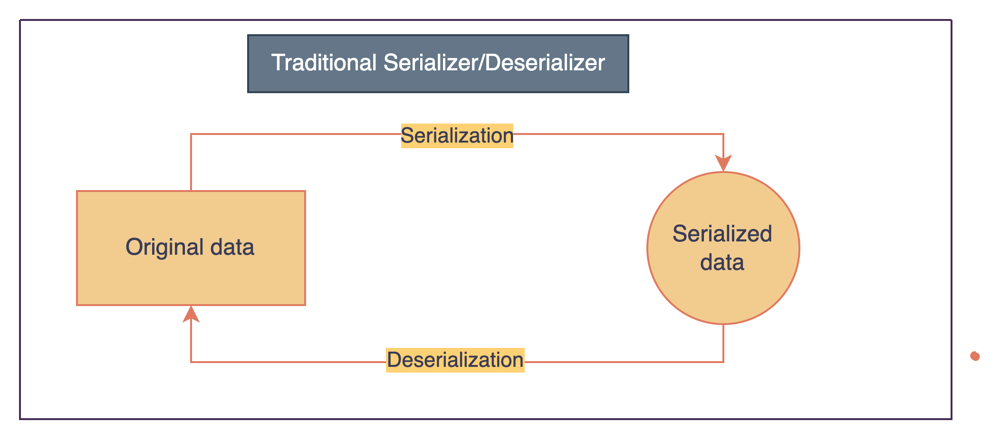
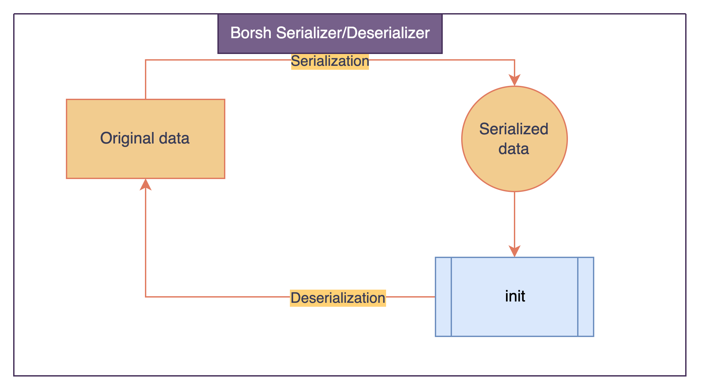

# Borsh

## Overview

**Borsh** stands for **Binary Object Representation Serializer for Hashing**. It is meant to be used in security-critical projects as it prioritizes consistency, safety, speed, and comes with a strict specification.

Developed by Near Foundation.

---

**Q. How better than Serde?**



---

**Utilities**:

- Near
- Solana

---

It is also available for other languages - TS, JS, Python, etc.

---



vs



## Installation

```bash
$ cargo add borsh
```

## Getting started

Follow [this](./demo/src/tut_1.rs) tutorial.

> Create a Tweet & then serialize/deserialize to save the data into DB.
> Also, helpful to speed-up the process of transmitting data over the
> network during downloading/uploading.

## References

- [Github](https://github.com/near/borsh-rs)
- [Medium | BORSH — Binary serializer for NEAR Protocol](https://medium.com/@alexfilatov/borsh-binary-serialiser-for-near-protocol-eed79a1638f4)
