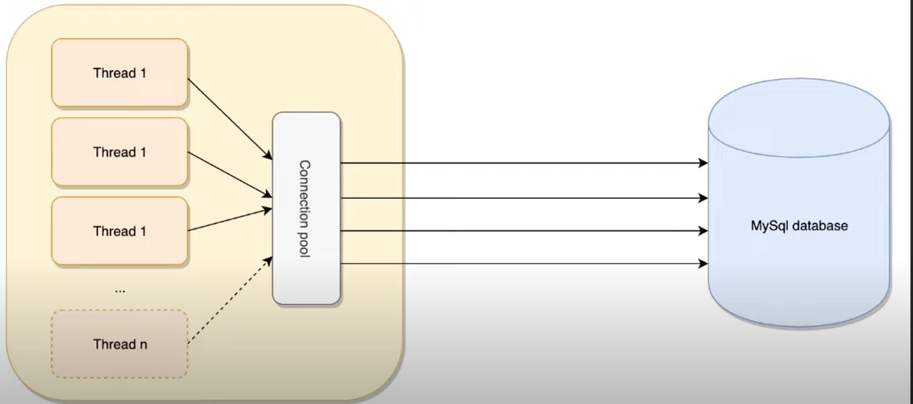
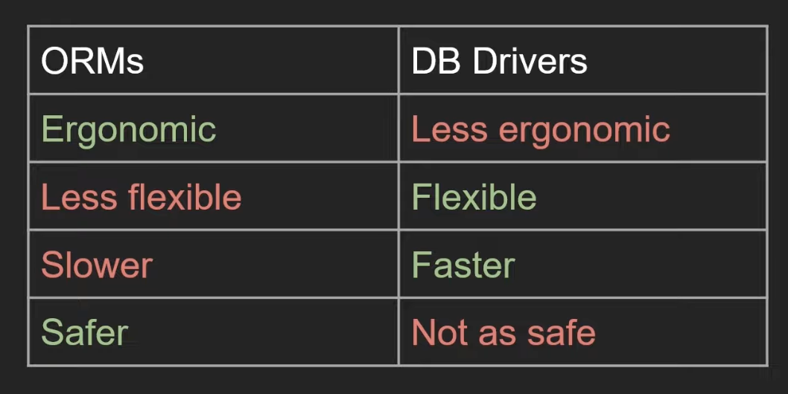
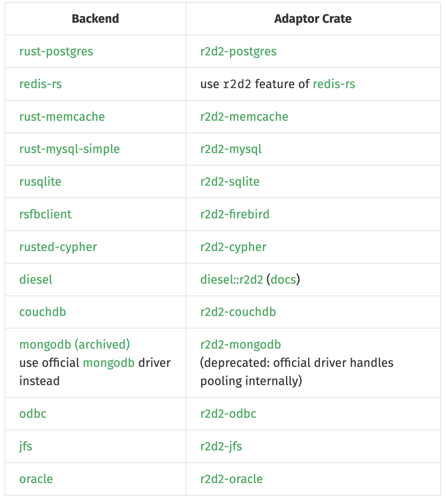

# Databases

## Overview

**Connection Pool**:

- It is required for multi-threaded App.

**ORM vs DB drivers**:

## Libraries

- [r2d2 Connection Pool](https://crates.io/crates/r2d2)

A table for individual DB type is below:

