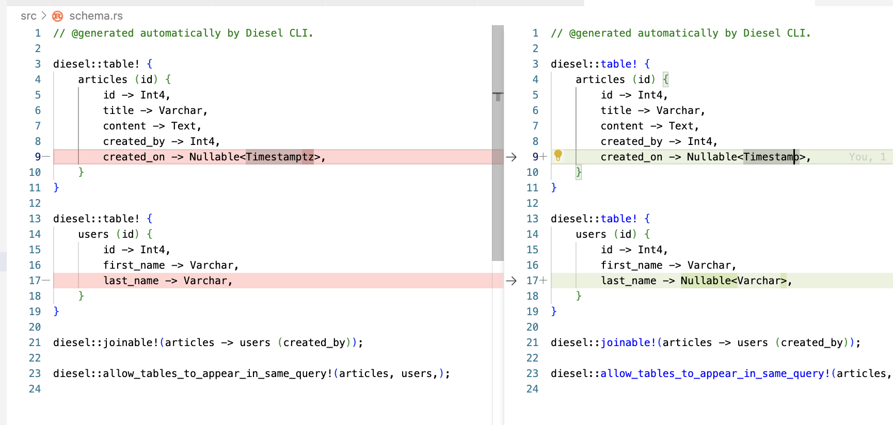
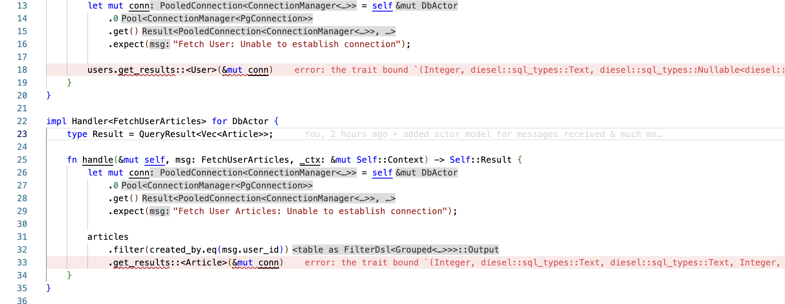

# PGSQL Demo

## Overview

- [ch-1](https://github.com/abhi3700/My_Learning-Rust/commit/fbe8bc1d5e3214b025c008a957fd6128ea4c9ed1)
- [ch-2.1](https://github.com/abhi3700/My_Learning-Rust/commit/116926ff6d62925570f08c57b21b07632cedc948)
- [ch-2.2](https://github.com/abhi3700/My_Learning-Rust/commit/16227b98adfdcf0d03b9cca9fdf6c3e6437f8d58)

## Setup

### Chapter-1

Added these files:

```sh
# files
src/main.rs
src/services.rs
```

1. `$ cargo add actix-web serde_json serde --features "derive"`

### Chapter-2

Added these files:

```sh
# files
src/schema.rs
src/db_models.rs
src/db_utils.rs
src/messages.rs
src/actors.rs

```

1. `$ cargo add diesel --features "diesel/postgres diesel/r2d2 diesel/chrono"`
2. `$ cargo add dotenv`
3. `$ diesel migration generate create_todo_table`

   > ensure `DATABASE_URL` is set in `.env` file

4. `$ diesel migration run` or `$ diesel print-schema > src/models/schema.rs`

   - in order to generate `schema.rs` in correct folder, run
   - add the SQL query for create, drop table in up.sql, down.sql respectively
   - `$ diesel migration run` -> generates `schema.rs` file (into the folder mentioned in `diesel.toml` file) with table macro `table!`.

   ```toml
   [print_schema]
    file = "src/models/schema.rs"
   ```

   > `$ diesel print-schema` is going to print the schema like this:

   ```rust
   // @generated automatically by Diesel CLI.

   diesel::table! {
       article (id) {
           id -> Int4,
           title -> Varchar,
           body -> Text,
           created_at -> Timestamp,
           updated_at -> Timestamp,
       }
   }
   ```

5. `$ diesel migration redo` or `$ diesel migration redo --migration-dir migrations/2023-05-15-053919_article_db`
   - runs `down.sql` & then `up.sql` i.e. drop table & then create table.
6. `$ diesel_ext > src/models/db_models.rs`
   - generates the models for the table in `db_models.rs` file.
7. `$ cargo add actix`
   - implements the actor model for making the app concurrent with multiple actors.
8. `$ cargo add chrono`
9. `$ cargo add env_logger`

## Build

```sh
# debug mode
$ cargo build
# release mode
$ cargo build --release
```

## DB Setup

For DB setup, run `down.sql` & then `up.sql` i.e. clean database (with 1 or more table) & then create DB (with 1 or more table).

For only running `down.sql`, run:

```sh
$ diesel migration revert
Rolling back migration 2023-05-15-053919_article_db

# Then you go to psql REPL & view this:
abhi3700=# \dt
                   List of relations
 Schema |            Name            | Type  |  Owner
--------+----------------------------+-------+----------
 public | __diesel_schema_migrations | table | abhi3700
(1 row)
```

---

```sh
❯ diesel migration run
Running migration 2023-05-15-053919_article_db

abhi3700=# \dt
                   List of relations
 Schema |            Name            | Type  |  Owner
--------+----------------------------+-------+----------
 public | __diesel_schema_migrations | table | abhi3700
 public | articles                   | table | abhi3700
 public | users                      | table | abhi3700
(3 rows)
```

> `__diesel_schema_migrations` is created by diesel itself. It keeps track of the migrations that have been run.

---

```sh
abhi3700=# SELECT * FROM __diesel_schema_migrations;
    version     |           run_on
----------------+----------------------------
 20230515053919 | 2023-05-17 18:05:19.054221
(1 row)
```

> There is a shortcut for both the steps: `$ diesel migration redo`.

> This command (`$ diesel migration revert`) clears the `schema.rs` and then we need to `$ diesel migration run` again to generate the `schema.rs` file. This leads to unwanted changes in the `schema.rs` file:



This modification leads to error:



Hence, in `schema.rs`, the LHS is correct. So, edit accordingly as there are trait bound issues.

## Run

Test API services

```sh
$ cargo run
```
