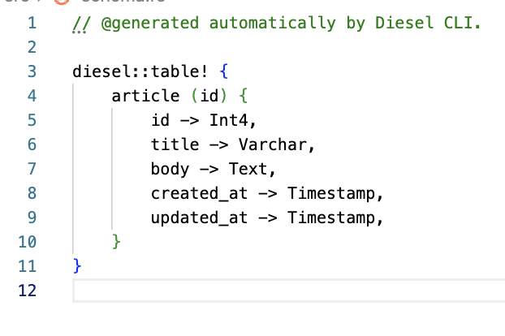

# PGSQL Demo

## Overview

- [part-a](https://github.com/abhi3700/My_Learning-Rust/commit/fbe8bc1d5e3214b025c008a957fd6128ea4c9ed1)

## Setup

```sh
1. cargo add actix-web serde_json serde --features "derive"
```

---

```sh
2. cargo add diesel --no-default-features --features "postgres"
3. cargo add dotenv
4. diesel migration generate create_todo_table
# add the SQL query for create, drop table in up.sql, down.sql respectively
# -> generates `schema.rs` file with table macro
5. diesel migration run
```

> ensure `DATABASE_URL` is set in `.env` file


