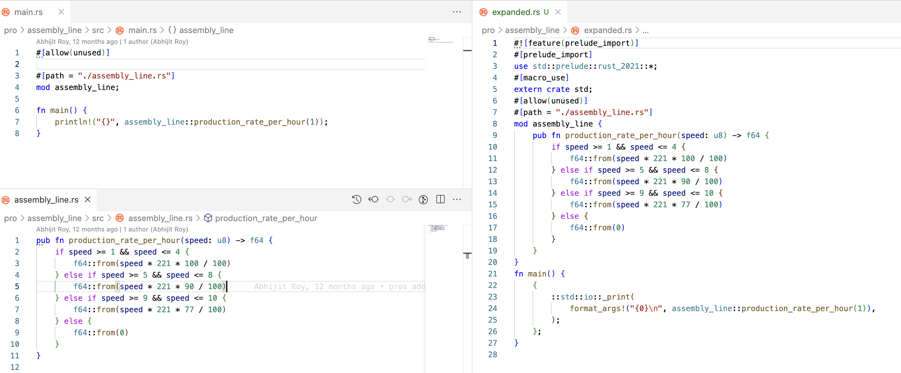

# Expanded Rust

## Overview

- We get to see a lot of the code getting abstracted away in the Rust standard library using macros.

## Example



So, here we can see that the `println!` macro is expanded to the `std::io::_print` function with the `format_args!` macro.

This is a very small eg, but you can definitely see how the code gets abstracted away for big codebases.

## Installation

```console
$ cargo install cargo-expand
```

## Usage

Inside a project directory with a `Cargo.toml` file, run:

```console
$ cargo expand >> expanded.rs
```

You will obtain a `expanded.rs` file in the project root directory.
