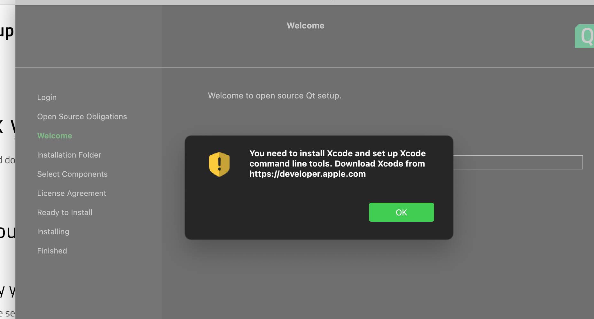
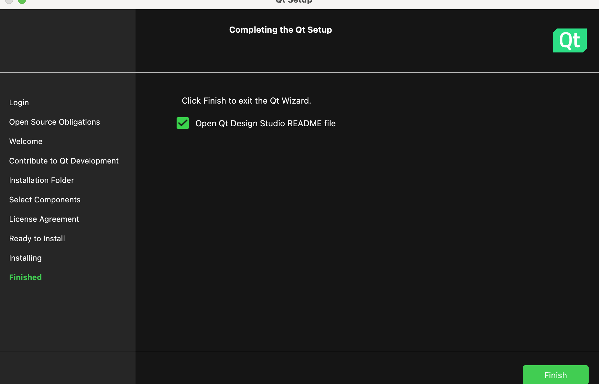

# Qt

## Overview

Build cross-platform binary executables for Linux, Windows and macOS. Originally written in C++.

## Prerequisites

Or else, it will show this error on `$ cargo run`:

```sh
thread 'main' panicked at 'Could not find Qt installation: QtMissing'
```

1. Install Qt from [online-installer](https://www.qt.io/download-qt-installer).

2. After successful installation, it will ask for XCode:
   
3. Select the Qt components (Qt Design Studio, libs). Select for custom installation.
4. And then download starts:

   ```
   Downloading packages...
   Downloading archive "4.6.0-0-202305220951tqtc-installer-framework-MacOS-MacOS_10_13-Clang-MacOS-MacOS_10_13-X86_64-QtInstaller.7z.sha1" for component Qt Maintenance Tool.
   Downloading archive "4.6.0-0-202305220951tqtc-installer-framework-MacOS-MacOS_10_13-Clang-MacOS-MacOS_10_13-X86_64-QtInstaller.7z" for component Qt Maintenance Tool.
   Downloading archive "4.6.0-0-202305220951MaintenanceTool.app.7z.sha1" for component Qt Maintenance Tool.
   Downloading archive "4.6.0-0-202305220951MaintenanceTool.app.7z" for component Qt Maintenance Tool.
   Downloading archive "4.6.0-0-202305220951installer-changelog.7z.sha1" for component Qt Maintenance Tool.
   Downloading archive "4.6.0-0-202305220951installer-changelog.7z" for component Qt Maintenance Tool.
   Downloading archive "4.6.0-0-202305220951installer-resource.7z.sha1" for component Qt Maintenance Tool.
   Downloading archive "4.6.0-0-202305220951installer-resource.7z" for component Qt Maintenance Tool.
   Downloading archive "11.0.1-0-202308030603qtcreator_sdktool.7z.sha1" for component SDKTool.
   Downloading archive "11.0.1-0-202308030603qtcreator_sdktool.7z" for component SDKTool.
   Downloading archive "4.2.0-0-202306191955opensource.7z.sha1" for component Qt Design Studio 4.2.0.
   Downloading archive "4.2.0-0-202306191955opensource.7z" for component Qt Design Studio 4.2.0.
   Downloading archive "4.2.0-0-202306191955content.7z.sha1" for component Qt Design Studio 4.2.0.
   Downloading archive "4.2.0-0-202306191955content.7z" for component Qt Design Studio 4.2.0.
   Downloading archive "1.0.0ThirdPartySoftware_Listing.7z.sha1" for component Qt 3rd Party Licenses.
   Downloading archive "1.0.0ThirdPartySoftware_Listing.7z" for component Qt 3rd Party Licenses.
   Downloading archive "1.0.0fdl_license.7z.sha1" for component Qt 3rd Party Licenses.
   Downloading archive "1.0.0fdl_license.7z" for component Qt 3rd Party Licenses.
   Downloading archive "11.0.1-0-202308030637qtcreator.7z.sha1" for component Qt Creator 11.0.1.
   Downloading archive "11.0.1-0-202308030637qtcreator.7z" for component Qt Creator 11.0.1.
   Downloading archive "3.24.2-202210260925macos64_x86_cmake_tools.7z.sha1" for component CMake 3.24.2.
   Downloading archive "3.24.2-202210260925macos64_x86_cmake_tools.7z" for component CMake 3.24.2.
   Downloading archive "1.10.2-202108061017macos64_ninja.7z.sha1" for component Ninja 1.10.2.
   Downloading archive "1.10.2-202108061017macos64_ninja.7z" for component Ninja 1.10.2.
   ```

5. Setup completed.
   

## Getting Started

During build, there is a failure issue:

TODO:
Refer this for [troubleshooting](https://web.stanford.edu/dept/cs_edu/resources/qt/install-mac).

## References

- [Qt on Apple Silicon](https://www.qt.io/blog/qt-on-apple-silicon)
- [Build a desktop app with Qt and Rust](https://blog.logrocket.com/build-desktop-app-qt-rust/)
