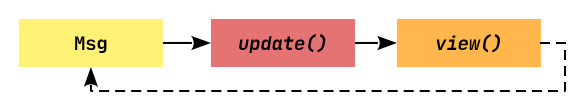

# Relm4

## Description

Relm4 is a GUI library inspired by Elm and based on GTK4.

A Relm4 application has three important types:

- The model type that stores the application state, the memory of our app.
The message type that describes which information can be sent to update the model.
- The widgets type that stores our widgets.

The app does all those things in a loop. It waits for messages and once a message is received, it runs `update` and then `view`.



<u>Cons</u>:

- Doesn't have much of component library which needs to be built from scratch using `DrawingArea` may be.

## Coding

- There are two important functions:
  - `update` receives a message and updates the model accordingly.
  - `update_view` receives the updated model and updates the widgets accordingly.
- `#[watch]` attribute is used to update the property in the `view!` function. Example: `counter` value in a Counter App may be updated based on App inputs/events. It is the replacement of this code snippet:

```rust
// update the view based on the model
 fn update_view(&self, widgets: &mut Self::Widgets, _sender: ComponentSender<Self>) {
  widgets.label.set_text(&format!("Counter: {}", self.counter.to_string()));
 }
```

- `#[relm4::component(pub)]` attribute is used to define a component. It adds `Widget` struct, of which the fields can be attributed with `#[name="progress_bar]` inside `view!` macro definition. This is used to access the widget in the `update_view` function with `widgets` arg.

> NOTE: This is more macro based approach to define the components.

- When a widget is defined like a big function using DrawingArea i.e. a custom widget. In that case, you can't use `#[name="progress_bar]` attribute there just like normal widgets. Consider this [function](https://github.com/abhi3700/My_Learning-Rust/blob/742c5c92f74d672c403274787d789ff038869bc9/libs/relm4/demo/examples/circle_progress.rs#L29-L98), where a custom widget is defined. This is a limitation of using macros to define the widgets. Now, you have 2 choices to resolve:
  - Either you take out the function definition and define it as a separate struct and implement `Widget` trait for it. Then, you can use `#[name="progress_bar]` attribute. Or,
  - Define the widget as a field in the `Model` struct and access it directly in the `update_view` function with `self.progress_bar`.

<details><summary>Code:</summary>

```rust
#[derive(Default)]
struct App {
 // other fields 

 // progress bar widget
 progress_bar: DrawingArea,
}

 view! {
  #[root]
  gtk::Window{
   gtk::Box {
    set_halign: gtk::Align::Center,
    set_valign: gtk::Align::Center,
    set_width_request: 300,
    set_spacing: 12,
    set_margin_top: 4,
    set_margin_bottom: 4,
    set_margin_start: 12,
    set_margin_end: 12,
    set_orientation: gtk::Orientation::Horizontal,

    gtk::Box {
     set_spacing: 4,
     set_hexpand: true,
     set_valign: gtk::Align::Center,
     set_orientation: gtk::Orientation::Vertical,

     append: &model.progress_bar
    },

    #[name="button"]
    gtk::Button {
     set_label: "Compute",
     connect_clicked => Input::Compute,
    }
   }
  }
 }


 fn init(
  _args: Self::Init,
  root: Self::Root,
  sender: ComponentSender<Self>,
 ) -> ComponentParts<Self> {
  let progress = Rc::new(RefCell::new(1.0));

  let model = Self {
   progress: progress.clone(),
   progress_bar: create_circular_progress_bar(
    20.0,
    10,
    10,
    10,
    10,
    true,
    "ETA for next reward payment",
    progress,
   ),
   ..App::default()
  };
  let widgets = view_output!();

  ComponentParts { model, widgets }
 }

  fn update_cmd_with_view(
  &mut self,
  widgets: &mut Self::Widgets,
  message: Self::CommandOutput,
  _sender: ComponentSender<Self>,
  _root: &Self::Root,
 ) {

  // other code...
  
  widgets.button.set_sensitive(!self.computing);
 }
```

</details>

[Full code](https://github.com/abhi3700/My_Learning-Rust/blob/1924bfb25e6b2cd3c9b1d7e19fc30cada432e921/libs/relm4/demo/examples/circle_progress.rs).

## References

- [Official Examples](https://github.com/Relm4/Relm4/tree/main/examples)
