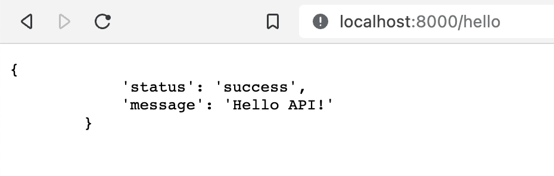

# Rocket

## Overview

- Rocket is a web framework for Rust.

## Getting Started

- Install Rust and Cargo.
- `$ cargo new rocket-web --bin`, where `--bin` flag is for binary project.
- set nightly version as `rocket` uses unstable features of Rust.
- **Cons**:
  - Checked version `0.4.5` & found that any updation made on the code level doesn't get updated on the fly on the browser api response. TODO: Need to check with the latest version.

## Build

- `$ cargo run`



## Test

## Deploy

## Troubleshooting

### 1. The API response in browser is not getting updated on the fly.

- _Cause_: This problem is observed in version: `0.4.5`.
- _Solution_: Restart the server.

```bash
lsof -i :8000
kill <PID>
cargo run
```

## References

- [Rocket](https://rocket.rs/)
- [Try Rocket w v0.4.5](https://blog.logrocket.com/rust-web-apps-using-rocket-framework/)
- [Different Rust web frameworks](https://yalantis.com/blog/rust-web-frameworks/)
