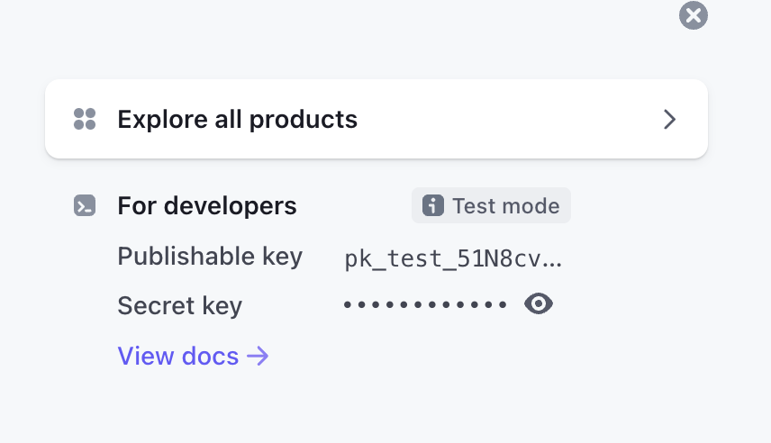

# Strip Payment

## Repositories

- [Async (and blocking!) Rust bindings for the Stripe API](https://github.com/arlyon/async-stripe)

## References

- [Stripe API reference](https://stripe.com/docs/api)
- Get your developer test API key from [dashboard](https://dashboard.stripe.com/test/dashboard)
  
