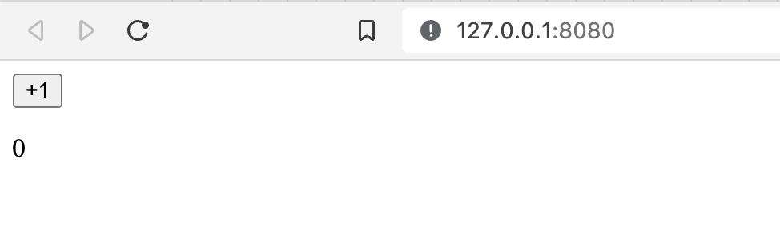
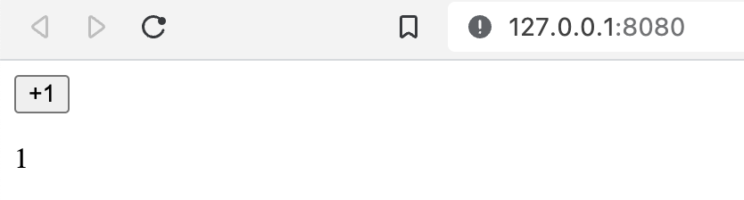

# Yew

## Overview

Yew is a modern Rust framework for creating multi-threaded front-end web apps with WebAssembly. It is component based framework.

- Yew framework codebase structure
  - trunk (used for wrapping as wasm-dist)
  - `src/main.rs`: file calls the App defined in `src/app.rs` file
    - `src/app.rs`: file has the logic of the app with html code. <br/>Our App’s HTML and code will be in our Rust source files.
  - `index.html` file has the html code for the app calls the `index.scss` file
    - `index.scss` file has the css code for the app

## Installation

> Rust is pre-installed in README.

1. Install [`cargo-generate`](https://github.com/cargo-generate/cargo-generate) via `$ cargo install --locked cargo-generate`
2. Ensure `wasm32-unknown-unknown` target is installed via `$ rustup target add wasm32-unknown-unknown`. Check if it is installed via `$ rustup target list`.

   ```console
   ❯ rustup target list | grep wasm32
   wasm32-unknown-emscripten
   wasm32-unknown-unknown (installed)
   wasm32-wasi
   ```

3. Create a project with a starter template: `$ cargo generate --git https://github.com/yewstack/yew-trunk-minimal-template`
4. Install [`trunk`](https://trunkrs.dev/) via `$ cargo install --locked trunk`
5. Install `wasm-bindgen` via `$ cargo install --locked wasm-bindgen-cli`

## Getting Started

1. Create a new project: `$ cargo new yew-app`
2. Add `yew` to `Cargo.toml`:

   ```toml
   [package]
   name = "yew-app"
   version = "0.1.0"
   edition = "2021"

   [dependencies]
   yew = { version = "0.20.0", features = ["csr"] }
   ```

3. Add this code to `src/main.rs`:

   ```rust
   use yew::prelude::*;

   #[function_component]
   fn App() -> Html {
      let counter = use_state(|| 0);
      let onclick = {
         let counter = counter.clone();
         move |_| {
               let value = *counter + 1;
               counter.set(value);
         }
      };

      html! {
         <div>
               <button {onclick}>{ "+1" }</button>
               <p>{ *counter }</p>
         </div>
      }
   }

   fn main() {
      yew::Renderer::<App>::new().render();
   }
   ```

4. Put a index.html file in the root of the project:

   ```html
   <!DOCTYPE html>
   <html>
     <head>
       <meta charset="utf-8" />
       <title>Yew App</title>
     </head>
   </html>
   ```

5. Run the app: `$ trunk serve` (Rebuilds the app whenever a change is detected and runs a local server to host it.)

   When loaded...
   

   After increment once,
   

6. Shutdown the repo: <kbd>ctrl+c</kbd> on terminal
7. Build the release version (has high performance) via `$ trunk build --release`

## Concepts

### Crates/Packages

- `yew`: A framework for making client-side single-page apps.
- `yew-router`: A router implementation for the Yew framework.
- `web-sys`: Bindings for all Web APIs, a procedurally generated crate from WebIDL.
- `log`: A lightweight logging facade for Rust.
- `wasm-logger`: A logger that sends a message with its Rust source’s line and filename to the browser console.

### Attributes

- `#[function_component(App)]`: A macro that converts a function into a component like this:

  ```rust
  html! {
     <>
     <div class="container">
        <h1>{"Basic Yew Web App"}</h1>
     </div>
     </>
  }
  ```

  - In this case, the attribute will create a component called `App` based on our `app` function.
  - Our function component here is a simplified version of a normal Component. Because normally a component is defined as a `struct` and has to implement the Component trait with certain functions. However, using `function_component` allows us to write a simple component with minimal code.

### html!

- `html!` is a macro that allows us to write macro allows us to write HTML and SVG code in a similar fashion as JSX in Rust source file.
- Literals must always be quoted and wrapped in braces. That’s why we wrote `<h1>{"Basic Yew Web App"}</h1>` there.

## Troubleshooting

### 1. error[E0463]: can't find crate for `core`

- _Cause_: `wasm32-unknown-unknown` target is not installed.
- _Solution_: Install `wasm32-unknown-unknown` target via `$ rustup target add wasm32-unknown-unknown`

### 2. could not find Renderer in yew with yew="0.20.0"

- _Cause_: you need to enable the `csr` feature in your final executable application to have access to `yew::Renderer`. Refer the [migration notes](https://yew.rs/docs/migration-guides/yew/from-0_19_0-to-0_20_0#yew-renderer).
- _Solution_:

```toml
# Cargo.toml
yew = { version = "0.20", features = ["csr"] }
```

## References

- [Yew](https://yew.rs/)
- [ ] [WebAssembly Rust front-end with Yew: how to P1](https://tms-dev-blog.com/webassembly-rust-front-end-with-yew-how-to-p1/)
- [ ] [CSS and JavaScript WASM Rust: Yew how to P2](https://tms-dev-blog.com/css-and-javascript-wasm-rust-yew-how-to-p2/)
- [ ] [Exploring Yew, the rust-based frontend framework as a React Developer](https://dev.to/hackmamba/exploring-yew-the-rust-based-frontend-framework-as-a-react-developer-52l)
