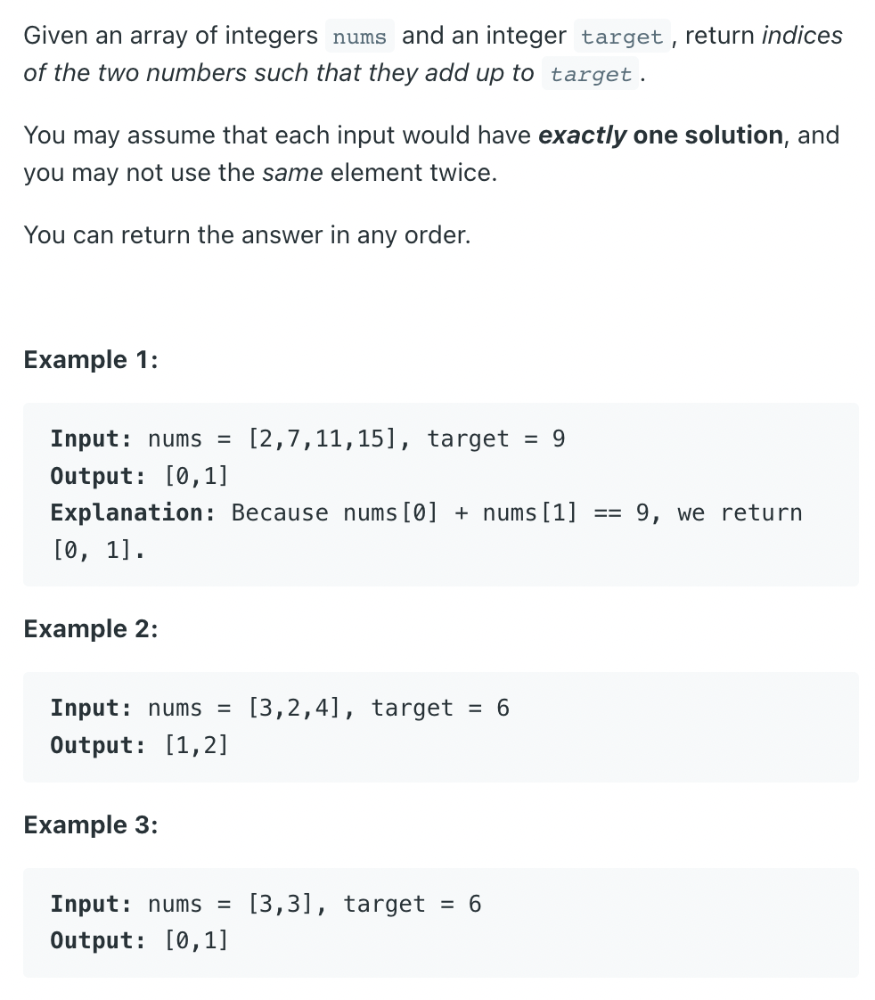

# Two Sum

## Problem



## Solution

View [this](./src/main.rs)

> You can see the changelog in git.

**OUTPUT**:

```console
❯ cargo run
   Compiling two_sum v0.1.0 (/Users/abhi3700/F/coding/github_repos/My_Learning-Rust/pro/two_sum)
    Finished dev [unoptimized + debuginfo] target(s) in 0.24s
     Running `target/debug/two_sum`
=======v1: capture only single/1st combination=========
Original array: [2, 7, 11, 15]
Final indices: [0, 1]
=======v2: capture all the combination=========
Original array: [2, 7, 2, 15]
Final indices: [(0, 1), (1, 2)]
```
