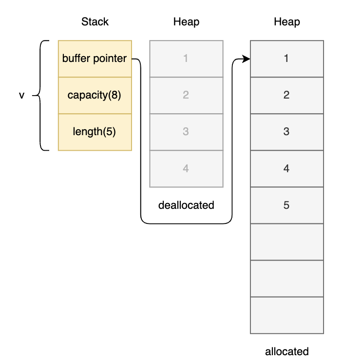

## Containers in Rust

### Array

- Arrays are fixed length. They are stored in stack.
- E.g.

  ```rs
  let array: [i32; 4] = [42, 10, 5, 2];
  ```

  

- Arrays `[T]` are **immutable** by default and **even with** `mut`, its element count cannot be changed.

> If you are looking for a dynamic/ growable array, you can use vectors. Vectors can contain any type of elements but all elements must be in the same data type.

Just like `&str` -> `String` similarly, `&[T]` -> `Vec<T>`

```rust
// conversion from array to vector
let arr = [1, 2, 3];
let vec = arr.to_vec();

// conversion from vector to array
let vec = vec![1, 2, 3];
let arr = vec.as_slice();
// OR
let arr = &vec[..];
```

### Vector

- Vectors are dynamic length. They are stored in heap.
- They are allocated/deallocated based on the capacity of the vector filled.
- In this code:

  ```rs
  //! step-1
  let mut v: Vec<i32> = vec![1, 2, 3, 4];
  //prints 4
  println!("v's capacity is {}", v.capacity());
  println!("v's length is {}", v.len());  // -> 4
  println!("Address of v's first element: {:p}", &v[0]); //{:p} prints the address
  v.push(5);

  //! step-2
  //prints 8
  println!("v's capacity is {}", v.capacity());
  println!("v's length is {}", v.len());  // -> 5
  println!("Address of v's first element: {:p}", &v[0]);
  ```

  **At step-1**:

  

  **At step-2**:

  

  > If you do not see a different address after pushing more elements onto a vector, it might be because the allocator had enough space at the end of the original buffer such that the new and the old buffers have the same starting address. Try pushing more elements and you will see a different address. Read about C library function `realloc` to understand how this might happen.
