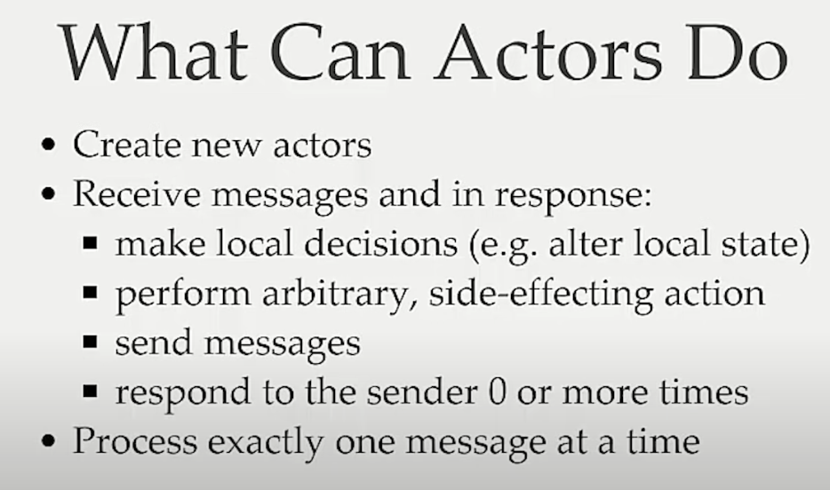

# Concurrency

## Overview

### Thread-safe vs Concurrency

Imagine a fridge (🧊) with a cake (🍰) inside, and two hungry people (👫) eyeing it.

💥 **Non Thread-Safe Scenario**: Both people try to grab the cake simultaneously, leading to a possible mess. This is akin to a race condition in a non-thread-safe program. Without proper coordination, conflicts arise over shared resources.

```
👫 ➡️ 🧊 (Open fridge)
👫 🤝 🍰 (Both grab the cake...Oops! Race condition!)
```

🔒 **Thread-Safe Scenario**: The two people coordinate. One waits for the other to get a piece before taking theirs - effectively adding a "lock" mechanism to the operation.

```
👱‍♂️ ➡️ 🧊 ➡️ 🍰 (Person 1 gets cake)
👱‍♀️ (waits...)

then

👱‍♀️ ➡️ 🧊 ➡️ 🍰 (Person 2 gets cake after Person 1 is done)
```

⏳ **Non-Concurrent Scenario**: Each person decides to prepare a coffee (☕) after getting their piece of cake, doing this sequentially.

```
👱‍♂️ ➡️ 🧊 ➡️ 🍰 ➡️ ☕ (Person 1 gets cake and makes coffee)

then

👱‍♀️ ➡️ 🧊 ➡️ 🍰 ➡️ ☕ (Person 2 gets cake and makes coffee after Person 1 is done)
```

⚡ **Concurrent Scenario**: One person prepares coffee while the other is getting the cake. They're operating concurrently, doing separate tasks that don't interfere with each other, at the same time.

```
👱‍♂️ ➡️ 🧊 ➡️ 🍰  simultaneously  👱‍♀️ ➡️ ☕ (Person 2 makes coffee while Person 1 gets cake)

then

👱‍♀️ ➡️ 🧊 ➡️ 🍰  simultaneously  👱‍♂️ (relaxes... Person 1 rests while Person 2 gets cake)
```

In summary:

- **Thread safety** is about coordinating access to shared resources to prevent conflicts.
- **Concurrency** is about executing different tasks that overlap in time.

### Actor model

- Problem: Not Everything not achievable using `Arc<Mutex>`, `Mutex<Todo>` i.e. wrap the .
- It is the most popular concurrency model used in the industry.
- In rust, we can use `actix` crate to incorporate actor model for each program written.
  > `actix-web` is built on top of `actix` crate.
- When there are multiple actors, we have concurrency.
- If `alice` & `bob` are 2 actors & then let's say `alice` messages `bob`, then the message ownership is transferred across the threads.
- Actors process message one at a time.
- An actor has its own private state (like in each process). [source](https://www.youtube.com/watch?v=YTQeJegJnbo)
  - And this state gets updated when there is a new valid message.
  - Actors don't share the state with each other. Each of them have their own _mailbox_ & a _state_.
    - Mailbox is for receving the new messages
    - State is for updating the value for each new message processed.
- An actor can send message to another actor by knowing the address of the receiving actor.

  - An actor can have the address of child actors as they can create actor

  > `Address ≠ Identity` of actor

- **Properties**:

  - An actor can create new actor
  - An actor has data persistence as it has a private state.
  - Actors are asynchronous in nature. Also handle the next message what to do.



<details>
<summary><b>Read more:</b></summary>

The Actor Model is a design pattern for writing programs that are distributed and concurrent. It's a way of managing multiple tasks that might be happening at the same time, which is common in modern software applications.

In the Actor Model, an "**actor**" is the fundamental unit of computation. This actor can do a few things:

- **Receive messages**: The primary way actors communicate is by sending and receiving messages (across processes, threads). When an actor receives a message, it can do some computation based on that message.

- **Send messages**: An actor can send messages to other actors. This is how work is distributed among different actors.

Create more actors: If an actor needs to, it can create more actors.

One important thing to note is that each actor has its own private state (data it's storing), and that state can only be modified by the actor itself. This makes it easier to write safe concurrent programs because you don't have to worry about two things modifying the same data at the same time.

---

Now, let's talk about the role of an **Actor** Framework in Rust:

Rust is a programming language that is designed for performance and safety, especially safe concurrency. Concurrency is when multiple tasks are making progress at roughly the same time. This can be within a single program or across multiple programs.

Rust doesn't have a built-in actor model framework, but there are libraries available that provide this functionality, such as Actix and Bastion. These libraries provide the tools you need to implement the Actor Model pattern in a Rust program.

By using an Actor Framework in Rust, you can:

- Write concurrent programs more easily.
- Make your programs more resilient to failures.
- Help your programs scale across multiple processors or machines.

In simpler terms, an Actor Framework in Rust can help you write programs that can do lots of things at once, recover from problems, and grow to handle more work over time.

</details>

- **Pros**:
  - Easy to scale
  - Fault tolerance
  - Geographical distribution
  - No shared state
- **Cons**:

  - Actors susceptible to deadlocks
    <details><summary><b>More on deadlocks</b>:</summary>
    In the context of computing and operating systems, a deadlock is a situation where two or more tasks (also known as processes or threads) are unable to proceed because each is waiting for the other to release a resource.

    Here's a simplified example to explain it:

    Consider two tasks, Task A and Task B, and two resources, Resource 1 and Resource 2. Suppose Task A has obtained Resource 1, and Task B has obtained Resource 2. Now, if Task A needs Resource 2 to proceed, and Task B needs Resource 1 to proceed, then a deadlock occurs. Task A can't proceed because it's waiting for Resource 2, which is held by Task B. But Task B can't release Resource 2 because it's waiting for Resource 1, which is held by Task A.

    In a real-world analogy, consider two people sitting at a table. Each has a fork, but to eat they need both a fork and a knife. The person on the left won't give up their fork until they get a knife, and the person on the right won't give up their knife until they get a fork. So, neither can eat. This is a deadlock situation.

    Detecting, preventing, and recovering from deadlocks is a significant area of study in computer science. Some techniques for handling deadlocks include avoiding them by careful resource scheduling, detecting them when they occur and breaking the deadlock by aborting one or more tasks, or preventing them from occurring in the first place by not allowing the system to get into a state where deadlock could occur.

    </details>

  - Actors mailbox overflow

## Resources

- [A brief introduction to the actor model & distributed actors](https://www.youtube.com/watch?v=YTQeJegJnbo) ✅ 🌟🌟🌟🌟🌟
- [Actor Model Explained | Finematics](https://www.youtube.com/watch?v=ELwEdb_pD0k) ✅ 🌟🌟🌟🌟
- [Actix and Actors in Rust — Nathan Hawkins](https://www.youtube.com/watch?v=W-hvnVeRJzs) ✅ 🌟🌟🌟
- [Keynote | Actors with Tokio – a lesson in ownership - Alice Ryhl](https://www.youtube.com/watch?v=W-hvnVeRJzs) 🧑🏻‍💻
- [Introduction to the Actor Model for Concurrent Computation: Tech Talks @ AppNexus](https://www.youtube.com/watch?v=lPTqcecwkJg) 🧑🏻‍💻
