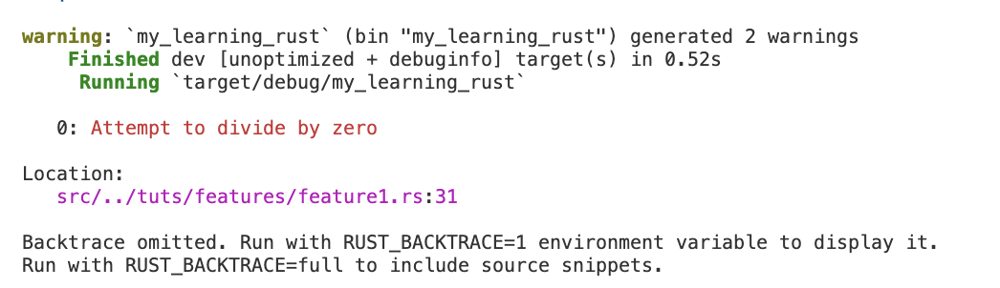

# Features

## Overview

This is about activating features in a rust project.

## Example

In this code example, there are 2 main functions that I want to run in 2 different conditions by activating features.

Using `color_eyre` crate, you get to see the error like this when using `{:#?}`:


but when you want to see the color trace, then use this `{:?}`:



Don't forget to install the color_eyre using this code snippet:

```rust
// at the beginning of the function
color_eyre::install()?;
```
