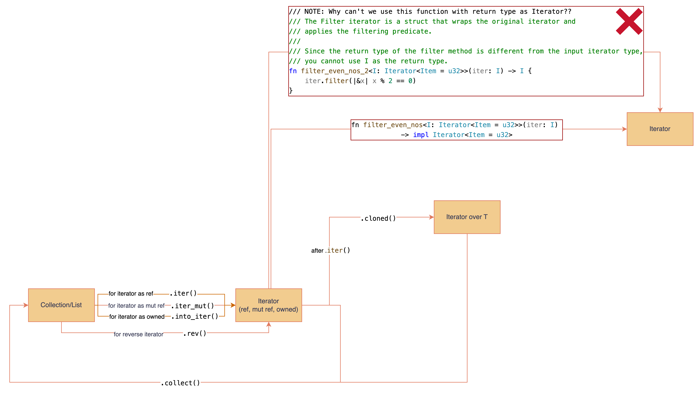

# Iterator

## Overview

## Notes

- `iter()` method returns an iterator over references to the items in the collection i.e. `&T`. Here, the original collection would be retained.
- `iter_mut()` method returns an iterator over mutable references to the items in the collection i.e. `&mut T`. Here, the original collection would be mutated.
- `into_iter()` method returns an iterator that takes ownership of the original collection i.e. `T`. Here, the original collection would be consumed.

  > Instead we can use `iter().cloned()` to get the iterator over owned elements. Here, the benefit is that it (original collection) would be retained.

  Hence, `into_iter()` == `iter().cloned()`.
