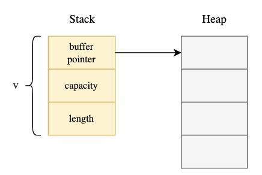
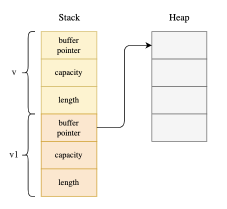
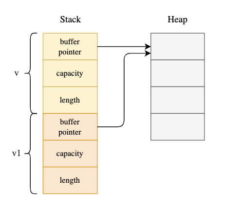
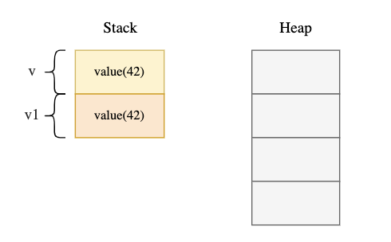
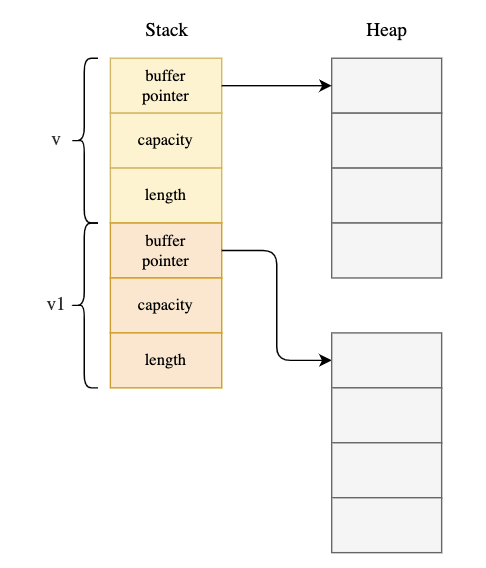

# Move | Copy | Clone

## Overview

In this tutorial we will learn how to `move`, `copy` and `clone`, `to_owned` in rust.

## Move

- Generally seen in assignment of variable to the assigned variable.
- **Shallow copy** of the data. This means irrespective of what it is present inside the variable (`struct`, `enum`), it is going to be **moved** to the assigned variable.
- In the following code:

```rs
let v: Vec<i32> = vec![1, 2, 3];
let v2 = v;
```

This is what happens at the memory level:

From:



To:



- Now, this is what happens in the memory when we try to access `v` after the assignment in this following code as it is stored in the **heap**:

  ```rs
  let v: Vec<i32> = vec![1, 2, 3];
  let v2 = v;
  println!("v is {:?}", v); //error: use of moved value: `v`
  ```

  Rust lang prevents from situations like this:

  

## Copy

- It is implicitly implemented for all the primitive data types like `i32`, `f32`, `bool`, `char` etc as these data types are stored in the **stack** rather than **heap**.

- In this code (stack based):

  ```rs
  let v: i32 = 42;
  let v1 = v;
  println!("v is {}", v);//compiles fine, no error!
  ```

  The following happens at the memory level:

  

  > That's why `v` is not moved as it is stored in the stack, not in the heap. That is why it is ok to allow access through both v and v1 — they are completely independent copies.

- Without `clone`, it is not possible. As `Clone` is a super-trait of `Copy` used like this:

  ```rs
  pub trait Copy: Clone {}
  ```

  So, always use `Clone` when you use `Copy` when using `derive` macro.

- `Copy` is a marker trait, which means it does not have any methods. It is used to indicate that the type can be copied.
- There are few data types for which this trait is not applicable like `Vec`, `String`, `HashMap` etc.

  ```rs
  // error: the trait `Copy` may not be implemented for this type
  // label: this field does not implement `Copy`
  #[derive(Debug, Clone, Copy)]
  struct Team {
      players: Vec<String>,
  }
  ```

  Here, this error is because `Vec` does not implement `Copy` trait.

## Clone

- **Deep copy** of the data. This means that the data is copied recursively like in a struct, enum, etc. We can use `clone` method to do this.
- The difference between `Copy` and `Clone` is that `Copy` duplicates bits stored in the stack, while `Clone` might involve copying heap data, which could or not result in a more expensive operation.
- `.clone()` generates a duplicate of types such as `&str` or &[u8] with the same type in its borrowed state (`&T`). This means using `.clone()` on `&str` and &[u8] will generate `&str` and [u8] respectively.
- The .clone() generates a duplicate of an object T with the same type T, meaning if

  - a is `u8`, the duplicate will be a `u8`
  - a is `String`, the duplicate will be a `String`
  - a is `&[&str]`, the duplicate will be a `&[&str]`
  - a is `MyObject`, the duplicate will be a `MyObject`

- The `.clone()` method is available to all types deriving the Clone trait.
- By default, all the primitive types (`str`, `i8`, `u8`, `char`,`array`, `bool`, etc), have access to the `.clone()` method.
- Thumb rule for type generation in `.clone()`

  1. Generating a duplicate with the same type (T -> T)

     - [valid for all]

     ```rs
     let number:u8 = 10; // type u8
     let cloned_number = number.clone(); // type u8

     let string: String = String::from("Hello, world!"); // type String
     let cloned_string = string.to_owned(); // type String

     let my_object = MyObject::new(); // type MyObject
     let cloned_my_object = my_object.clone(); // type MyObject

     let owned_array: [i32; 3] = [1, 2, 3]; // type is [i32; 3]
     let cloned_owned_array = owned_array.clone(); // type is [i32; 3]
     ```

  2. Generating a duplicate from borrowed type (&T -> T)

     - [valid for primary scalar, String, tuples, Struct]

     ```rs
     let borrowed_integer: &u8 = &1; // type is &u8
     let cloned_borrowed_integer = borrowed_integer.clone(); // type is u8

     let borrowed_floating_number = &2.3; // type is &f64
     let cloned_borrowed_floating_number = borrowed_floating_number.clone(); // type is f64

     let borrowed_boolean = &true; // type is &boolean
     let cloned_borrowed_boolean = borrowed_boolean.clone(); // type is boolean

     let borrowed_character = &'a'; // type is &char
     let cloned_borrowed_character = borrowed_character.clone(); // type is char

     let borrowed_string: &String = &String::from("Hello, world!"); // type is &String
     let cloned_borrowed_string = borrowed_string.clone(); // type is String

     // here struct type is of fixed size i.e. name, age. can't add more variables.
     let my_object = &MyObject::default();  // type is &MyObject
     let cloned_object = my_object.clone(); // type is MyObject
     ```

  3. Generating a duplicate from borrowed type (&[T] -> [T])

     - [valid for fixed length array]

     ```rs
     let borrowed_array: &[&str; 3] = &["a", "b", "c"]; // type is &[&str; 3]
     let cloned_borrowed_array = borrowed_array.clone(); // type is [&str; 3]

     let borrowed_array = &[1, 2, 3]; // it will implicitly define the type as &[i32; 3]
     let cloned_borrowed_array = borrowed_array.clone(); // type is [i32; 3]
     ```

  4. Generating a duplicate from borrowed type (&[T] -> &[T])

     - [valid for arrays without defined capacity]

     ```rs
     // all arrays are of variable length
     let array: &[&str] = &["a", "b", "c"]; // type &[&str]
     let cloned_array = array.clone(); // type &[&str]

     let numbers: &[i32] = &[1, 2, 3];
     let cloned_numbers = numbers.clone(); // type is [&i32]

     let strs: &[&str] = &["asfa", "saf", "asfas"];
     let cloned_strs = strs.clone(); // type is &[&str]

     let v = vec![1, 2, 3]; // type is Vec<i32>
     let cloned_v = v.clone(); // type is Vec<i32>
     ```

- [Example](./clone_1.rs)
- Looks like this:



## ToOwned

- `.to_owned()` generates a duplicate of types such as `&str` or &[u8] with types that have ownership. This means using `.to_owned()` on `&str` and &[u8] will generate a `String` and a Vec<u8> respectively.
- The `ToOwned` trait generalizes Clone to construct owned data from any borrow of a given type.

```rs
// T -> T
let v: Vec<i32> = vec![1, 2, 3]; // type is Vec<i32>
let cloned_v = v.to_owned(); // type is Vec<i32>

// &T -> T
let v: &Vec<i32> = &vec![1, 2, 3]; // type is &Vec<i32>
let cloned_v = v.to_owned(); // type is Vec<i32>

// &[T] -> T, when fixed size array
let v: &[Vec<i32>; 1] = &[vec![1, 2, 3]]; // type &[Vec<i32>; 1]
let cloned_v = v.to_owned(); // type [Vec<i32>; 1]

// &[T] -> T2, when dynamic size array
let v: &[Vec<i32>] = &[vec![1, 2, 3]]; // type is &[Vec<i32>]
let cloned_v = v.to_owned(); // type is Vec<Vec<i32>>
```

## Comparison

| Move                                                      | Copy                                                    | Clone                                                                                                                             | ToOwned                                                                                                                |
| --------------------------------------------------------- | ------------------------------------------------------- | --------------------------------------------------------------------------------------------------------------------------------- | ---------------------------------------------------------------------------------------------------------------------- |
| the variable is moved. Hence, has no ownership afterwards | the variable is copied. Hence, has ownership afterwards | the variable is copied. Hence, has ownership afterwards                                                                           | the variable is copied. Hence, has ownership afterwards                                                                |
| `=` sign                                                  | `=` sign                                                | `.clone()`                                                                                                                        | `.to_owned()`                                                                                                          |
| Shallow                                                   | Shallow                                                 | Deep                                                                                                                              | Deep                                                                                                                   |
| primitive/derived types                                   | primitive types                                         | derived types                                                                                                                     | derived types                                                                                                          |
| Stack/Heap                                                | Stack                                                   | available for stack/Heap, but recommended for Heap                                                                                | Heap                                                                                                                   |
| returns same type                                         | returns same type                                       | returns same type                                                                                                                 | returns diff. type like `&str -> String`, `&[u8] -> Vec<u8>`                                                           |
|                                                           |                                                         | the cloned variable type can be borrowed or owned type depending on the clonee. `T -> T`, `&T -> T`, `&[T] -> [T]` `&[T] -> &[T]` | the cloned variable type shall always be owned depending on the clonee. `T -> T`, `&T-> T` `&[T] -> [T]`, `&[T] -> T2` |

<u>Practical summary</u>:

- `.clone()` is used to get the borrowed type (in some cases gives same type) after cloning the variable, whereas `.to_owned()` is used to get the owned type after cloning the variable always.
- `.clone()` is an expensive operation, whereas `.to_owned()` is a cheap operation.

## References

- [Moves, copies and clones in Rust](https://hashrust.com/blog/moves-copies-and-clones-in-rust/) ✅
- [Arrays, vectors and slices in Rust](https://hashrust.com/blog/arrays-vectors-and-slices-in-rust/) ✅
- [Rust | The Difference Between .clone() and .to_owned()](https://www.becomebetterprogrammer.com/rust-clone-vs-to_owned/)
