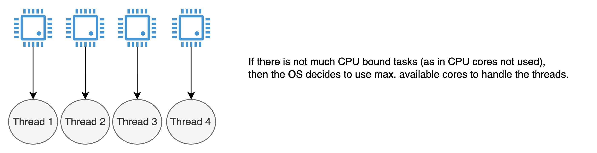
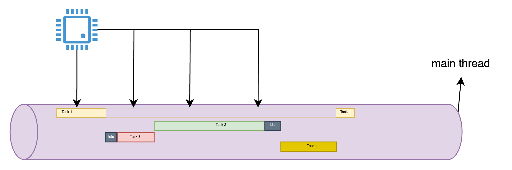
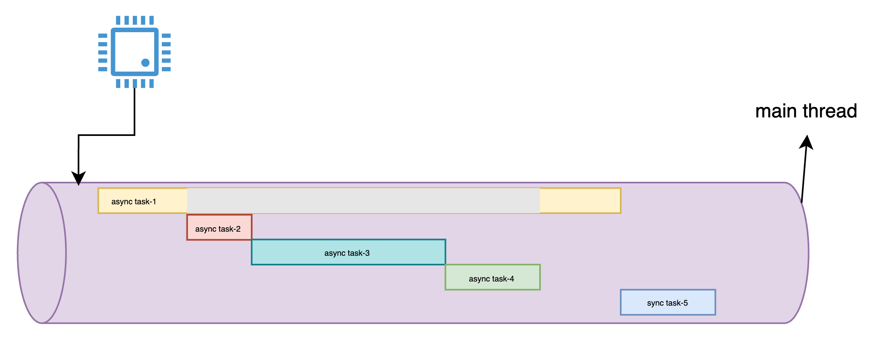
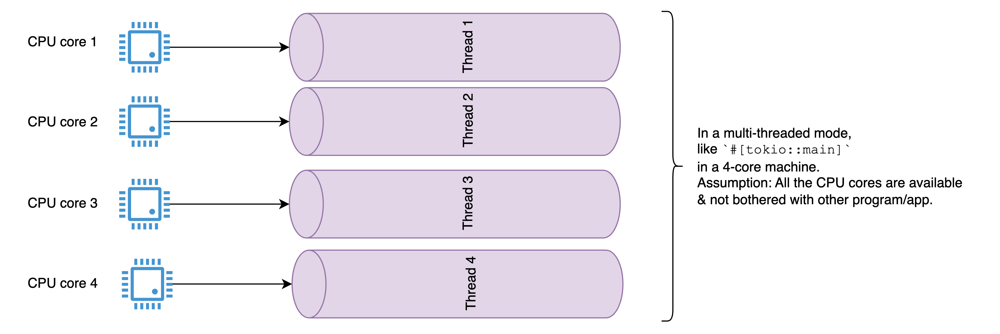
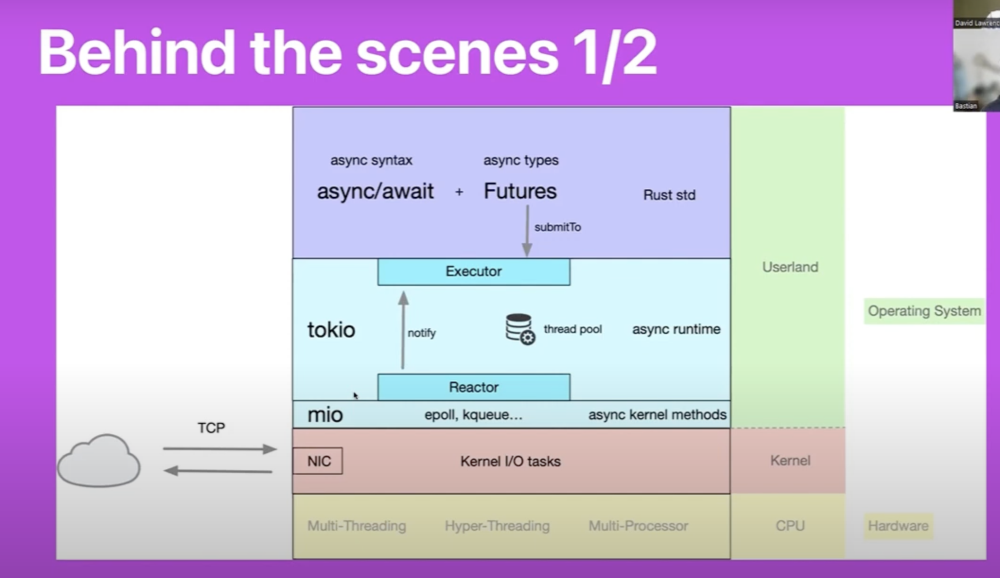
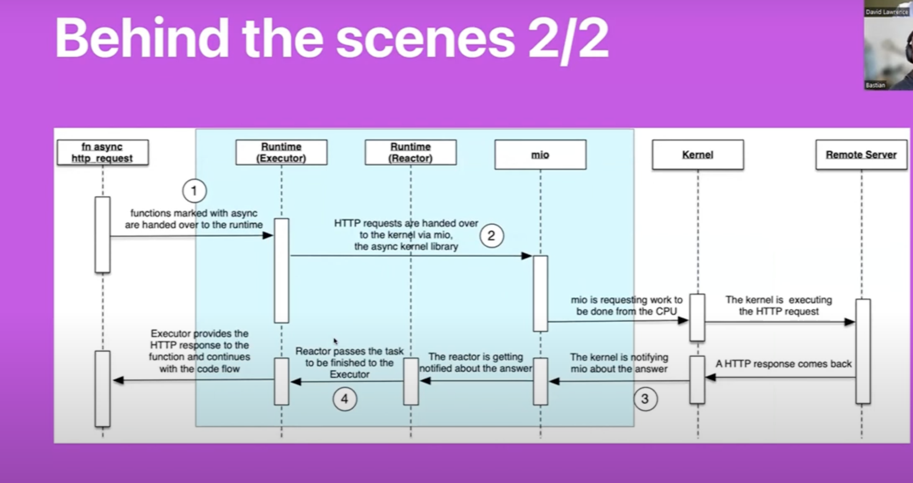
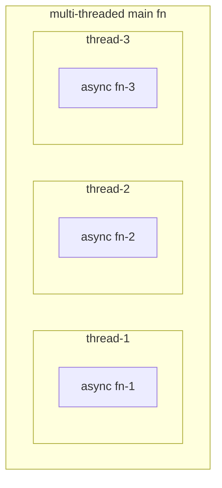

# Asynchronous Rust

## Overview

- Asynchronous programming in Rust.
- Common keywords
  - Hardware/Software: **Core**, **Thread**, **Task**, **OS** (sorted by most used).
  - Rust code: `async`, `await`, `Future`, `poll`, `Poll::Ready`, `Poll::Pending`.
- **OS** schedules **threads** based on the number of available CPU **cores**. In an ideal situation, 1 thread is mapped to each core given the no. of threads spawned ≤ no. of CPU cores. This is what happens during `#[tokio::main]` when used in Rust code.
  > NOTE: For a large program, threads count can go upto tens of thousands handled by just few cores. So, mapping 1 thread to 1 core is incorrect.
- 💡 🤯 🔥 **CPU cores used do not depend on the no. of threads, but rather aimed to run the synchronous/asynchronous code (program running on OS) using its max. limit on machine. As mentioned previously, OS schedule thread(s) to CPU core(s)**.
- Threads are for handling async tasks. Threads are spawned by user code (programs running on top of OS) to handle tasks asynchronously.
  - Like we have `#[tokio::main]` representing multi-threaded code. This means that we can have multiple async tasks handled by multiple threads.
  - Like we have `#[tokio::main(flavor="current_thread")]` representing single-threaded code. This means that there is a single thread to handle async tasks.
- In rust, there is no default async executor (runtime). So, community started building with tokio first, then many more like [smol](https://crates.io/crates/smol), etc. Moreover, the tokio runtime by default used as multi-threaded via `#[tokio::main]` which means when the `main` program is running, then you can spawn multiple threads inside & the modern machine can take care of this. Please ensure you disable multi-thread in `tokio` in low computing devices like microcontrollers, where possibly we would have 1 or 2 cores depending on the model.
- Async is different than parallelism, concurrency.
  - **parallelism**: Multiple CPU cores doing multiple tasks at the same time. In rust, there is a crate called [`rayon`](https://crates.io/crates/rayon) which provides parallelism. Parallelism involves performing multiple operations at the exact same time, which requires a multi-core processor. Rust's threading model enables parallel execution by allowing separate threads to run on different CPU cores simultaneously. This is particularly useful for CPU-bound tasks that can be divided into independent units of work.
    
  - **concurrency**: A single CPU core doing multiple tasks, but only one task is running at a time. It's kind of like _faking parallelism_. It's like watching a YT video and listening to another music at the same time. You are not watching both at the same time, but you are switching between them. So, here the CPU does take some <kbd>pause</kbd>s in between. Hence, the idle time. So, these idle times could be because of moving some mouse or keyboard. Here, there is a concept of context switching.
    
  - **asynchronous**: Single CPU core doing multiple tasks, but only one task is running at a time, and the tasks are not blocking the main thread. Hence, _no idle time_. In the diagram below, the task-1 is paused because it is waiting for some resources/information that can be achieved after the completion of the other 3 tasks. So, after task 4 ends, the task-1 resumes. In rust, there is a crate called [`tokio`](https://crates.io/crates/tokio) which provides asynchronous programming. In other words, asynchronous involves sometimes parallelism or concurrency.
    

   In a single-threaded mode, like `#[tokio::main(flavor = "current_thread")]` in a 4-core machine. Generally done for small tasks that mostly gets handled by a single thread.<br/>
   Total no. of threads = 1<br/>
   Additional thread for the synchronous `task-5`:
  - If executed directly within the async context or main function: 0 additional threads, running everything on the main thread.
  - If offloaded to another thread: 1 additional thread. So, total no. of threads become 2.

   And we should know when to use what. There are mainly 2 types of task:
  - **CPU bound task**: lot of processing related work (crunching no.s). In this case, parallelism can be really helpful.
  - **I/O bound task**: lot of networking related work like connecting to a network server and waiting for its response. It could also be reading files or getting responses based on thousands of requests to a server. Here, connection pooling could be helpful. This includes opening multiple connections at different ports & sending requests to them. In this case, concurrency can be really helpful.
- On a high level, the `async`/`await` syntax is a way to write asynchronous code that looks like synchronous code. On a low level, there is a trait `Future` which has a function - `poll` which constantly checks if the task is done or not. If it is done, then it returns `Poll::Ready`. If it is not done, then it returns `Poll::Pending` and then it is constantly checked by the executor like `#[tokio::main]` macro. So, the `async`/`await` syntax is just a way to write asynchronous code that looks like synchronous code. It is just a syntactic sugar. It is not a new concept. It is just a new way of writing asynchronous code. It is just a new way of writing `Future` trait.
- There is a `Future` trait in the std library which is similar to the concept of a `Promise` in JavaScript.
- Futures are inert in Rust and make progress only when polled. Dropping a future stops it from making further progress.
- Async is zero-cost in Rust, which means that you only pay for what you use. Specifically, you can use async without heap allocations and dynamic dispatch, which is great for performance! This also lets you use async in constrained environments, such as embedded systems.
- **No built-in runtime** is provided by std Rust. Instead, runtimes are provided by community maintained crates like `tokio`. I think `async`/`await` has been added in Rust 1.75.0.
- Both single and multithreaded runtimes are available in Rust, which have different strengths and weaknesses.

More on this in the [Async vs threads in Rust](https://rust-lang.github.io/async-book/01_getting_started/02_why_async.html#async-vs-threads-in-rust) section.

- On a last note, asynchronous programming is not better than threads, but different. If you don't need async for performance reasons, threads can often be the simpler alternative.

## Concepts

There are 2 ways of representing async operations:

- Low level which includes `Future` & `Pin`.
- High level which includes `async` & `await`.
  
Then finally require an executor to run all the tasks:

So, there is a crate - `tokio` which provides a runtime for executing asynchronous tasks like this:

```rust
#[tokio::main]
async fn main() {
   let mut counter = 0;
   let mut interval = tokio::time::interval(Duration::from_secs(1));
   loop {
      interval.tick().await;
      counter += 1;
      println!("tick {}", counter);
   }
}
```

This is called "**Executor**" as `#[tokio::main]` ensures execution of all the async tasks. They continuously poll futures using `poll` function of `Future` trait to check if they are complete i.e. `Poll::Ready`. It makes the whole async machinery come together. There are many executors that are available in the community like `tokio`, `async-std`, `smol`, etc.

However, one can create own executor referring this [doc](https://rust-lang.github.io/async-book/02_execution/04_executor.html).

---

- When `async` is used in a function, it means that the function is going to return a `Future` trait object (actually the return type `T` is implemented with `Future` trait). This is a way to write asynchronous code that looks like synchronous code. It is just a syntactic sugar. It is not a new concept. It is just a new way of writing asynchronous code. It is just a new way of writing `Future` trait.
- Futures (like Promise in JS/TS) are always lazy by nature. So, they need to be awaited via `.await` at the end of an `async` fn. Otherwise, it returns just Future type, hence not executed.

Like this function `get_number` below is going to return a `Future` trait object, not the actual value `42` when called.

```rust
async fn get_number() -> u32 {
   42
}
```

So, instead of calling `get_number` like this:

```rust
let number = get_number();
```

It should be called like this:

```rust
let number = get_number().await;
```

---

As mentioned earlier, `async` is a high level implementation. Here is a comparo with low-level implementation using `Future` trait:

```rust
use std::future::Future;

async fn foo() -> u8 {
   42
}

// OR

fn foo() -> impl Future<Output = u8> {
   async {
      42
   }
}

// `foo` can be awaited like this:
#[tokio::main]
async fn main() {
   let x = foo().await;
   assert_eq!(x, 42);
}
```

So, basically, `async` simplifies the writing of `Future` trait as shown for `foo` function.

---

`tokio` crate is the default choice in the industry for asynchronous tasks. It creates a thread per CPU core by default. So, if there are 4 cores, then 4 threads are created. And, the tasks are distributed among these threads by the runtime for multi-threading.



---

There is a trait called `Future` which acts as base layer for `tokio` crate. It is similar to the concept of a `Promise` in JavaScript. This is just to represent a type/process that implements `Future` trait which includes a function called `poll` which is used to check if a future has completed or not. If it has completed, then it returns `Poll::Ready` with the result. If it has not completed, then it returns `Poll::Pending`. Then, it might ask the runtime to check later (may be every few seconds). Or there can be a callback function that can be called when the future is ready.

Here is some piece of code that shows how `Future` trait is implemented:

```rust
use std::pin::Pin;
use std::task::{Context, Poll};

trait Future {
   // the computation will produce a result of type `Output` like u32, String, MyStruct, MyEnum, etc.
   type Output;

   // Pin is used to pin the memory location of the future. This is used to prevent the future from moving in memory.
   // Context type is used to pass information (whether the future is ready or not) to the future.
   fn poll(self: Pin<&mut Self>, cx: &mut Context<'_>) -> Poll<Self::Output>;
}
```

**Example code**:

A `Future` in Rust represents a value that will be available at some point in the future. It’s not the actual value but a promise of a value. When a future is ready to provide its value, it returns `Poll::Ready(value)`. If it’s not ready, it returns `Poll::Pending`.<br/>
Now, **who is going to ensure the future is ready?**<br/>
It is the executor like `tokio` which is going to ensure that the future is ready with either `Poll::Ready(T)` or `Poll::Pending`. Now, if it is `Poll::Ready(T)`, then the executor is going to take the value `T` and do something with it. If it is `Poll::Pending`, then the executor is going to check it later.<br/>
**How to notify the executor to check it later?** <br/>
It is done by the `Context` type which is used to pass information. This context has a method called `waker` which is used to wake up the executor to check the future again. This is done by the `poll` method of the `Future` trait. So, if it is `Poll::Pending`, then the `poll` method is going to call the `waker` method of the `Context` type to wake up the executor to check the future again.

```rust
use std::future::Future;
use std::task::{Context, Poll};
use std::pin::Pin;

stuct ExampleFuture;

impl Future for ExampleFuture {
   type Output = u8;

   fn poll(self: Pin<&mut Self>, _cx: &mut Context<'_>) -> Poll<Self::Output> {
      Poll::Ready(42)
   }
}
```

Here, `ExampleFuture` is a trivial Future that is always ready and returns the value 42.

> NOTE
>
> - the underscore used in `_cx` as it is not used in the function.
> - This example is a low level implementation showcasing how to define an async function.

---

Next comes the high level representation of async function in Rust:

```rust
async fn foo() -> u8 {
   42
}

async fn bar() {
    let x = foo().await;
    println!("x = {x}");
}


// Run this async function `bar` inside `main()` function attributed with tokio executor
#[tokio::main]
async fn main() {
   bar().await;
}
```

We would mostly get to use high level representation.

---

Behind any asynchronous request made using rust code, this is what is happening:

Here is the request/response code snippet:

```rust
use std::collections::Hashmap;
use std::error::Error;

#[tokio::main]
async fn main() -> Result<(), Box<dyn Error>> {
   let resp = reqwest::get("https://www.rust-lang.org").await?.json::<Hashmap<String, String>>().await?;

   println!("{:#?}", resp);

   Ok(())
}
```

Below is the hardware diagram of the above code working under the hood:


And here is the corresponding sequence diagram:



Here:

`step-1`: From the code perspective, `#[tokio::main]` attribute is the executor which runs all the async functions put inside the `main` fn, in an spawned/unspawned threaded condition. In this program, I/O bound operation is shown as it handles TCP request/response.

In an CPU bound operation, it would be handled by the CPU layer for handling multiple threads as shown in the code below:



The above code has multiple threads spawned which is going to be taken care of by all cores of machine.

Multiple cases possible in an 8-core (say) machine with `#[tokio::main]` attribute:

1. <u>no. of core < threads</u>: some threads have to wait
2. <u>no. of core = threads</u>: each core takes up 1 thread
3. <u>no. of core > threads</u>: each core takes up 1 thread & the pending threads are taken up as soon as any of the cores get free.

---

There is a way to use single thread via `#[tokio::main(flavor = "current_thread")]`:

In eg. [`async_1`](./async_1/), this is going to be the output, when 50ms of sleep was put in a function

```console
[0] I'm a async function
[1] I'm a async function
[0]First result: DB read
[1]First result: DB read
[0] Second result: DB read
[1] Second result: DB read
```

But, in the same example if we remove the single thread flavor, then for different sleep time, the output is going to be different.

for 50 ms,

```console
[0] I'm a async function
[1] I'm a async function
[1]First result: DB read
[0]First result: DB read
[0] Second result: DB read
[1] Second result: DB read
```

### Rc & Arc

`Rc` stands for "reference counting" and is a non-atomic reference-counting smart pointer. It keeps track of the number of references to the data and deallocates the data when the last reference is dropped. `Rc` is useful when you need to share ownership of a value within a single thread.

`Arc` stands for "atomic reference counting" and is a thread-safe reference-counting smart pointer. It provides the same functionality as `Rc`, but it can be shared across multiple threads. `Arc` uses atomic operations to keep track of the number of references to the data, which makes it safe to use in a concurrent environment.

In the code snippet you provided, `Arc` is used to share ownership of the `provider` variable across multiple threads.

```rust
#[derive(Clone, Debug)]
pub struct Provider<P> {
    // ...
    node_client: Arc<Mutex<Option<NodeClient>>>,
}
```

Here, `Arc<Mutex<Option<NodeClient>>>` is a type that represents a shared ownership smart pointer (`Arc`) to a mutable lock (`Mutex`) that guards an optional value of type `NodeClient`. The `Mutex` is used to ensure that only one thread can access the `NodeClient` at a time.

This is necessary because the `tokio` library is used for asynchronous programming, which means that multiple tasks can run concurrently on different threads. By using `Arc`, each task can have a reference to the same `provider` variable, and the variable will be deallocated only when the last reference is dropped.

---

In both these shared pointers, data can be cloned in 2 methods:

```rust
//! Shown eg for Arc. Similarly, Rc pointer can also be cloned.
let data = Arc::new(5);
// M-1
let cloned_data = data.clone();
// M-2
let cloned_data = Arc::clone(&data);
```

## Threads

- All threads are asynchronous & hence the main thread might end before the other threads. Hence, each spawned thread should be defined in such a way that the variables taken from the main thread must have more lifetime than the main thread. Otherwise, the spawned thread will panic. This is called **thread safety**. So, the spawned thread should not depend on the main thread. It should be independent.
  This can be achieved by defining the local variable in the main thread as `static mut` or `Arc` (with Mutex so as to make it thread safe). This is because `static mut` is a global variable & hence it has more lifetime than the main thread. And, `Arc` is a shared pointer & hence it can be shared across multiple threads. So, the spawned thread(s) can take ownership of cloned `Arc` pointer.

   [Code example](./sync10.rs)
- `std::thread` module provides the `spawn` function for creating a new thread.
- `spawn` function takes a closure as an argument, and the closure is executed in the new thread.
- `spawn` function returns a `JoinHandle` which can be used to wait for the thread to finish.
- `JoinHandle` implements the `JoinHandle::join` method which waits for the thread to finish and returns a `Result` containing the return value of the closure.
- Chosing b/w `spawn` vs `join!` vs `select!`:

  - Use `tokio::spawn` when tasks are independent, or when you need to keep the main flow unblocked. It's also useful when you want tasks to continue running even if the part of your program that spawned them moves on.
  - Use `join!` when you need to run multiple futures concurrently and want to wait for all of them to complete before proceeding.
  - Use `select!` when you want to run multiple futures concurrently and want to proceed as soon as any of them completes. [code example](../../../libs/smol-demo/examples/3_3projects_select.rs) using `smol` crate.

  [Code example](./sync9.rs)

- `move` inside `spawn`:

  - `move` keyword is used to move the ownership of the variables inside the closure.
  - If we don't use `move`, then the closure will borrow the variables from the parent thread.
  - If we use `move`, then the closure will take ownership of the variables from the parent thread.

  [Code example](./sync10.rs)

- Here, the spawned tasks run sequentially:

   ```rs
   tokio::spawn(async {
      println!("I'm a thread 1");
   }).await;

   tokio::spawn(async {
      println!("I'm a thread 2");
   }).await;

   tokio::spawn(async {
         println!("I'm a thread 3");
   }).await;
   ```

- Here, the spawned tasks run relatively concurrently [RECOMMENDED] when you do care about the order of execution of the threads i.e. you want the tasks to run in a specific order i.e. here `1-2-3`:

   ```rs
   let task1 = tokio::spawn(async {
      println!("I'm a thread 1");
   });

   let task2 = tokio::spawn(async {
      println!("I'm a thread 2");
   });

   let task3 = tokio::spawn(async {
         println!("I'm a thread 3");
   });

   task1.await;
   task2.await;
   task3.await;
   ```

- Here, the spawned tasks run concurrently [RECOMMENDED] when you don't care about the order of execution of the threads i.e. any task can start first:

   ```rs
   let task1 = tokio::spawn(async {
      println!("I'm a thread 1");
   });

   let task2 = tokio::spawn(async {
      println!("I'm a thread 2");
   });

   let task3 = tokio::spawn(async {
         println!("I'm a thread 3");
   });

   let _ = join!(task1, task2, task3);
   ```

So, the threads are run like this:

Threads run in the order they are spawned

```rust
let thread1 = tokio::spawn(|| {
   println!("I'm a thread 1");
}).join();

let thread2 = tokio::spawn(|| {
   println!("I'm a thread 2");
}).join();

let thread3 = tokio::spawn(|| {
   println!("I'm a thread 3");
}).join();
```

But, this approach has limitation in cases where I want to set the order as 1-3-2. Then, I have to move the code. But, imagine those are in different files or modules. Then, it is not possible to move the code. So, this approach is impractical.

So, in order to make the threads run concurrently, code like this:

```rust
let thread1 = tokio::spawn(|| {
   println!("I'm a thread 1");
});

let thread2 = tokio::spawn(|| {
   println!("I'm a thread 2");
});

let thread3 = tokio::spawn(|| {
   println!("I'm a thread 3");
});

let _ = thread1.join();
let _ = thread2.join();
let _ = thread3.join();

// or

let _ = join!(thread1, thread2, thread3);
```

[Code example](./sync_4.rs)

But, here it is not guaranteed that the threads will run in the order they are spawned. In fact, not even the order of the `join` calls is guaranteed.

Now, to set the order, we can use synchronization primitives like `Mutex`, `Condvar`, and `Barrier`. These primitives allow you to coordinate the execution of multiple threads and ensure that they execute in a specific order.

### Concurrency

#### Concurrency with `futures::future::join_all`

To add concurrency, we can use the `tokio::spawn` function to spawn multiple threads & then use `join_all` to wait for all the threads to finish.
> Here, each handle is going to return future of same `Output`.

A simple example:

```rust
let mut handles = Vec::new();
for i in 0..10 {
   let handle = tokio::spawn(move || {
      println!("I'm a thread {}", i);
   });
   handles.push(handle);
}

let _ = join_all(handles);
```

<details>
<summary> Now, a complex example (from one of my private projects): </summary>

```rust
async fn get_onchain_balance_of(
   &self,
   user_addresses: HashMap<ChainProtocol, String>,
   coin: &StableCoin,
   latest: bool,
) -> eyre::Result<HashMap<ChainName, U256>> {
   let mut balances = HashMap::<ChainName, U256>::with_capacity(ChainName::all().len());
   let mut tasks = Vec::new();

   for chain in ChainName::all() {
   let chain_protocol = chain.get_chain_protocol();
   let user_address = user_addresses
      .get(&chain_protocol)
      .ok_or_eyre("Address not found for this protocol")?
      .parse::<Address>()?;
   let coin = coin.clone();
   match chain_protocol {
      ChainProtocol::Evm => {
      let provider = self.get_evm_node_provider(chain).await?.ws;
      tasks.push(tokio::spawn(async move {
            let balance =
               Sdk::coin_balance(provider, chain, &coin, user_address, latest).await?;
            Ok::<_, eyre::Error>((chain, balance))
            }));
         },
         // TODO: Add support for other chains
      }
   }

  let results = tokio::join!(join_all(tasks));

  for result in results.0 {
      let (chain, balance) = result??;
   balances.insert(*chain, balance);
  }

   Ok(balances)
  }
```

Here, in order to update the `balances` hashmap, we need both keys & values. So, we add both (chain, balance) to each handle.

</details>

In this, if any of the task fails, the pending tasks won't run. So, it's either **all or none**.

#### Concurrency with `tokio::try_join!`

Same as above, just that it can have handles of different `Output`.

Like in this case:

```rust
// results is of tuple type holding the outputs of each handle
let results = tokio::try_join!(task1, task2, task3);
```

> Here, `task1`, `task2`, `task3` are handles of different `Output`.

Sample code:

```rust
// Add concurrency for health checks
try_join!(
   sdk.check_db_health(),
   sdk.coingecko_health(&sdk.coingecko_api_key)
)?;
```

where:

```rust
async fn check_db_health() -> Result<()> {
   // ...
}

async fn coingecko_health(api_key: &str) -> Result<bool> {
   // ...
}
```

#### Concurrency with `JoinSet`

The same complex example using `JoinSet`:

<details>
<summary> Code example: </summary>

```rust
async fn get_onchain_balance_of(
    &self,
    user_addresses: HashMap<ChainProtocol, String>,
    coin: &StableCoin,
    latest: bool,
) -> eyre::Result<HashMap<ChainName, U256>> {
    let mut balances = HashMap::with_capacity(ChainName::all().len());
    let mut tasks = JoinSet::new();

    for chain in ChainName::all() {
        let chain_protocol = chain.get_chain_protocol();
        let user_address = user_addresses
            .get(&chain_protocol)
            .ok_or_eyre("Address not found for this protocol")?
            .clone();
        
        let provider = self.get_evm_node_provider(chain).await?.ws.clone();
        let coin = coin.clone();

         match chain_protocol {
            ChainProtocol::Evm => {
                  tasks.spawn(async move {
                  let balance = Sdk::coin_balance(provider, &chain, &coin, user_address.parse()?, latest).await?;
                  Ok::<_, eyre::Error>((chain, balance))
               });
            },
            // TODO: Add support for other chains
         }
    }

    while let Some(result) = tasks.join_next().await {
        let (chain, balance) = result??;
        balances.insert(chain, balance);
    }

    Ok(balances)
}
```

</details>

In this, if any of the task fails, the pending tasks would still run. So, it's **all or some**. So, use accordingly.

## API Server

### REST API

Initially there were 2 libs for REST API: Actix-web & Axum. Honestly, I was a bit confused between them. But, now, Actix-web is secondary for me. So, Axum is the primary choice.

Follow this folder for [axum tutorials](../../../libs/axum-playground/).

## FAQs

**Q: Which declarative macros like println! are used for automatically calling the Deref trait for Rc smart pointer?**

A: The declarative macro that is used for automatically calling the `Deref` trait for `Rc` smart pointers is `format!`. When you use `format!` with an `Rc<T>` argument, the `Deref` trait is automatically called on the `Rc<T>`, which returns a reference to the value inside the `Rc<T>`. This reference is then used to format the string.

**Q: In Rust, how can I access the value of an `Rc` smart pointer without using the dereference operator `*`?**

A: You can access the value of an `Rc` smart pointer without using the dereference operator `*` by using the `Deref` trait. When you use an `Rc<T>` as an argument to a function or macro that expects a reference to `T`, the `Deref` trait is automatically called on the `Rc<T>`, which returns a reference to the value inside the `Rc<T>`. This reference can then be used as if it were a reference to `T`. Examples of functions and macros that automatically call `Deref` include `println!`, `format!`.

**Q: What is the difference between `Rc` and `Arc`?**

A: **`Arc` vs `Rc`**: `Rc` and `Arc` are both smart pointers in Rust that allow multiple ownership of the same data. The main difference between them is that `Rc` provides shared ownership of a value within a single thread, while `Arc` provides shared ownership of a value across multiple threads.

## Reference

- [Asynchronous Programming in Rust](https://rust-lang.github.io/async-book/01_getting_started/01_chapter.html)
- [Intro to Rust Async Function Execution With Smol 🦀 Rust Programming Tutorial for Developers](https://www.youtube.com/watch?v=NSgyNb0egm4) ✅
