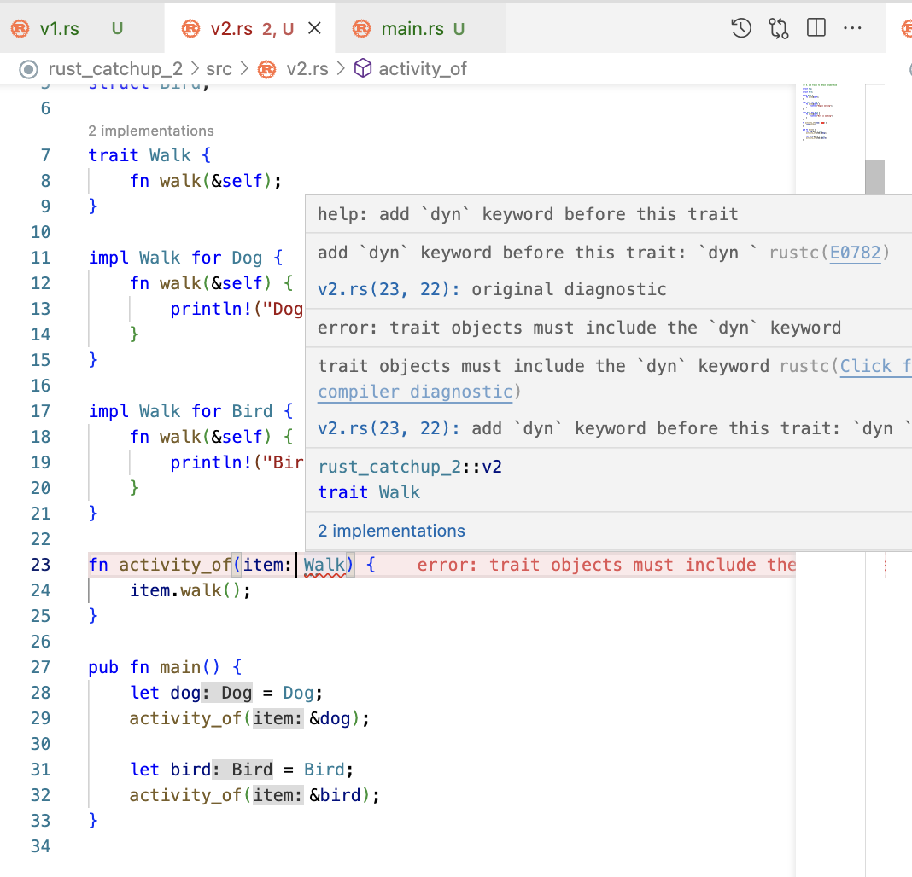
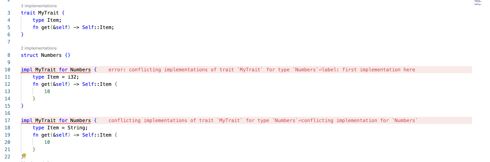

# Traits in Rust

## About

- <u>Definition</u>: A trait in Rust is a collection of methods that can be implemented by structs or other traits. Traits are similar to interfaces in other languages, but they can also provide `default` method implementations.
- In Rust, there is no concept of "inheriting" the properties of a struct. Instead, when you are designing the relationship between objects do it in a way that one's functionality is defined by an interface (a trait in Rust). This promotes **composition over inheritance**, which is considered more useful and easier to extend to larger projects.
- For defining attributes, use `struct`, `enum`. But, for behavior, define everything in `traits` like an `interface` i.e. w/o definition (in Solidity, Java).
- `trait` name is supposed to be written in CamelCase.
- Define `trait` like this:

```rs
<visibility: pub, priv> trait <TraitName> {
    ///
    /// method declaration
    ///
}
```

- Implementing `trait` for a `type` like this:

```rs
impl <TraitName> for <TypeName> {
    ///
    /// method definition
    ///
}
```

- Ideally, `struct` in C/C++ is same as here in Rust. But, in order to define methods we need to use `impl`s for them. We can use multiple `impl` for a type in order to implement `Trait`s. We can use `#[derive(...)]` macro for this. But in some cases, if we require to customize the output, we have to implement the Trait explicitly & then inside the implementation, we add some logic to customize the output. And also we can definitely give our own type in cases of GATs (Generic Associated Types).
- `impl`s are used to define methods for Rust `struct`s and `enum`s.
- Traits are kind of similar to interfaces in **OOP** languages. They are used to define the functionality a type must provide. Multiple traits can be implemented for a single type. Although we can use `traits` in much more flexible way unlike `interface` in traditional languages.
- But traits can also include default implementations of methods. Default methods can be overridden when implementing for the types. For instance, we can explicitly apply our own logic to the `to_string` method of the `ToString` trait.
- A `trait` tells the Rust compiler about functionality a particular `type` has and can share with other `type`s. Traits are an abstract definition of shared behavior amongst different types. So, we can say that `trait`s are to **Rust** what `interface`s are to **Java** or abstract classes are to C++. A trait method is able to access other methods within that trait.
- **Analogy**

  | Rust  | Java      | C++            | Solidity  |
  | ----- | --------- | -------------- | --------- |
  | trait | interface | abstract class | interface |

- In Rust, traits can have default function implementation like this:

  ```rust
  trait MyTrait {
      fn my_func(&self) {
          println!("Default MyTrait");
      }
  }
  ```

  And now, if this trait is implemented for a type, then the default implementation will be used. But, if the type implements the method, then the implementation will override the default implementation. Here is the example:

  ```rust
  struct MyStruct;

  /// use the default implementation
  impl MyTrait for MyStruct {}

  /// override the default implementation
  impl MyTrait for MyStruct {
      fn my_func(&self) {
          println!("MyStruct");
      }
  }
  ```

- Polymorphism with a Trait Object. Follow this [quiz](../../rust-catchups/rust_catchup_2/)



By default, the compiler always gives suggestion to use `dyn` keyword for trait objects. This is because the compiler is not sure about the size of the trait object at compile time. So, it uses a pointer to the trait object and the size of the pointer is known at compile time. This is called **dynamic dispatch**.

But, the work can be done using **static dispatch** as well. For that, we need to use `impl Trait` syntax. This is called **existential types**.

> Existential types in Rust are a way to abstract over concrete types and allow for more flexible and dynamic programming. They are used when we want a function or method to work with any type that satisfies certain traits or constraints, but we don't want to specify the exact type at compile-time. This makes it possible to write generic code that doesn't require the caller to know the specific type being used.

```rs
fn print_debug(val: &dyn Debug) {
    println!("{:?}", val);
}
```

The same can be done using `&impl Debug` syntax as well.

> NOTE: The use of `&` (borrow) is optional here. It is used to avoid the ownership transfer of the value to the function.

Here, runtime cost-wise: `dyn Debug` is more expensive than `impl Debug`.

"Static dispatch vs Dynamic dispatch" [Video](https://youtu.be/CHRNj5oubwc)

In order to understand, follow this [example](./traits_14.rs).

## FAQs

<details>
<summary><b>Show:</b></summary>

### Q. Why GAT is required when we have Associated Types?

> GAT: Generic Associated Types

It is required in this condition:



Here, we are trying to implement the `Number` struct with different types. But, the compiler is not able to understand which type to use for `Output` type. So, we need to use GAT here.

### Q. What is the difference between "Static dispatch" & "Dynamic dispatch"?

Sure, let's dive into the concepts of static dispatch and dynamic dispatch in Rust. We'll use both simple visuals and emojis to make the concept clearer.

#### 1. **Static Dispatch**

Static dispatch occurs when the compiler knows at compile time which function you're calling. This is typically achieved with generics and traits in Rust.

Let's visualize static dispatch using emojis. Imagine we have a couple of different emoji characters, and they all need to "speak". Here's our cast:

🐶 - Dog
🐱 - Cat

In Rust, we can define a trait called `Speak` that these characters can implement:

```rust
trait Speak {
    fn speak(&self);
}
```

The 🐶 and 🐱 can have their own implementations of `speak`.

```rust
struct Dog;
struct Cat;

impl Speak for Dog {
    fn speak(&self) {
        println!("Woof!");
    }
}

impl Speak for Cat {
    fn speak(&self) {
        println!("Meow!");
    }
}
```

Now, let's create a function that takes a generic `T` where `T` implements the `Speak` trait:

```rust
fn make_speak<T: Speak>(character: T) {
    character.speak();
}
```

When we call `make_speak(Dog)` or `make_speak(Cat)`, the compiler knows exactly which implementation of `speak` to call. This is static dispatch. The compiler decides at compile time which method to call, resulting in fast, inline calls.

#### 2. **Dynamic Dispatch**

Dynamic dispatch occurs when the compiler doesn't know at compile time which function you're calling. Instead, it uses a vtable (a table of function pointers) to decide at runtime. This is typically achieved with trait objects in Rust.

Continuing our emoji story, let's say we now have a box 📦 that can contain either a 🐶 or a 🐱, and we want it to "speak". We don't know what's in the box until runtime, so we can't use static dispatch here.

In Rust, we can define a trait object by using a box:

```rust
/// Use this because of borrowing nature
/// This is a dynamic dispatch which is using borrowing
fn make_speak_dyn(animal: &dyn Speak) {
    animal.speak();
}

/// Avoid this because of ownership transfer
/// This is a dynamic dispatch which is taking ownership of the object
fn make_speak_box(animal: Box<dyn Speak>) {
    animal.speak();
}
```

When we call `make_speak_box(Box::new(Dog))` or `make_speak_box(Box::new(Cat))`, the compiler uses a vtable to look up the correct `speak` method at runtime. This is dynamic dispatch. It's a bit slower and uses more memory than static dispatch because of the overhead of the vtable and the heap allocation.

---

**Major Differences**

- **Compile Time vs Runtime**: Static dispatch decides which method to call at compile time, while dynamic dispatch decides at runtime.
- **Performance**: Static dispatch can inline function calls, leading to potentially better performance. Dynamic dispatch has some overhead due to the vtable and heap allocation.
- **Flexibility**: Dynamic dispatch is more flexible because it allows you to decide behavior at runtime. Static dispatch requires that you know the types at compile time.
- **Memory Usage**: Dynamic dispatch uses more memory due to heap allocations and the vtable.

### Q. Are these 2 codes same?

**Implementation-1**:

```rust
fn make_speak<T>(animal: &T)
where
    T: Speak,
{
    animal.speak();
}
```

**Implementation-2**:

```rust
fn make_speak_2(animal: &impl Speak) {
    animal.speak();
}
```

===

Yes, both of these implementations in Rust are functionally the same. They both define a function that takes a reference to some type that implements the `Speak` trait, and then calls the `speak` method on that type.

Implementation-1 uses a trait bound with a `where` clause:

```rust
fn make_speak<T>(animal: &T)
where
    T: Speak,
{
    animal.speak();
}
```

In this case, `T` is a type parameter that can represent any type. The `where` clause is used to specify that `T` must implement the `Speak` trait.

Implementation-2 uses an `impl Trait` syntax:

```rust
fn make_speak_2(animal: &impl Speak) {
    animal.speak();
}
```

> Here, `impl Speak` is a shorthand for "some type that implements the `Speak` trait", and is often used when the exact type is either unimportant or unknown.

Both of these are examples of static dispatch, as the exact method to call (`speak`) is known at compile time. The choice between them often comes down to personal or project style preferences. They both provide the same functionality, so you can use whichever one you find more readable or intuitive.

### Q. Is zero-cost abstraction possible in Rust?

Yes! It is possible to write high level code using Generics, Traits so that it performs as if it was written in low level code.

**Zero-Cost Abstraction** 🏗️🚀:

Imagine a fantastic building tool (🏗️) that lets you construct a building as easily as stacking blocks. Even though you're working at a high level (stacking blocks), the end result is a strong, efficient building that could stand up to any professional construction (🚀). This is the essence of zero-cost abstraction: you're working with high-level code, but the end result is as efficient as if you'd written it in low-level code.

### Q. Why do we need "zero-cost abstraction"?

In the realm of programming, we continually seek a balance between two crucial aspects: high performance and developer friendliness.

Performance often demands the precision and control of low-level languages, while developer friendliness typically favors the abstraction and simplicity of high-level languages. The challenge lies in achieving both in our software products. But how can we bridge this gap?

Enter Rust: a language that boldly promises to deliver both. The secret lies in a powerful concept known as "Zero-Cost Abstractions."

Zero-cost abstractions in Rust allow developers to write high-level code without sacrificing performance. This means you can enjoy the simplicity and readability of high-level programming while the end result runs as efficiently as if you'd written it in a low-level language.

In essence, Rust offers the best of both worlds. It's a testament to the power of modern programming languages and their ability to marry performance with developer friendliness. Stay tuned as we dive deeper into this fascinating subject. #rustlang #zerocostabstractions #programming #softwaredevelopment

### Q. "How does the concept of 'zero-cost abstraction' relate to 'static dispatch' and 'dynamic dispatch' in the context of Rust programming?"?

Absolutely! Let's summarize this with visuals and emojis:

1. **Zero-Cost Abstraction with Static Dispatch** 🎉🐶🦴🐱🐟:

   Imagine planning a party (🎉) where you already know exactly who's coming: a Dog (🐶) and a Cat (🐱). You know what each guest likes: the Dog likes bones (🦴) and the Cat likes fish (🐟). You prepare these things ahead of time. When the party starts, you can immediately give each guest what they like without having to ask or look it up. This is like static dispatch in Rust, where the Rust compiler knows at compile time exactly what function to call for each type. This leads to highly optimized, efficient code (fast party handouts), demonstrating zero-cost abstraction.

2. **Zero-Cost Abstraction with Dynamic Dispatch** 🎊📦🦴🐟🍒:

   Now imagine a surprise party (🎊) where guests could be anyone. You prepare a variety of items 🦴🐟🍒. When a guest arrives, you have to check a list to see what they like. This is like dynamic dispatch in Rust, where the Rust compiler doesn't know which function to call at compile time and has to use a vtable to look it up at runtime. There's a bit of overhead (checking the list), so it's not exactly zero-cost.

In conclusion, static dispatch in Rust is like knowing your party guests in advance and preparing everything they like: it leads to efficient, optimized code that demonstrates zero-cost abstraction. On the other hand, dynamic dispatch is like hosting a surprise party where you have to check a list to see what each guest likes: it's more flexible, but comes with a slight overhead. However, Rust's design tries to minimize this overhead as much as possible to get close to the ideal of zero-cost abstraction.

</details>
