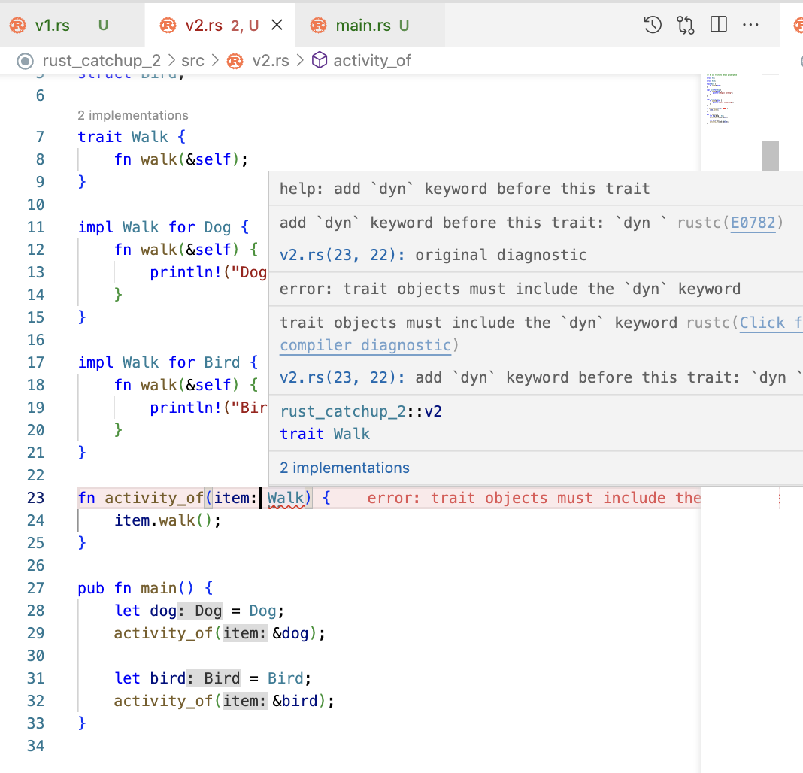

# Traits in Rust

## About

- <u>Definition</u>: A trait in Rust is a collection of methods that can be implemented by structs or other traits. Traits are similar to interfaces in other languages, but they can also provide `default` method implementations.
- In Rust, there is no concept of "inheriting" the properties of a struct. Instead, when you are designing the relationship between objects do it in a way that one's functionality is defined by an interface (a trait in Rust). This promotes **composition over inheritance**, which is considered more useful and easier to extend to larger projects.
- For defining attributes, use `struct`, `enum`. But, for behavior, define everything in `traits` like an `interface` i.e. w/o definition (in Solidity, Java).
- `trait` name is supposed to be written in CamelCase.
- Define `trait` like this:

```rs
<visibility: pub, priv> trait <TraitName> {
    ///
    /// method declaration
    ///
}
```

- Implementing `trait` for a `type` like this:

```rs
impl <TraitName> for <TypeName> {
    ///
    /// method definition
    ///
}
```

- Ideally, `struct` in C/C++ is same as here in Rust. But, in order to define methods we need to use `impl`s for them.
- `impl`s are used to define methods for Rust `struct`s and `enum`s.
- Traits are kind of similar to interfaces in **OOP** languages. They are used to define the functionality a type must provide. Multiple traits can be implemented for a single type.
- But traits can also include default implementations of methods. Default methods can be overridden when implementing types."
- A `trait` tells the Rust compiler about functionality a particular `type` has and can share with other `type`s. Traits are an abstract definition of shared behavior amongst different types. So, we can say that `trait`s are to **Rust** what `interface`s are to **Java** or abstract classes are to C++. A trait method is able to access other methods within that trait.
- **Analogy**

| Rust  | Java      | C++            | Solidity  |
| ----- | --------- | -------------- | --------- |
| trait | interface | abstract class | interface |

- Polymorphism with a Trait Object. Follow this [quiz](../../rust-catchups/rust_catchup_2/)



By default, the compiler always gives suggestion to use `dyn` keyword for trait objects. This is because the compiler is not sure about the size of the trait object at compile time. So, it uses a pointer to the trait object and the size of the pointer is known at compile time. This is called **dynamic dispatch**.

But, the work can be done using **static dispatch** as well. For that, we need to use `impl Trait` syntax. This is called **existential types**.

> Existential types in Rust are a way to abstract over concrete types and allow for more flexible and dynamic programming. They are used when we want a function or method to work with any type that satisfies certain traits or constraints, but we don't want to specify the exact type at compile-time. This makes it possible to write generic code that doesn't require the caller to know the specific type being used.

```rs
fn print_debug(val: &dyn Debug) {
    println!("{:?}", val);
}
```

The same can be done using `&impl Debug` syntax as well.

Here, cost-wise: `&dyn Debug` is more expensive than `&impl Debug`. Even more costly would be Generic type `T` which is the most flexible.

Hence, the order of runtime cost is `T` > `&dyn Debug` > `&impl Debug` (decreasing order).
